# Architecture Overview

OpenClaw's architecture is built around a single central concept: **one Gateway, many surfaces**.

---

## Big Picture

```mermaid
graph TB
    subgraph Channels["📨 Messaging Channels"]
        WA[WhatsApp<br/>via Baileys]
        TG[Telegram<br/>via grammY]
        DC[Discord<br/>via Carbon]
        SL[Slack<br/>via Bolt]
        IM[iMessage<br/>via AppleScript]
        WC[WebChat]
    end

    subgraph GW["🏠 Gateway (your machine)"]
        direction TB
        CHAN[Channel Manager]
        SESS[Session Store]
        AGENT[Agent Runtime<br/>pi-mono]
        TOOLS[Tool Engine]
        CONFIG[Config / Auth]
    end

    subgraph Providers["☁️ LLM Providers"]
        ANT[Anthropic]
        OAI[OpenAI]
        OLL[Ollama<br/>local]
        OR[OpenRouter]
    end

    subgraph Clients["💻 Control Clients"]
        MAC[macOS App]
        CLI[CLI]
        WEBUI[Web UI]
    end

    subgraph Nodes["📱 Nodes"]
        IOS[iOS]
        AND[Android]
    end

    Channels <-->|inbound/outbound| CHAN
    CHAN --> SESS
    SESS --> AGENT
    AGENT <-->|tool calls| TOOLS
    AGENT -->|API calls| Providers
    Providers -->|responses| AGENT
    AGENT --> SESS
    SESS --> CHAN
    Clients <-->|WebSocket| GW
    Nodes <-->|WebSocket| GW
```



The Gateway is the **hub**. Everything else connects to it.

---

## The Gateway

The Gateway is a long-lived Node.js process. Its responsibilities:

1. **Own channel connections** — maintains persistent connections to WhatsApp, Telegram bots, Discord servers, etc.
2. **Route inbound messages** → session → agent
3. **Manage sessions** — stores conversation context per-user, per-channel, per-group
4. **Run the agent** — invokes the LLM, processes tool calls, streams responses
5. **Expose a WebSocket API** — for control clients (macOS app, CLI, Web UI) and nodes (iOS, Android)
6. **Serve the Canvas** — an agent-driven visual workspace

```
Gateway listens on:
  ws://127.0.0.1:18789  (WebSocket — control plane)
  http://127.0.0.1:18789/__openclaw__/canvas/  (Canvas UI)
```

---

## Component Deep Dive

### Channel Manager

Each channel has a **plugin** that handles the platform-specific protocol:

| Channel | Library | Notes |
|---------|---------|-------|
| WhatsApp | Baileys | Maintains a WhatsApp Web session (QR scan) |
| Telegram | grammY | Bot API polling or webhook |
| Discord | @buape/carbon | Slash commands + DMs + channels |
| Slack | @slack/bolt | Event API |
| Signal | signal-cli | Requires separate signal-cli daemon |

When a message arrives on any channel, the Channel Manager:
1. Validates the sender (allowlist / pairing check)
2. Determines the session key
3. Hands off to the Session Manager

### Session Manager

Sessions are the unit of conversation continuity. A session is:
- A unique key (e.g., `agent:main:telegram:dm:123456789`)
- A JSONL transcript file (`~/.openclaw/agents/<id>/sessions/<SessionId>.jsonl`)
- Metadata: token counts, last updated, channel origin

Session keys follow this pattern:

```
agent:<agentId>:<channel>:<type>:<id>
               │         │      │
               │         │      └── sender ID or group ID
               │         └── dm, group, channel
               └── telegram, discord, whatsapp, etc.
```

### Agent Runtime

The agent is built on **pi-mono**, a coding agent framework. OpenClaw wraps it with:
- Custom tool wiring (browser, canvas, nodes, cron, session tools)
- Workspace bootstrap injection (AGENTS.md, SOUL.md, etc.)
- Skill loading (bundled + managed + workspace skills)
- Compaction (context window management)
- Memory flush (pre-compaction note-writing)

The agent runs **one turn at a time per session**. If a new message arrives while a turn is running, it's queued according to the queue mode (steer/followup/collect).

### Tool Engine

Tools are what give the agent its power. Core tools (always available):

| Tool | What it does |
|------|-------------|
| `read` | Read file contents |
| `write` | Write/create files |
| `edit` | Precise text replacement in files |
| `exec` | Run shell commands (with sandboxing) |
| `browser` | Control a browser (Playwright) |
| `canvas` | Control the visual Canvas |
| `nodes` | Control paired iOS/Android/headless nodes |
| `message` | Send messages to channels |
| `web_search` | Web search |
| `web_fetch` | Fetch URL content |
| `image` | Analyze images |
| `tts` | Text-to-speech |

Skills can register additional tools.

---

## WebSocket Control Plane

Clients (macOS app, CLI, Web UI) connect to the Gateway via WebSocket. The protocol is typed and schema-validated:


The protocol uses:
- **Requests** → **Responses** (1:1 with request ID)
- **Events** (server push, not tied to a request)
- **Idempotency keys** on mutating requests to safely retry

---

## Nodes: The Mobile Extension

Nodes (iOS, Android, macOS) connect to the same WebSocket as clients, but declare `role: "node"`. They provide:
- Camera feeds (photos/video)
- Screen recording
- Location
- Canvas rendering (the visual workspace)
- Voice input/output (Talk Mode)

Nodes are **paired** — they go through a one-time pairing approval flow. Once paired, they get a device token for subsequent connects.

---

## State Storage

All state lives in `~/.openclaw/`:

```
~/.openclaw/
├── openclaw.json          ← Main config
├── agents/
│   └── main/
│       ├── sessions/
│       │   ├── sessions.json        ← Session registry
│       │   └── <SessionId>.jsonl    ← Conversation transcript
│       └── pairing/
│           └── store.json           ← Paired devices
├── skills/                ← Managed skills
└── auth/                  ← OAuth tokens, API keys cache
```

No external database. No Redis. No PostgreSQL. Just files.

---

## Security Boundaries

```mermaid
graph LR
    INTERNET["🌐 Internet<br/>(Untrusted)"]
    CHANNEL["Channel<br/>(e.g. Telegram)"]
    GW["Gateway<br/>(Trusted)"]
    LLM["LLM Provider<br/>(Semi-trusted)"]
    TOOLS["Tools<br/>(Elevated trust)"]

    INTERNET -->|"message from anyone"| CHANNEL
    CHANNEL -->|"pairing check +<br/>allowlist filter"| GW
    GW -->|"sanitized context"| LLM
    LLM -->|"tool call requests"| GW
    GW -->|"sandboxed exec"| TOOLS
```



Key security model:
- **Inbound messages are untrusted** by default — wrapped in `EXTERNAL_UNTRUSTED_CONTENT` markers
- **Pairing + allowlists** gate who can talk to your agent
- **Tool policy** controls what the agent can execute (sandbox vs elevated)
- **LLM provider** is trusted for tool call structure but not for prompt content

We'll cover security in depth in Module 6.

---

## How it All Fits Together

When you send a message on Telegram:

1. **Telegram** delivers it to the Gateway's grammY bot
2. **Gateway** checks: is this sender approved? (pairing/allowlist)
3. **Channel Manager** normalizes it to an internal `InboundMessage`
4. **Session Manager** finds (or creates) the session for this conversation
5. **Agent** adds the message to the session transcript, calls the LLM
6. **LLM** responds with text or tool call requests
7. **Tool Engine** executes requested tool calls (sandboxed)
8. **Agent** feeds tool results back to the LLM, continues until done
9. **Channel Manager** delivers the final response back to Telegram
10. **Transcript** updated with the full turn

This all happens in memory — no round-trips to a database. Fast and local.

---

## Summary

| Layer | Technology | Role |
|-------|-----------|------|
| Channels | Platform-specific libs | Inbound/outbound messaging |
| Gateway | Node.js, Express, WS | Control plane, session mgmt |
| Agent | pi-mono runtime | LLM calls, tool execution |
| Storage | JSONL files | Session transcripts, state |
| Control | WebSocket API | CLI, macOS app, Web UI |
| Nodes | WS + device pairing | Mobile/companion devices |

In the next lesson, we'll trace a single message through the entire system, step by step.
