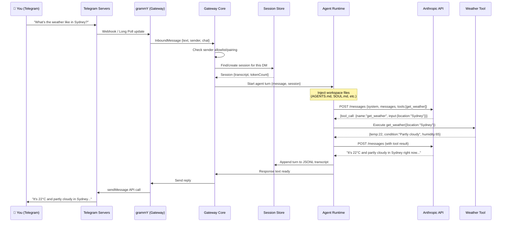

# End-to-End Message Flow

Let's trace a single message — "What's the weather like in Sydney?" — from the moment you type it on your phone to the moment you get a response. This will make everything concrete.

---

## The Setup

- You're messaging via **Telegram**
- Your agent is running on a **Mac Mini**
- The LLM is **Claude Sonnet 4.6** (Anthropic)
- A **weather skill** is loaded that adds a `get_weather` tool

---

## Full Flow Diagram



Let's walk through each step in detail.

---

## Step 1: You Send a Message

You type in Telegram on your phone and hit send. Telegram's servers receive the message and need to deliver it to your bot.

---

## Step 2: Delivery to Gateway

Telegram delivers the message via one of two mechanisms:

**Long polling** (default for most setups):
```
Gateway → Telegram: "any updates since offset X?"
Telegram → Gateway: [update: message from user 123456789]
```

**Webhook** (faster, requires HTTPS endpoint):
```
Telegram → Gateway: POST /webhook {update: message...}
```

grammY (the Telegram library) handles this transparently. Either way, the Gateway receives a structured `Update` object.

---

## Step 3: Channel Manager Processes It

The Telegram channel plugin:

1. **Validates** the update (is it a message? from whom?)
2. **Checks the allowlist**: Is `123456789` in `channels.telegram.allowFrom`?
   - If not: sends a pairing code and drops the message
3. **Wraps** it in OpenClaw's `InboundMessage` format:

```javascript
{
  text: "What's the weather like in Sydney?",
  sender: "telegram:123456789",
  chat: "telegram:dm:123456789",
  channel: "telegram",
  timestamp: 1709042400000,
  media: null
}
```

4. **Marks the inbound content as untrusted** — any LLM prompt will have this message wrapped in safety markers to prevent prompt injection.

---

## Step 4: Session Lookup

The Gateway determines the session key based on `dmScope`. With the default `main` scope:

```
session key: "agent:main:main"
```

The Session Store looks up `~/.openclaw/agents/main/sessions/sessions.json`:
- Found: loads the existing session ID
- Not found: creates a new session

It then loads (or starts) the **JSONL transcript file** for this session. This file contains every previous message and tool call in this conversation.

---

## Step 5: Agent Turn Begins

The Agent Runtime starts a new turn with:

```javascript
{
  session: { id: "ses_xyz", tokenCount: 12543 },
  message: { role: "user", content: "What's the weather like in Sydney?" },
  tools: [...all registered tools...],
}
```

**Bootstrap injection**: If this is the first turn of a new session, the workspace files (AGENTS.md, SOUL.md, TOOLS.md, USER.md, IDENTITY.md) are prepended to the system prompt.

The system prompt looks something like:

```
<system>
[AGENTS.md content]
[SOUL.md content]
[TOOLS.md content]
[USER.md content]

## Available Skills
<available_skills>
  <skill name="weather">Get weather forecasts...</skill>
  ...
</available_skills>

## Current Date & Time
Time zone: Australia/Sydney
...
</system>
```

---

## Step 6: First LLM Call

The agent calls Anthropic's Messages API:

```http
POST https://api.anthropic.com/v1/messages
Authorization: Bearer sk-ant-...
Content-Type: application/json

{
  "model": "claude-sonnet-4-6",
  "max_tokens": 8096,
  "system": "...",
  "messages": [
    {"role": "user", "content": "What's the weather like in Sydney?"}
  ],
  "tools": [
    {
      "name": "get_weather",
      "description": "Get current weather for a location",
      "input_schema": {"type": "object", "properties": {"location": {"type": "string"}}}
    }
  ]
}
```

Anthropic returns a **tool call**:

```json
{
  "stop_reason": "tool_use",
  "content": [
    {
      "type": "tool_use",
      "id": "toolu_01Abc...",
      "name": "get_weather",
      "input": {"location": "Sydney"}
    }
  ]
}
```

---

## Step 7: Tool Execution

The Tool Engine receives the `get_weather` call. Based on tool policy:

- **Sandboxed tools** (exec): run in a restricted environment
- **Skill tools**: run their registered handler function

The weather skill calls its API and returns:

```json
{
  "location": "Sydney, NSW, AU",
  "temperature": 22,
  "feels_like": 20,
  "condition": "Partly cloudy",
  "humidity": 65,
  "wind_kph": 15
}
```

---

## Step 8: Second LLM Call

The tool result is appended to the conversation and sent back to Anthropic:

```json
{
  "messages": [
    {"role": "user", "content": "What's the weather like in Sydney?"},
    {"role": "assistant", "content": [{"type": "tool_use", "name": "get_weather", ...}]},
    {"role": "user", "content": [{"type": "tool_result", "content": "{\"temperature\": 22, ...}"}]}
  ]
}
```

Claude now responds with text:

> "It's currently 22°C (feels like 20°C) and partly cloudy in Sydney. Humidity is sitting at 65% with a light 15 km/h breeze. A nice day to be out! ☀️🌤"

---

## Step 9: Transcript Append

The completed turn is appended to the JSONL transcript:

```jsonl
{"role":"user","content":"What's the weather like in Sydney?","timestamp":"2026-02-27T..."}
{"role":"assistant","content":[{"type":"tool_use","name":"get_weather",...}],"timestamp":"..."}
{"role":"tool","content":[{"type":"tool_result","content":"{...}"}],"timestamp":"..."}
{"role":"assistant","content":"It's currently 22°C...","timestamp":"..."}
```

Token counts are updated in `sessions.json`.

---

## Step 10: Response Delivery

The response goes back through the Channel Manager → grammY → Telegram API → your phone.

If **block streaming** is enabled, chunks appear as the model generates them. Otherwise (default), the full response sends at once.

---

## What Makes This Fast?

- **In-memory session**: no DB query per turn — transcript is loaded once per session
- **Single process**: no service hops — all components live in one Node process
- **Streaming**: responses can appear progressively (when block streaming is on)
- **Local execution**: tool calls run on your machine, not a remote container

---

## What Could Go Wrong?

| Scenario | What happens |
|----------|-------------|
| Sender not on allowlist | Pairing code sent, message dropped |
| LLM API rate limited | Exponential backoff retry (configurable) |
| Tool execution fails | Error returned as tool result, agent gets to decide next step |
| Context window full | Auto-compaction kicks in, older history summarized |
| Network disconnect | Channel reconnects with exponential backoff |
| Gateway crash | Daemon supervisor (launchd/systemd) restarts it |

---

## Summary

The full round-trip for a single message:

1. 📱 User → Telegram → Gateway (grammY long poll/webhook)
2. 🔒 Allowlist/pairing check
3. 📂 Session lookup (JSONL transcript)
4. 🤖 Agent turn: inject workspace context
5. ☁️ LLM API call (Anthropic/OpenAI/etc.)
6. 🔧 Tool calls (0 or more times)
7. 📝 Transcript append
8. 📱 Response → Telegram → User

Typical latency: **1–5 seconds** (dominated by LLM API time).

---

> **Exercise:** Look at your own session transcript. Open `~/.openclaw/agents/main/sessions/` and find the latest `.jsonl` file. Open it and read through a few turns. Notice how tool calls and tool results are structured.

---

In the next module, we'll go deep on the **Gateway Architecture** — the WebSocket control plane, session management, and how channels plug in.
