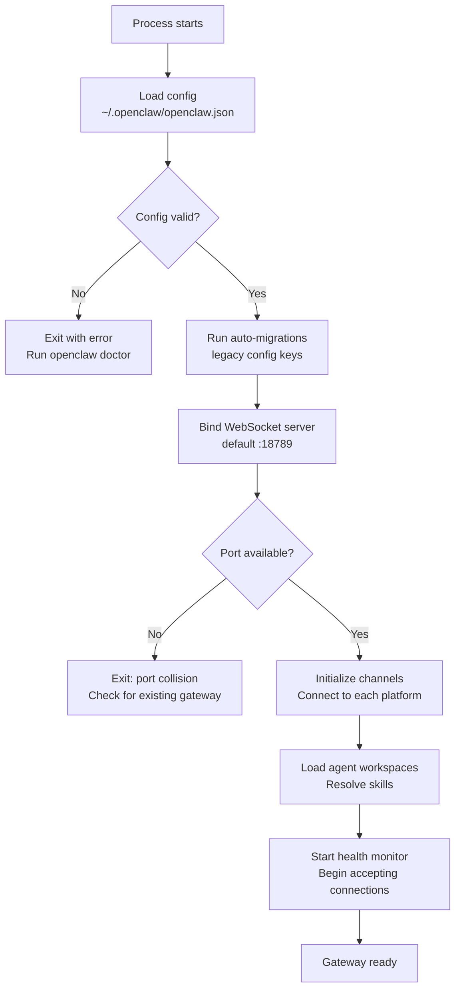

# The Gateway Daemon

The Gateway is a **long-lived Node.js process** — the beating heart of your OpenClaw setup. It owns every channel connection, every session, every agent loop. When it's running, your AI is alive. When it stops, everything stops.

In this lesson, we'll look at how the Gateway starts, how it stays running, how to check its health, and where it puts its logs.

---

## Daemon Management: launchd and systemd

OpenClaw doesn't just run in a terminal tab — it installs itself as a **system service** so it survives reboots, crashes, and closed laptops.

| Platform | Supervisor | Service type |
|----------|-----------|--------------|
| macOS | launchd | User agent (`~/Library/LaunchAgents/`) |
| Linux | systemd | User service (`~/.config/systemd/user/`) |
| Windows | schtasks | Scheduled task (WSL2 recommended) |

### Installing the daemon

When you run onboarding, it offers to install the service for you:

```bash
openclaw onboard --install-daemon
```

Or install it explicitly:

```bash
openclaw gateway install
```

This writes a service definition that tells your OS to:
1. Start the Gateway automatically on login/boot
2. Restart it if it crashes
3. Run it under your user account (not root)

### macOS (launchd)

On macOS, the service is a **LaunchAgent** — a plist file that launchd watches:

```bash
# View the installed plist
cat ~/Library/LaunchAgents/ai.openclaw.gateway.plist

# Manual start/stop (rarely needed)
launchctl load ~/Library/LaunchAgents/ai.openclaw.gateway.plist
launchctl unload ~/Library/LaunchAgents/ai.openclaw.gateway.plist
```

launchd will auto-restart the process if it exits unexpectedly. The `KeepAlive` flag ensures the Gateway comes back up after a crash.

### Linux (systemd)

On Linux, OpenClaw installs a **user-level systemd service**:

```bash
# Check service status
systemctl --user status openclaw-gateway

# Restart
systemctl --user restart openclaw-gateway

# View logs
journalctl --user -u openclaw-gateway -f
```

One important gotcha: systemd user services only run while you're logged in — unless you enable **lingering**:

```bash
loginctl enable-linger $USER
```

`openclaw doctor` checks for this and will prompt you to fix it.

---

## The Startup Sequence

When the Gateway process starts, it follows a deterministic sequence. Understanding this helps you debug startup failures.



Let's walk through each phase:

### 1. Config Load

The Gateway reads `~/.openclaw/openclaw.json` (JSON5 format). If it finds **legacy config keys** (from older versions), it auto-migrates them in-memory and writes the updated config back. This is the same migration that `openclaw doctor` performs manually.

### 2. WebSocket Bind

The Gateway binds its WebSocket server to the configured port (default `18789`). This is the single control plane for all clients — CLI, macOS app, Web UI, iOS/Android nodes.

```
ws://127.0.0.1:18789
```

If the port is already in use (another Gateway, an SSH tunnel, etc.), the process exits immediately. You can diagnose this with:

```bash
openclaw doctor    # checks for port collisions
lsof -i :18789    # see what's using the port
```

### 3. Channel Initialization

Each configured channel starts its connection:
- **Telegram**: begins long-polling (or registers webhook)
- **WhatsApp**: loads Baileys auth state, connects to WhatsApp Web
- **Discord**: connects to Discord Gateway WebSocket
- **Slack**: opens Socket Mode connection

Channels that fail to connect don't crash the Gateway — they log errors and retry with exponential backoff.

### 4. Agent + Skills

Workspaces are resolved for each configured agent. Skills (bundled, managed, workspace) are loaded and snapshotted. Bootstrap context files (AGENTS.md, SOUL.md, etc.) are validated.

### 5. Ready

The Gateway is now accepting inbound messages and WebSocket connections. It writes a **gateway lock file** to prevent duplicate instances.

---

## The Gateway Lock

Only one Gateway should run per state directory. OpenClaw enforces this with a lock mechanism:

```
~/.openclaw/gateway.lock
```

If a second Gateway process tries to start, it detects the lock and exits. If the lock is stale (from a crash), the new process reclaims it.

This is why you'll sometimes see "Gateway already running" — it's the lock doing its job. If you're sure nothing is running, `openclaw doctor` can help clean up a stale lock.

---

## Health Checks

OpenClaw provides multiple ways to check Gateway health:

### Quick status

```bash
openclaw status
```

This prints a local summary: Gateway reachability, channel auth age, session count, and recent activity. It doesn't probe the running Gateway process.

### Full local diagnosis

```bash
openclaw status --all
```

Full local state read — safe to paste for debugging. Includes everything from `status` plus config details.

### Deep probe

```bash
openclaw status --deep
```

This actually **connects to the running Gateway** via WebSocket and runs per-channel probes. Use this when something isn't working.

### Health JSON

```bash
openclaw health --json
```

Asks the Gateway for a structured health snapshot — linked creds, per-channel probe summaries, session store status, probe duration. Exits non-zero if the Gateway is unreachable.

### In-chat check

Send `/status` as a message in WhatsApp or WebChat to get a status reply without invoking the agent.

| Command | What it does | Connects to Gateway? |
|---------|-------------|---------------------|
| `openclaw status` | Local state summary | No |
| `openclaw status --all` | Full local diagnosis | No |
| `openclaw status --deep` | Per-channel probes | Yes (WebSocket) |
| `openclaw health --json` | Structured health snapshot | Yes (WebSocket) |
| `/status` in chat | In-band status reply | Yes (via channel) |

---

## Log Locations

OpenClaw has two log surfaces — understanding where to look saves hours of debugging.

### File Logs (JSON lines)

```bash
# Default location — one file per day
/tmp/openclaw/openclaw-YYYY-MM-DD.log
```

Each line is a JSON object. Dates follow the gateway host's local timezone.

Tail them live:

```bash
openclaw logs --follow
```

Or from the Control UI: the Logs tab tails this file via the Gateway's `logs.tail` WebSocket method.

### Console Output

What you see in the terminal when running `openclaw gateway` directly. This is formatted for humans — colored, prefixed by subsystem.

```
[gateway]       Gateway listening on ws://127.0.0.1:18789
[telegram]      Bot connected: @your_bot
[whatsapp]      Session restored from disk
[agent/main]    Workspace loaded: ~/.openclaw/workspace
```

### Configuring Log Levels

```json5
{
  logging: {
    level: "info",           // File log level: trace | debug | info | warn | error
    file: "/tmp/openclaw/",  // Log directory
    consoleLevel: "info",    // Console verbosity (independent of file)
    consoleStyle: "pretty",  // pretty | compact | json
  },
}
```

Key insight: `--verbose` on the CLI only affects **console verbosity** — it does not change the file log level. If you need verbose details in file logs, set `logging.level` to `debug` or `trace`.

### Verbose Mode

Run the Gateway with verbose output to see all WebSocket traffic:

```bash
# See all WS request/response traffic (compact format)
openclaw gateway --verbose --ws-log compact

# See all WS traffic with full metadata
openclaw gateway --verbose --ws-log full
```

Without `--verbose`, the Gateway only prints "interesting" events: errors, slow calls (>=50ms), and parse errors.

---

## Graceful Shutdown and Restart

### In-place restart

The Gateway supports **in-place restart** via `SIGUSR1`. This is what happens when you run:

```bash
openclaw gateway restart
```

The process tears down channels, reloads config, and reinitializes — without losing the PID or the service supervisor connection.

### Graceful shutdown

On `SIGTERM` or `SIGINT`, the Gateway:
1. Stops accepting new messages
2. Waits for in-flight agent turns to complete (with a timeout)
3. Closes channel connections
4. Releases the gateway lock
5. Exits cleanly

The service supervisor (launchd/systemd) then decides whether to restart based on its configuration.

---

## openclaw doctor

`openclaw doctor` is your first-line diagnostic and repair tool. Run it whenever something feels off.

```bash
openclaw doctor           # Interactive — prompts for fixes
openclaw doctor --yes     # Accept default repairs
openclaw doctor --repair  # Apply repairs without prompting
openclaw doctor --deep    # Scan for extra gateway installs
```

What it checks:

| Check | What it does |
|-------|-------------|
| Config normalization | Migrates legacy keys to current schema |
| State integrity | Verifies sessions, transcripts, permissions |
| Model auth health | Checks OAuth expiry, refreshes tokens |
| Sandbox images | Validates Docker images if sandboxing enabled |
| Service config | Audits launchd/systemd for missing defaults |
| Port collisions | Checks if `18789` is already in use |
| Channel probes | Tests connectivity on each enabled channel |
| Security warnings | Flags open DM policies, missing auth tokens |
| Runtime checks | Warns about Bun usage, version-manager paths |

> **Key Takeaway:** `openclaw doctor` is not just a diagnostic — it actively repairs. Legacy configs, stale state, missing service files, expired OAuth tokens — it handles all of it. Make it your first reflex when troubleshooting.

---

## Common Startup Issues

| Symptom | Likely cause | Fix |
|---------|-------------|-----|
| "Port 18789 already in use" | Another Gateway or SSH tunnel | `lsof -i :18789` then kill the occupant |
| "Config validation failed" | Bad JSON5 or unknown keys | `openclaw doctor` to migrate/fix |
| Gateway starts but no channel messages | Channel not configured or auth expired | `openclaw status --deep` to probe |
| "Service not running" after reboot | systemd linger not enabled (Linux) | `loginctl enable-linger $USER` |
| WhatsApp "logged out" | Session expired or 515 error | `openclaw channels logout && openclaw channels login` |

---

## Exercises

1. **Check your daemon status**: Run `openclaw status --all` and identify which channels are connected and what agent(s) are configured. Note the Gateway port and session count.

2. **Read the file logs**: Open today's log file at `/tmp/openclaw/openclaw-YYYY-MM-DD.log`. Find a `web-inbound` entry and trace the corresponding response. How many tool calls did the agent make?

3. **Run doctor**: Execute `openclaw doctor` and review each check it performs. Note any warnings or migrations it offers.

---

In the next lesson, we'll dig into the **WebSocket protocol** — the wire format that every client speaks to communicate with the Gateway.
