# The Gateway daemon

The Gateway isn't a script you run once. It's a long-lived process — the control plane that holds your entire AI setup together. Know what it owns and the rest of this module falls into place.

---

## What is the Gateway?

The Gateway is a **Node.js process** that runs continuously in the background on your machine. You start it once (usually at login, via a system service) and it stays alive indefinitely:

- Connections to messaging channels (Telegram, WhatsApp, Discord, etc.)
- Conversation sessions for every user
- The agent runtime that calls LLMs
- Tool execution (shell commands, browser, file reads)
- A WebSocket API for control clients (CLI, Web UI, macOS app)

It lives at a single address:

```
ws://127.0.0.1:18789       ← WebSocket control plane
http://127.0.0.1:18789/__openclaw__/canvas/  ← Canvas UI
```

> **Note:** The default port is `18789`. You can change it with `gateway.port` in your config, but most users never need to.

No microservice mesh, no Redis, no PostgreSQL. Just Node.js and files.

---

## How the Gateway starts

### macOS — launchd

On macOS, OpenClaw installs a **launchd user agent**. It starts at login and restarts automatically if it crashes.

```bash
# Install the service (done once during setup)
openclaw gateway install

# Manual control
openclaw gateway start
openclaw gateway stop
openclaw gateway restart

# Check status
openclaw gateway status
```

The launchd plist lives at:
```
~/Library/LaunchAgents/ai.openclaw.gateway.plist
```

> **Warning:** Avoid using `launchctl restart` directly — use `openclaw gateway restart` instead, or `launchctl stop` + `launchctl start` with a sleep between them. The `restart` subcommand can race on some macOS versions.

### Linux — systemd

On Linux, the Gateway installs as a **systemd user service**:

```bash
openclaw gateway install    # creates ~/.config/systemd/user/openclaw-gateway.service
systemctl --user status openclaw-gateway
```

On servers without a persistent login session, enable systemd "linger" so the service survives logout:

```bash
loginctl enable-linger $USER
```

`openclaw doctor` will warn you if linger isn't enabled.

### Docker

Running in a container? The Gateway starts with:

```bash
docker run -d \
  -v ~/.openclaw:/root/.openclaw \
  -p 18789:18789 \
  openclaw/openclaw:latest
```

The Gateway process runs in the foreground inside the container; Docker/Compose manages restart policy.

---

## What the Gateway owns

The Gateway owns four domains:

```mermaid
graph TB
    GW["🏠 Gateway"]
    
    GW --> CH["📨 Channel Manager\n(WhatsApp, Telegram,\nDiscord, Slack, ...)"]
    GW --> SS["📂 Session Store\n(JSONL transcripts,\nrouting state)"]
    GW --> AR["🤖 Agent Runtime\n(pi-mono, LLM calls,\ntool execution)"]
    GW --> WS["🔌 WebSocket API\n(CLI, Web UI,\nmacOS App, Nodes)"]

    CH --> SS
    SS --> AR
    AR --> CH
```



### 1. Channel Manager

Each channel (Telegram, WhatsApp, Discord, etc.) has a **plugin** that handles the platform-specific protocol. The Channel Manager:

- Maintains persistent connections to each platform
- Validates inbound senders (allowlist / pairing)
- Normalizes messages into OpenClaw's internal `InboundMessage` format
- Routes normalized messages to the Session Manager
- Delivers outbound responses back to the platform

### 2. Session Store

Sessions are the unit of conversation continuity. The Gateway owns the mapping from `(channel, sender)` → `session key` → JSONL transcript file. Lesson 3 covers sessions in depth.

### 3. Agent Runtime

The agent (built on **pi-mono**) calls the LLM and executes tools. The Gateway wraps pi-mono with:

- Custom tool wiring (browser, canvas, nodes, cron, messaging tools)
- Workspace bootstrap injection (AGENTS.md, SOUL.md, etc.)
- Skill loading (bundled + managed + workspace skills)
- Auto-compaction (context window management)
- Memory flush (pre-compaction note-writing)

### 4. WebSocket API

The Gateway exposes a typed WebSocket API on port 18789. Control clients — the CLI, the Web UI, the macOS menu bar app, and paired mobile nodes — all connect here. Lesson 2 traces this protocol.

---

## The event loop: how a message becomes a response

When a message arrives, the Gateway processes it through a pipeline:


Key properties of this pipeline:

- Runs are queued per session, not parallelized. Session 1 can run while Session 2 queues another turn, but no two turns for the same session overlap.
- The transcript loads into memory once per session. No per-turn database queries.
- Channel, session, agent, and tool all run in the same Node.js process. No inter-service network hops.

### Queue modes

When a new message arrives while a turn is running, the Gateway has three strategies:

| Mode | Behavior |
|------|----------|
| `followup` | Hold the message until the current turn ends, then start a new turn |
| `collect` | Collect multiple incoming messages and batch them into one turn |
| `steer` | Inject the new message into the current running turn (after the next tool call) |

The default is `followup`. Configure with `messages.queue.mode` in `openclaw.json`.

---

## Crash recovery and restarts

The system service (launchd/systemd) acts as a supervisor:

- **Crash**: automatically restarts the Gateway after a brief delay
- **On restart**: channels reconnect, sessions resume from their on-disk JSONL transcripts
- **In-progress turns**: any turn running when the Gateway crashed is lost — the session is clean on restart, but the incomplete turn won't be replayed

This "stateless restart" behavior is by design. Sessions are durable (JSONL on disk). In-flight work is not. Design your workflows accordingly.

> **Tip:** If the Gateway seems stuck, `openclaw gateway restart` is always safe. Sessions survive the restart.

---

## Gateway health

Check that everything is running:

```bash
openclaw gateway status        # running/stopped + port
openclaw channels status       # connection state per channel
openclaw doctor                # full health + config audit
```

`openclaw doctor` is the comprehensive health check tool — it validates config, checks for stale state, migrates legacy formats, and warns about security issues. Run it whenever something seems off or after an upgrade.

---

## Summary

| Aspect | Detail |
|--------|--------|
| Runtime | Long-lived Node.js process |
| Startup | launchd (macOS), systemd (Linux), Docker |
| Port | `18789` (WebSocket + HTTP) |
| State | `~/.openclaw/` (files, no database) |
| Crash recovery | Supervisor restarts; sessions resume from JSONL |
| Concurrency | Serialized per session, global concurrency via `maxConcurrent` |

---

> **Exercise:** Check your Gateway is running and healthy.
> 1. Run `openclaw gateway status` — confirm it shows "running"
> 2. Run `openclaw channels status` — see which channels are connected
> 3. Run `openclaw doctor` — read any warnings it surfaces
>
> If the Gateway isn't running, start it with `openclaw gateway start`.

---

The next lesson covers the WebSocket protocol — how clients connect to the Gateway and what the message framing looks like.
