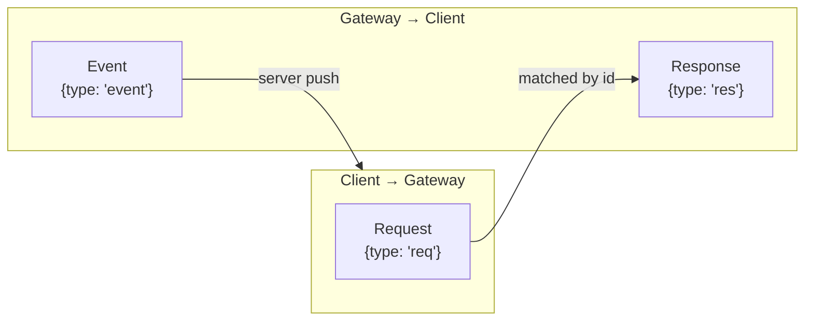
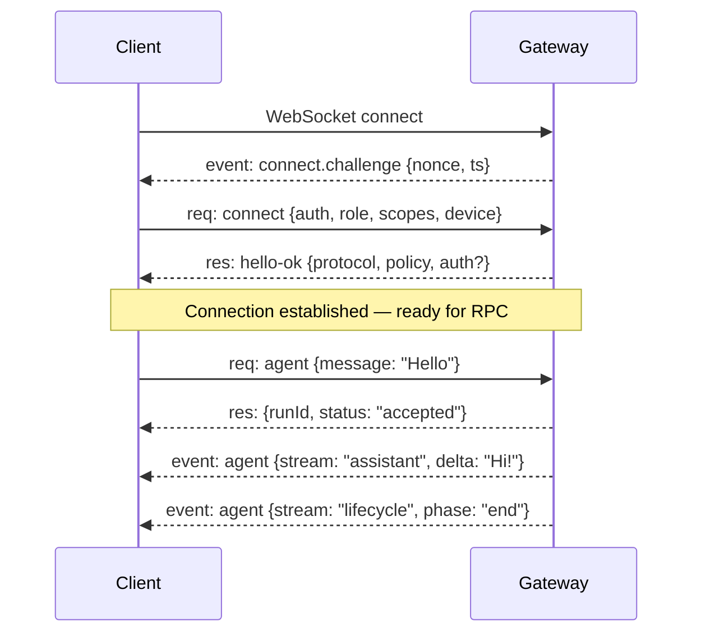

# WebSocket Protocol

Every client that talks to the Gateway — CLI, macOS app, Web UI, iOS node, Android node, headless automation — speaks the same language: a typed, schema-validated WebSocket protocol.

This is the **single control plane** for OpenClaw. Understanding the wire format helps you debug connection issues, build custom integrations, and reason about what's happening under the hood.

---

## Why WebSocket?

HTTP REST would mean request-response only — no server push. gRPC would add complexity and tooling. WebSocket gives OpenClaw:

- **Bidirectional**: Gateway pushes events (agent deltas, tool progress, presence changes) without polling
- **Persistent**: one connection, no reconnect overhead per request
- **Simple**: JSON text frames, readable in any WebSocket debugger
- **Universal**: works from browsers, CLI, mobile apps, IoT devices

The Gateway listens on a single port (default `18789`):

```
ws://127.0.0.1:18789
```

All traffic — control commands, agent messages, node capabilities, streaming responses — flows through this one socket.

---

## Frame Types

Every WebSocket message is a JSON text frame. There are exactly **three frame types**:



### Request

Client sends a request, expects exactly one response:

```json
{
  "type": "req",
  "id": "req_001",
  "method": "agent",
  "params": {
    "message": "What's the weather?",
    "sessionKey": "agent:main:main"
  }
}
```

| Field | Type | Description |
|-------|------|-------------|
| `type` | `"req"` | Always `"req"` |
| `id` | string | Client-generated unique ID for correlation |
| `method` | string | The RPC method name |
| `params` | object | Method-specific parameters |

### Response

Gateway responds with the same `id`:

```json
{
  "type": "res",
  "id": "req_001",
  "ok": true,
  "payload": {
    "runId": "run_abc123",
    "status": "accepted"
  }
}
```

| Field | Type | Description |
|-------|------|-------------|
| `type` | `"res"` | Always `"res"` |
| `id` | string | Matches the request `id` |
| `ok` | boolean | `true` = success, `false` = error |
| `payload` | object | Success payload (when `ok: true`) |
| `error` | object | Error details (when `ok: false`) |

### Event

Gateway pushes events without a preceding request:

```json
{
  "type": "event",
  "event": "agent",
  "payload": {
    "stream": "assistant",
    "delta": "It's 22°C and partly cloudy..."
  },
  "seq": 42,
  "stateVersion": 7
}
```

| Field | Type | Description |
|-------|------|-------------|
| `type` | `"event"` | Always `"event"` |
| `event` | string | Event category name |
| `payload` | object | Event-specific data |
| `seq` | number? | Optional sequence number for ordering |
| `stateVersion` | number? | Optional state version for optimistic UI |

---

## Connection Lifecycle

The connection follows a strict handshake protocol. The first frame **must** be a `connect` request — anything else and the Gateway closes the socket.



### Step 1: Challenge

The Gateway sends a `connect.challenge` event immediately after WebSocket upgrade:

```json
{
  "type": "event",
  "event": "connect.challenge",
  "payload": { "nonce": "a1b2c3d4...", "ts": 1737264000000 }
}
```

### Step 2: Connect Request

The client must respond with a `connect` request that includes auth, role, and device identity:

```json
{
  "type": "req",
  "id": "init_1",
  "method": "connect",
  "params": {
    "minProtocol": 3,
    "maxProtocol": 3,
    "client": {
      "id": "cli",
      "version": "1.2.3",
      "platform": "macos",
      "mode": "operator"
    },
    "role": "operator",
    "scopes": ["operator.read", "operator.write"],
    "auth": { "token": "your-gateway-token" },
    "device": {
      "id": "device_fingerprint",
      "publicKey": "...",
      "signature": "...",
      "signedAt": 1737264000000,
      "nonce": "a1b2c3d4..."
    }
  }
}
```

The `device` block signs the server's challenge nonce, proving the client controls the private key.

### Step 3: Hello

The Gateway validates auth, checks the protocol version, and responds:

```json
{
  "type": "res",
  "id": "init_1",
  "ok": true,
  "payload": {
    "type": "hello-ok",
    "protocol": 3,
    "policy": { "tickIntervalMs": 15000 },
    "auth": {
      "deviceToken": "dt_...",
      "role": "operator",
      "scopes": ["operator.read", "operator.write"]
    }
  }
}
```

If a **device token** is issued, the client should persist it for future connects (avoiding re-pairing).

---

## Roles and Scopes

Clients declare their role at connect time. This determines what they can do.

### Roles

| Role | Purpose | Examples |
|------|---------|---------|
| `operator` | Control plane client | CLI, Web UI, macOS app, automation scripts |
| `node` | Capability host | iOS app, Android app, headless Mac node |

### Operator Scopes

| Scope | What it grants |
|-------|---------------|
| `operator.read` | Read status, sessions, logs |
| `operator.write` | Send messages, trigger agent runs |
| `operator.admin` | Config changes, restart, update |
| `operator.approvals` | Approve/deny exec requests |
| `operator.pairing` | Manage device pairing |

### Node Capabilities

Nodes declare what hardware/software they can offer:

```json
{
  "role": "node",
  "caps": ["camera", "canvas", "screen", "location", "voice"],
  "commands": ["camera.snap", "canvas.navigate", "screen.record"],
  "permissions": {
    "camera.capture": true,
    "screen.record": false
  }
}
```

The Gateway treats these as **claims** and enforces server-side allowlists. Just because a node says it can record the screen doesn't mean the Gateway will let it.

---

## Event Types

Once connected, the Gateway pushes events as things happen. The main event categories:

| Event | When it fires | Key payload fields |
|-------|--------------|-------------------|
| `agent` | Agent streaming output | `stream` (assistant/tool/lifecycle), `delta`, `done` |
| `exec.approval.requested` | Exec needs human approval | `command`, `sessionKey`, `agentId` |
| `system-presence` | Device connects/disconnects | `deviceId`, `roles`, `scopes` |
| `channel.*` | Channel state changes | Channel-specific status |

### Agent stream events

Agent events are the most common. They use a `stream` field to distinguish content types:

```json
// Assistant text delta
{"type":"event","event":"agent","payload":{"stream":"assistant","delta":"Here's what I found..."}}

// Tool call start
{"type":"event","event":"agent","payload":{"stream":"tool","phase":"start","name":"exec","input":{"command":"ls"}}}

// Tool call result
{"type":"event","event":"agent","payload":{"stream":"tool","phase":"end","name":"exec","result":"file1.txt\nfile2.txt"}}

// Agent turn complete
{"type":"event","event":"agent","payload":{"stream":"lifecycle","phase":"end"}}

// Agent turn error
{"type":"event","event":"agent","payload":{"stream":"lifecycle","phase":"error","error":"Rate limited"}}
```

---

## Idempotency Keys

Side-effecting requests (anything that changes state) require **idempotency keys**. This is what makes the protocol safe to retry.

Why it matters: if your WebSocket drops mid-request, you need to reconnect and retry. Without idempotency, the retry might execute the operation twice (send a message twice, start an agent turn twice). With an idempotency key, the Gateway recognizes the retry and returns the cached response.

```json
{
  "type": "req",
  "id": "req_042",
  "method": "agent",
  "params": {
    "message": "Deploy to production",
    "idempotencyKey": "idem_7f3a2b..."
  }
}
```

If the Gateway has already processed `idem_7f3a2b...`, it returns the original response without re-executing.

> **Key Takeaway:** Idempotency keys are what make OpenClaw's WebSocket protocol **reliable over unreliable networks**. Every mutating operation should include one. The client libraries handle this automatically, but if you're building a custom integration, don't skip it.

---

## Authentication

The Gateway supports multiple auth mechanisms:

### Token auth

Set a Gateway token in your config:

```json5
{
  gateway: {
    auth: {
      token: "your-secret-token"
    }
  }
}
```

Clients include it in the connect request:

```json
{ "auth": { "token": "your-secret-token" } }
```

If the token doesn't match, the socket is closed immediately.

### Device pairing

New devices go through a pairing flow:
1. Device connects with its public key
2. Gateway broadcasts a pairing approval request
3. An operator client approves/rejects
4. On approval, a device token is issued

This is how iOS/Android nodes get authorized — you scan a QR code or enter a pairing code, and the operator (you, via CLI or macOS app) approves it.

### Challenge signing

All connections sign the server's challenge nonce with the device private key. This proves the client controls the key that was registered during pairing.

---

## Protocol Versioning

The protocol version is a single integer. Clients declare the range they support:

```json
{
  "minProtocol": 3,
  "maxProtocol": 3
}
```

The Gateway picks the highest version both sides support. If there's no overlap, the connection is rejected.

This allows:
- Clients to upgrade independently of the Gateway
- The Gateway to support older clients during transitions
- Clean rejection of incompatible clients with actionable errors

The protocol schemas are generated from **TypeBox** definitions in the source code. This means the schema is the single source of truth — TypeScript types, validation, and documentation all flow from the same definition.

---

## Presence

The Gateway tracks which devices are connected and their roles:

```json
{
  "type": "event",
  "event": "system-presence",
  "payload": {
    "devices": {
      "device_abc": {
        "deviceId": "device_abc",
        "roles": ["operator", "node"],
        "scopes": ["operator.read", "operator.write"]
      }
    }
  }
}
```

Presence is keyed by device identity, so a single device that connects as both operator and node shows as one entry.

---

## Debugging the Protocol

### Watch live traffic

```bash
# Compact paired request/response view
openclaw gateway --verbose --ws-log compact

# Full per-frame output
openclaw gateway --verbose --ws-log full
```

### What normal mode shows

Without `--verbose`, the Gateway only logs:
- Errors (`ok: false`)
- Slow calls (>=50ms)
- Parse errors

This keeps output clean during normal operation while surfacing problems immediately.

---

## Exercises

1. **Watch the wire**: Run `openclaw gateway --verbose --ws-log compact` in one terminal. In another, run `openclaw status --deep`. Watch the WebSocket frames fly by. Identify the `connect` handshake, the status request, and the health probe responses.

2. **Inspect an agent turn**: Send a message via Telegram or WebChat while watching verbose output. Count the frames: how many events does a single agent turn generate? Look for `lifecycle.start`, assistant deltas, tool events, and `lifecycle.end`.

3. **Think about retry safety**: Imagine your WiFi drops while the agent is mid-turn. The client reconnects and retries. What would happen without idempotency keys? What does the Gateway do with the retry when the key matches?

---

In the next lesson, we'll look at the **Session Store** — how conversations are persisted, keyed, and maintained on disk.
