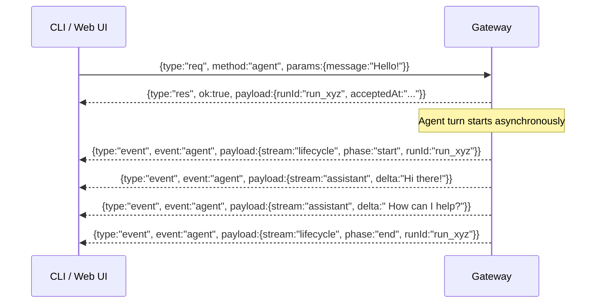

# WebSocket protocol

The Gateway exposes a single WebSocket endpoint that every control client connects to — the CLI, the Web UI, the macOS menu bar app, and mobile nodes. Knowing the protocol helps when you hit connection issues and gives you a solid mental model of what the control plane is actually doing.

---

## What connects via WebSocket

The Gateway's WebSocket API is used by three kinds of clients:

| Client | Role | What it does |
|--------|------|-------------|
| **CLI** (`openclaw`) | Control | Send agent messages, read streaming responses, manage sessions |
| **Web UI / macOS App** | Control | Full conversation UI, session management, config |
| **Nodes** (iOS, Android) | Node | Camera, screen, location, Canvas, Talk Mode |

All three connect to the same address:

```
ws://127.0.0.1:18789
```

Control clients declare `role: "control"`. Nodes declare `role: "node"` during the handshake.

> **Remote Gateways:** If your Gateway is on a remote server (VPS, Mac Mini at home), the CLI connects via `wss://` over a secure tunnel (Tailscale, SSH tunnel, or HTTPS reverse proxy). Local connections never need TLS.

---

## The handshake

Every connection starts with a `connect` request:

```json
{
  "type": "req",
  "id": "req_001",
  "method": "connect",
  "params": {
    "role": "control",
    "version": "2026.1.0",
    "clientId": "cli-abc123"
  }
}
```

The Gateway responds with a snapshot of current state:

```json
{
  "type": "res",
  "id": "req_001",
  "ok": true,
  "payload": {
    "snapshot": {
      "sessions": [...],
      "channels": {...},
      "agents": [...],
      "runningRuns": [...]
    }
  }
}
```

If authentication is configured (`gateway.auth.token`), the connection must include the token in the `params` or the Gateway returns `ok: false` and closes the socket.

---

## Message framing

The protocol uses three message types, all JSON over WebSocket:

### 1. Requests (client → gateway)

```json
{
  "type": "req",
  "id": "req_<unique>",
  "method": "agent",
  "params": { ... }
}
```

Every request has a unique `id`. Responses are matched by `id`. Mutating requests can include an `idempotencyKey` — safe to retry without double-execution.

### 2. Responses (gateway → client)

```json
{
  "type": "res",
  "id": "req_<same id>",
  "ok": true,
  "payload": { ... }
}
```

Or on error:

```json
{
  "type": "res",
  "id": "req_<same id>",
  "ok": false,
  "error": {
    "code": "NOT_FOUND",
    "message": "Session not found"
  }
}
```

### 3. Events (gateway → client, server-push)

Events are not tied to a request. The Gateway emits them when things happen:

```json
{
  "type": "event",
  "event": "agent",
  "payload": {
    "runId": "run_xyz",
    "stream": "assistant",
    "delta": "It's 22°C in Sydney right now..."
  }
}
```

Common event types:

| Event | When it fires |
|-------|--------------|
| `agent` | Agent run lifecycle, streaming deltas, tool events |
| `channel` | Channel connection state changes |
| `session` | Session created, updated, or compacted |
| `node` | Node connected, disconnected, or sent data |
| `gateway` | Gateway startup/shutdown events |

---

## Sending an agent message

Here's the full request-response-event flow for asking the agent a question:



The `agent` method returns **immediately** with `{runId, acceptedAt}`. The actual response comes via streaming events.

If you need to **wait** for completion (e.g., in a script), use `agent.wait`:

```json
{
  "type": "req",
  "id": "req_002",
  "method": "agent.wait",
  "params": {
    "runId": "run_xyz",
    "timeoutMs": 30000
  }
}
```

Returns `{status: "ok"|"error"|"timeout", startedAt, endedAt, error?}`.

---

## Streaming events in detail

The `agent` event's `payload.stream` field tells you what kind of content is coming:

| `stream` value | Meaning |
|---------------|---------|
| `lifecycle` | Run started (`phase:"start"`), ended (`phase:"end"`), or errored |
| `assistant` | Text delta from the LLM (build the response by concatenating these) |
| `tool` | Tool call started, in-progress, or completed |
| `compaction` | Auto-compaction triggered |

A tool event looks like:

```json
{
  "type": "event",
  "event": "agent",
  "payload": {
    "runId": "run_xyz",
    "stream": "tool",
    "tool": {
      "phase": "start",
      "name": "read",
      "input": { "path": "AGENTS.md" }
    }
  }
}
```

---

## WebChat: browser-based UI

The **WebChat** channel is built into the Gateway — a browser UI that connects via WebSocket directly to `ws://127.0.0.1:18789`. No external server required.

Open it at:
```
http://127.0.0.1:18789/__openclaw__/webchat/
```

WebChat uses the exact same WebSocket protocol as the CLI. When you type a message in the browser, it sends an `agent` request; streaming deltas update the UI in real time.

> **Tip:** WebChat is always available when the Gateway is running. No Telegram bot or WhatsApp linking needed — useful for local testing before you've wired up any channels.

---

## Reconnection and session resumption

WebSocket connections can drop — your laptop sleeps, Wi-Fi hiccups, the Gateway restarts. The protocol handles this gracefully.

### Client reconnection

Control clients reconnect automatically with exponential backoff:

```json5
// Default reconnect config (in openclaw.json)
{
  web: {
    reconnect: {
      initialMs: 2000,    // first retry delay
      maxMs: 120000,      // max delay between retries
      factor: 1.4,        // backoff multiplier
      jitter: 0.2,        // randomization (±20%)
      maxAttempts: 0      // 0 = retry forever
    }
  }
}
```

After reconnecting, the client re-sends `connect` and receives a fresh snapshot — including any runs that completed while disconnected.

### What happens to in-progress runs?

If the WebSocket drops mid-run:

- The **Gateway continues the run** (it's not tied to the WebSocket connection)
- On reconnect, the `snapshot` in the `connect` response includes any `runningRuns`
- The client can attach to the run's event stream to catch up

Runs are owned by the Gateway, not by the client connection. Your question keeps getting answered even if your browser tab refreshes.

---

## Authentication

By default (local mode), the Gateway runs unauthenticated — it only listens on `127.0.0.1` so only local processes can connect.

When exposing the Gateway remotely (behind a reverse proxy or via Tailscale), enable a token:

```json5
{
  gateway: {
    auth: {
      token: "your-secret-token"
    }
  }
}
```

Clients include it as a query parameter or header. `openclaw doctor` will prompt you to generate a token if you're running in a network-accessible mode without one.

---

## Summary

| Concept | Detail |
|---------|--------|
| Endpoint | `ws://127.0.0.1:18789` (local) |
| Protocol | JSON over WebSocket; requests + responses + events |
| Agent method | Returns `{runId}` immediately; response comes via streamed events |
| Stream types | `lifecycle`, `assistant`, `tool`, `compaction` |
| Reconnection | Automatic exponential backoff; runs survive disconnections |
| Auth | Token-based (optional for local; required for remote) |

---

> **Exercise:** Watch the WebSocket protocol in action.
> 1. Open the WebChat UI: `http://127.0.0.1:18789/__openclaw__/webchat/`
> 2. Open your browser DevTools → Network → WS
> 3. Send a message to your agent
> 4. Watch the frames — find the `connect` handshake, the `agent` request, and the streaming `assistant` event deltas
>
> Notice how many small delta events build up the full response one chunk at a time.

---

The next lesson covers the Session Store — how conversations are keyed, stored, and managed across channels.
