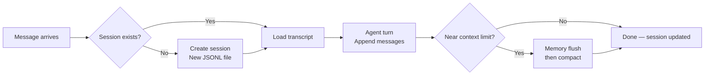

# Session Store

Sessions are OpenClaw's unit of **conversation continuity**. Every message you send, every tool call the agent makes, every response it generates — it all lands in a session. Understanding how sessions are stored, keyed, and maintained is essential for debugging, migration, and keeping your setup healthy.

---

## What Is a Session?

A session is:
- A **unique key** that identifies a conversation context
- A **JSONL transcript file** containing the full conversation history
- **Metadata** (token count, last updated, channel origin) tracked in a registry

There's no database. No Redis. No PostgreSQL. Sessions are **files on disk** — fast, simple, and inspectable with any text editor.

```
~/.openclaw/agents/main/sessions/
├── sessions.json                  ← Session registry (metadata)
├── ses_a1b2c3d4e5f6.jsonl       ← Transcript: your main DM conversation
├── ses_f7e8d9c0b1a2.jsonl       ← Transcript: a Telegram group
└── ses_1234567890ab.jsonl        ← Transcript: a Discord channel
```

---

## Session Keys

Every conversation maps to a **session key** — a deterministic string that decides which transcript file to use.

### Key format

```
agent:<agentId>:<channel>:<type>:<id>
```

| Segment | Meaning | Examples |
|---------|---------|---------|
| `agentId` | Which agent brain | `main`, `work`, `coding` |
| `channel` | Source platform | `telegram`, `discord`, `whatsapp`, `slack` |
| `type` | Chat type | `dm`, `group`, `channel` |
| `id` | Platform-specific ID | Telegram user ID, Discord channel ID, WhatsApp group JID |

### DMs collapse to main

Here's the crucial design decision: **all direct messages collapse into one session per agent**, regardless of which channel they come from.

```
WhatsApp DM  →  agent:main:main
Telegram DM  →  agent:main:main
Discord DM   →  agent:main:main
WebChat      →  agent:main:main
```

This means your Telegram conversation and your WhatsApp conversation share the same context. The agent remembers what you said on WhatsApp when you message it on Telegram. It's one brain, one memory.

### Groups stay isolated

Group conversations get their own session keys:

```
Telegram group -1001234567890     →  agent:main:telegram:group:-1001234567890
Discord channel 222222222222      →  agent:main:discord:channel:222222222222222222
WhatsApp group 120363...@g.us     →  agent:main:whatsapp:group:120363...@g.us
```

### Threads

Some platforms support threads, which create sub-sessions:

```
Slack thread   →  agent:main:slack:channel:C123456:thread:1234567890
Discord thread →  agent:main:discord:channel:123456:thread:987654
Telegram topic →  agent:main:telegram:group:-1001234567890:topic:42
```

---

## The JSONL Transcript

Each session has a **JSONL (JSON Lines) file** — one JSON object per line, appended sequentially. This is the full conversation transcript.

### Structure

```jsonl
{"role":"user","content":"What's the weather in Sydney?","timestamp":"2026-02-28T10:15:30.000Z"}
{"role":"assistant","content":[{"type":"tool_use","id":"toolu_01","name":"get_weather","input":{"location":"Sydney"}}],"timestamp":"2026-02-28T10:15:31.500Z"}
{"role":"tool","content":[{"type":"tool_result","tool_use_id":"toolu_01","content":"{\"temp\":22,\"condition\":\"Partly cloudy\"}"}],"timestamp":"2026-02-28T10:15:32.200Z"}
{"role":"assistant","content":"It's 22°C and partly cloudy in Sydney right now.","timestamp":"2026-02-28T10:15:33.800Z"}
```

Each line has:
- `role`: `user`, `assistant`, or `tool`
- `content`: the message payload (string or structured array)
- `timestamp`: when it was recorded

### Why JSONL?

| Format | Append | Read last N | Human-readable | Corruption recovery |
|--------|--------|-------------|----------------|-------------------|
| SQLite | OK | Good | No | Hard |
| Single JSON | Bad (rewrite all) | Bad (parse all) | Yes | Hard |
| **JSONL** | **Great (append)** | **Great (tail)** | **Yes** | **Great (skip bad line)** |

JSONL is the sweet spot for append-heavy conversational data:
- **Append-only**: new messages just get appended, no rewriting
- **Partial reads**: you can tail the last N lines without loading the whole file
- **Corruption-resistant**: a bad line doesn't invalidate the rest of the file
- **Inspectable**: open it in any editor, pipe it through `jq`

### Inspecting transcripts

```bash
# Find your sessions
ls ~/.openclaw/agents/main/sessions/*.jsonl

# Read the last 5 messages from a transcript
tail -5 ~/.openclaw/agents/main/sessions/ses_abc123.jsonl | jq .

# Count messages in a session
wc -l ~/.openclaw/agents/main/sessions/ses_abc123.jsonl

# Find all tool calls
grep '"tool_use"' ~/.openclaw/agents/main/sessions/ses_abc123.jsonl | jq .name
```

---

## The Session Registry

`sessions.json` is the **metadata index** — it maps session keys to session IDs and tracks stats without parsing every transcript:

```json
{
  "sessions": {
    "agent:main:main": {
      "id": "ses_a1b2c3d4e5f6",
      "tokenCount": 15432,
      "lastUpdated": "2026-02-28T10:15:33.800Z",
      "channel": "telegram",
      "compactions": 2,
      "memoryFlushDone": true
    },
    "agent:main:telegram:group:-1001234567890": {
      "id": "ses_f7e8d9c0b1a2",
      "tokenCount": 3200,
      "lastUpdated": "2026-02-27T18:30:00.000Z",
      "channel": "telegram"
    }
  }
}
```

Key fields:

| Field | Purpose |
|-------|---------|
| `id` | The session ID (maps to transcript filename) |
| `tokenCount` | Estimated token usage (for compaction decisions) |
| `lastUpdated` | Timestamp of last activity |
| `channel` | Originating channel |
| `compactions` | Number of compaction passes performed |
| `memoryFlushDone` | Whether pre-compaction memory flush has run |

---

## Session Lifecycle



1. **Creation**: first message to a new key creates the session entry and JSONL file
2. **Growth**: each turn appends user message, assistant response, and any tool calls
3. **Compaction**: when token count approaches the model's context window, older history is summarized (see Module 4)
4. **Reset**: `/new` or `/reset` starts a fresh session ID for the same key

---

## Session Management Commands

### List sessions

```bash
openclaw sessions list
```

Shows active sessions with their keys, token counts, and last activity.

### View history

```bash
openclaw sessions history --session "agent:main:main" --limit 10
```

### Reset a session

In chat, send:
```
/new          ← Start a fresh session (new ID, same key)
/reset        ← Same as /new
```

Via CLI:
```bash
openclaw sessions reset --session "agent:main:main"
```

This doesn't delete the old transcript — it creates a new session ID for the key. The old JSONL file remains on disk.

---

## Pruning and Maintenance

Over time, session files accumulate. Here's how to keep things tidy.

### Disk usage

Each message is typically 100-500 bytes in JSONL. A busy session with 1000 turns might be 200KB-1MB. Tool results (especially `exec` output) can inflate this significantly.

Check your disk usage:

```bash
du -sh ~/.openclaw/agents/*/sessions/
```

### Session pruning vs compaction

These are often confused. They're different operations:

| Operation | What it does | Persistent? | When it runs |
|-----------|-------------|-------------|-------------|
| **Compaction** | Summarizes old messages into a compact entry | Yes (written to JSONL) | Near context limit |
| **Session pruning** | Trims old tool results in-memory before LLM call | No (transient) | Each LLM request |

**Compaction** is a lossy summarization that permanently changes the transcript. **Pruning** is a temporary optimization that keeps the on-disk transcript intact while reducing what gets sent to the model.

### Manual cleanup

To remove old sessions entirely:

```bash
# List sessions to find stale ones
openclaw sessions list

# Delete a specific session's transcript
rm ~/.openclaw/agents/main/sessions/ses_oldone.jsonl
```

> **Caution:** Don't delete `sessions.json` — it's the registry. If you need to clean it up, use `openclaw doctor` which validates the registry against existing transcript files.

### Transcript integrity

`openclaw doctor` checks for:
- Session entries with **missing transcript files** (warns about data loss)
- **Main transcript with only 1 line** (history not accumulating)
- **Permission issues** on session directories
- **Multiple state directories** (split history across installs)

---

## Session Storage Paths

All session data lives under the agent's state directory:

```
~/.openclaw/
└── agents/
    ├── main/
    │   └── sessions/
    │       ├── sessions.json
    │       └── *.jsonl
    ├── work/
    │   └── sessions/
    │       ├── sessions.json
    │       └── *.jsonl
    └── coding/
        └── sessions/
            ├── sessions.json
            └── *.jsonl
```

Each agent gets **fully isolated sessions**. The `main` agent's sessions never mix with the `work` agent's sessions — even if the same Telegram message could reach either one (routing determines which agent handles it).

You can override the session store path via `session.store` in your config, with `{agentId}` templating for per-agent paths.

---

## Environment Variables

| Variable | Effect |
|----------|--------|
| `OPENCLAW_STATE_DIR` | Moves the entire state directory (sessions, config, creds) |
| `OPENCLAW_HOME` | Base for internal paths |
| `OPENCLAW_CONFIG_PATH` | Override config file location |

> **Key Takeaway:** OpenClaw's session store is beautifully simple — JSONL files indexed by a JSON registry. No database to manage, no migrations to run, no connection strings to configure. But that simplicity means **you** are responsible for backups. Consider putting your `~/.openclaw/` directory under version control or syncing it to a backup target.

---

## Exercises

1. **Explore your sessions**: Run `openclaw sessions list` and find your most active session. Open the corresponding JSONL file and read through a few turns. Notice how tool calls and results are structured.

2. **Calculate session size**: Pick a session and count lines (`wc -l`), check file size (`ls -lh`), and note the `tokenCount` from `sessions.json`. What's the relationship between file size and token count?

3. **Trace a key**: Send a message from Telegram and a message from WhatsApp. Do they end up in the same session? Check `sessions.json` to verify. Now send a message in a Telegram group — what session key does it get?

---

In the next lesson, we'll explore the **Configuration System** — JSON5 schema, validation, and the art of `openclaw doctor`.
