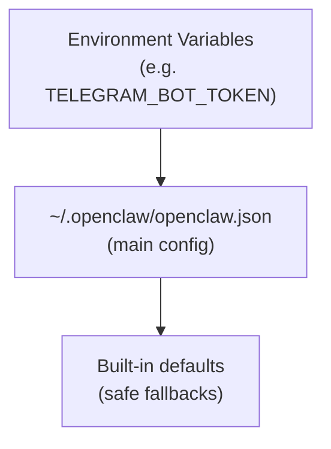

# Configuration system

One file controls how your OpenClaw instance behaves: `~/.openclaw/openclaw.json`. Which channels are active, what model it uses, how sessions are keyed, what tools are available — it's all there.

---

## The config file

Located at `~/.openclaw/openclaw.json` (or the path in `OPENCLAW_CONFIG_PATH`), this file uses **JSON5** format:

- Comments allowed (`//` and `/* */`)
- Trailing commas allowed
- Unquoted keys are fine
- Otherwise it's valid JSON

```json5
// ~/.openclaw/openclaw.json
{
  // Top-level sections
  agents: { ... },
  channels: { ... },
  gateway: { ... },
  memory: { ... },
  tools: { ... },
  bindings: [ ... ],
  messages: { ... },
  commands: { ... },
}
```

All fields are **optional**. OpenClaw uses safe defaults when sections or keys are omitted. You don't need a sprawling config to get started.

---

## Key sections

### `agents` — agent configuration

Controls the agent runtime, model selection, workspace, and per-session behavior.

```json5
{
  agents: {
    defaults: {
      workspace: "~/.openclaw/workspace",  // agent's working directory
      model: {
        primary: "anthropic/claude-sonnet-4-6",
        fallbacks: ["openai/gpt-5.2"]
      },
      timeoutSeconds: 600,          // max seconds per agent turn
      maxConcurrent: 3,             // max parallel runs across sessions
      session: {
        dmScope: "main"             // main | channel | peer | channel-peer
      },
      compaction: {
        mode: "safeguard",
        reserveTokensFloor: 24000
      },
      heartbeat: {
        every: "30m",               // 0m to disable
        session: "main"
      }
    },
    list: [
      // Only needed for multi-agent setups
      { id: "main", workspace: "~/.openclaw/workspace" },
      { id: "work", workspace: "~/.openclaw/workspace-work" }
    ]
  }
}
```

`agents.defaults` sets defaults for all agents. Individual agents in `agents.list` can override any default.

### `channels` — messaging channel configuration

Each channel starts automatically when its config section exists (and `enabled` isn't `false`).

```json5
{
  channels: {
    telegram: {
      botToken: "your-bot-token",        // or TELEGRAM_BOT_TOKEN env var
      dmPolicy: "pairing",               // pairing | allowlist | open | disabled
      allowFrom: ["tg:821071206"],
      groups: {
        "*": { requireMention: true }    // require @mention in all groups
      }
    },
    whatsapp: {
      dmPolicy: "allowlist",
      allowFrom: ["+61400000000"]
    },
    discord: {
      token: "your-bot-token",
      guilds: {
        "123456789": {
          channels: {
            "general": { allow: true }
          }
        }
      }
    }
  }
}
```

> **Tip:** Don't include a channel section for channels you don't use. An absent section = channel disabled. A section with `enabled: false` also disables it explicitly.

### `gateway` — Gateway process settings

Controls how the Gateway process itself behaves:

```json5
{
  gateway: {
    port: 18789,           // WebSocket port (default: 18789)
    host: "127.0.0.1",    // bind address (default: 127.0.0.1, local only)
    auth: {
      token: "secret"     // required for remote access
    },
    mode: "local"         // local | remote
  }
}
```

For most users, you never need to touch `gateway` — the defaults work fine.

### `memory` — memory backend

Controls how long-term memory search works.

```json5
{
  memory: {
    backend: "builtin"    // builtin | qmd
  }
}
```

The built-in backend uses `MEMORY.md` and `memory/*.md` files in the workspace. The QMD backend adds semantic search with vector embeddings. (Covered in Module 4.)

### `tools` — tool policy

Controls which tools are available and how they're secured:

```json5
{
  tools: {
    exec: {
      applyPatch: false,          // enable apply_patch tool
      backgroundMs: 10000,        // auto-background threshold
      timeoutSec: 1800            // max exec duration
    },
    elevated: {
      enabled: false,             // allow elevated (host) execution
      allowFrom: {
        telegram: ["tg:821071206"]
      }
    },
    agentToAgent: {
      enabled: false,             // allow agents to message each other
      allow: ["main", "work"]
    }
  }
}
```

> **Warning:** `elevated: true` allows the agent to run commands on your host system without sandboxing. Only enable for trusted senders.

### `bindings` — message routing

Routes inbound messages to specific agents (multi-agent setups only):

```json5
{
  bindings: [
    // Route Telegram to "work" agent
    { agentId: "work", match: { channel: "telegram" } },
    // Route WhatsApp to "main" agent
    { agentId: "main", match: { channel: "whatsapp" } },
    // Per-peer override (peer bindings always win)
    {
      agentId: "work",
      match: { channel: "whatsapp", peer: { kind: "direct", id: "+15551234567" } }
    }
  ]
}
```

Bindings are evaluated most-specific-wins. Peer-level matches beat channel-level matches.

### `commands` — chat command handling

Controls which slash commands are available:

```json5
{
  commands: {
    text: true,            // parse /commands in messages
    bash: false,           // allow ! <cmd> for shell access
    config: false,         // allow /config reads/writes
    restart: false,        // allow /restart
    allowFrom: {
      telegram: ["tg:821071206"]
    }
  }
}
```

### `messages` — message handling

Controls queue mode, group chat defaults, and history limits:

```json5
{
  messages: {
    queue: {
      mode: "followup"   // followup | collect | steer
    },
    groupChat: {
      historyLimit: 50   // max messages kept per group session
    }
  }
}
```

---

## Config loading order

OpenClaw resolves configuration in this priority order (highest wins):



1. **Built-in defaults** — safe values for everything
2. **`openclaw.json`** — your customizations override defaults
3. **Environment variables** — override specific values at runtime

### Environment variable overrides

Some config values have dedicated env var equivalents:

| Env var | Config key |
|---------|-----------|
| `TELEGRAM_BOT_TOKEN` | `channels.telegram.botToken` |
| `DISCORD_BOT_TOKEN` | `channels.discord.token` |
| `OPENCLAW_CONFIG_PATH` | Path to the config file itself |
| `OPENCLAW_STATE_DIR` | State directory (default: `~/.openclaw`) |
| `OPENCLAW_PROFILE` | Profile name (changes default workspace + state dirs) |

Most tokens can live in the config file _or_ as environment variables. The env var takes precedence when both are set.

---

## Validating with `openclaw doctor`

Before restarting the Gateway after config changes, always validate:

```bash
openclaw doctor
```

Doctor checks:

- Config normalization: fixes legacy key formats automatically
- Schema validation: warns about unknown or invalid keys
- State integrity: checks session dirs, transcript files, and permissions
- Channel health: probes channel connections if the Gateway is running
- Security warnings: flags open DM policies or missing auth tokens
- Migration: applies any needed config format upgrades

For a quick syntax-only check before running doctor:

```bash
# JSON5 is a superset of JSON — check basic validity
python3 -c "import json; json.load(open('$HOME/.openclaw/openclaw.json'))" 2>/dev/null \
  && echo "JSON OK" || echo "JSON syntax error"
```

> **Note:** JSON5 features (comments, trailing commas) will fail a raw `json.load` check. That's fine — it just means your file uses JSON5 features. `openclaw doctor` handles JSON5 natively.

### Running doctor non-interactively

```bash
openclaw doctor --yes          # accept all default repair prompts
openclaw doctor --repair       # apply recommended fixes without prompting
openclaw doctor --non-interactive  # safe for scripts and CI
```

---

## Safe config change workflow

Follow this workflow when making config changes to avoid breaking a running Gateway:

```bash
# 1. Edit the config
nano ~/.openclaw/openclaw.json

# 2. Validate (doctor handles JSON5, catches schema errors)
openclaw doctor --non-interactive

# 3. Restart the Gateway
openclaw gateway restart

# 4. Verify channels are healthy
openclaw channels status
```

> **Warning:** Avoid editing `openclaw.json` while the Gateway is writing to it (e.g., when `/config set` is running from chat). The Gateway can write config changes triggered by in-chat commands — concurrent edits may conflict.

---

## Config for minimal vs full setups

### Minimal (one Telegram bot, one agent):

```json5
{
  agents: {
    defaults: {
      workspace: "~/.openclaw/workspace",
      model: "anthropic/claude-sonnet-4-6"
    }
  },
  channels: {
    telegram: {
      botToken: "123456:ABC...",
      dmPolicy: "pairing"
    }
  }
}
```

### Full (multiple channels, multiple agents, tools policy):

See `~/.npm-global/lib/node_modules/openclaw/docs/gateway/configuration-examples.md` for a complete annotated example.

---

## Summary

| Section | Controls |
|---------|---------|
| `agents` | Model, workspace, timeout, session scope, compaction |
| `channels` | Which channels are active and their access policies |
| `gateway` | Port, auth token, local/remote mode |
| `memory` | Memory backend (builtin or QMD) |
| `tools` | Tool policy, elevated access, exec timeouts |
| `bindings` | Message routing for multi-agent setups |
| `commands` | Slash command availability and authorization |
| `messages` | Queue mode, group history limits |

---

> **Exercise:** Inspect your current config and run a health check.
> 1. Open `~/.openclaw/openclaw.json` in your editor
> 2. Identify which sections are present in your config
> 3. Run `openclaw doctor` and read any warnings
> 4. Find one thing in the config you didn't know was there — look it up in the docs
>
> **Bonus:** Add a comment to your config explaining what one of your settings does. JSON5 comments are `//` style — add `// My Telegram bot for personal use` above your telegram config.

---

That wraps up Module 2. You now understand the Gateway daemon, the WebSocket protocol, the session store, and the configuration system. Take the quiz before moving on.
