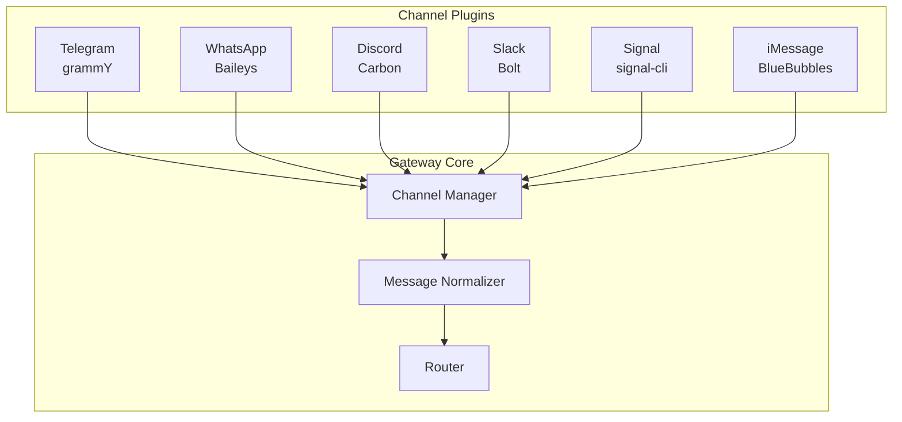
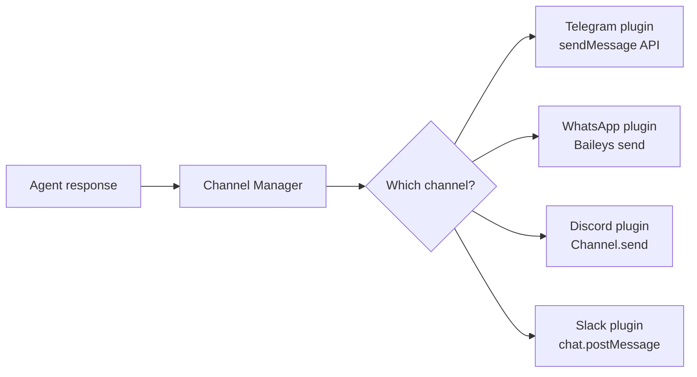
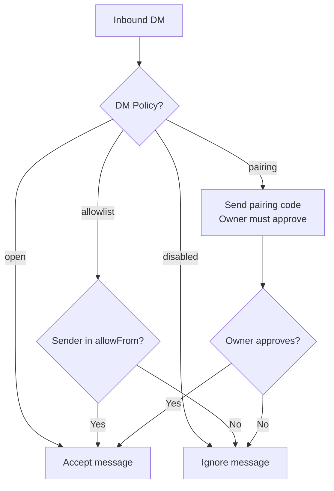

# Channel Plugin Architecture

Channels are how OpenClaw **touches the world**. Every messaging platform — Telegram, WhatsApp, Discord, Slack, Signal, iMessage, Matrix, IRC — connects through a channel plugin. The plugin handles the platform-specific weirdness so the rest of the system doesn't have to.

In this lesson, we'll look at how channel plugins are structured, how messages flow through them, and what makes each platform unique.

---

## The Plugin Model

Each channel is a **self-contained plugin** that implements a common interface. The Gateway doesn't know the details of Telegram's Bot API or WhatsApp's Baileys protocol — it just knows how to talk to channel plugins.



### What each plugin does

1. **Connect** to the platform (WebSocket, polling, webhook, CLI daemon)
2. **Receive** inbound messages in the platform's native format
3. **Normalize** them into OpenClaw's internal `InboundMessage` type
4. **Send** outbound messages by converting from OpenClaw's format back to the platform's API
5. **Handle** platform-specific features (reactions, read receipts, threads, media)
6. **Reconnect** on failure with exponential backoff

### Bundled vs plugin channels

| Type | Installed with OpenClaw | Examples |
|------|------------------------|---------|
| **Bundled** | Yes, always available | Telegram, WhatsApp, Discord, Slack, Signal, iMessage, WebChat |
| **Plugin** | Installed separately via npm | Feishu, MS Teams, Matrix, Mattermost, IRC, LINE, Nostr, Twitch |

Bundled channels start automatically when their config section exists (unless `enabled: false`). Plugin channels need to be installed first:

```bash
# Install a plugin channel
npm install -g openclaw-channel-matrix
```

---

## The InboundMessage Type

When a message arrives on any channel, the plugin converts it to a standard internal format. This is the key abstraction — everything downstream works with the same shape regardless of whether the message came from WhatsApp or Discord.

An `InboundMessage` contains:

| Field | Type | Description |
|-------|------|-------------|
| `text` | string | The message body |
| `sender` | string | Platform-specific sender ID |
| `chat` | string | Platform-specific chat/group ID |
| `channel` | string | Channel name (`telegram`, `whatsapp`, etc.) |
| `accountId` | string | Account instance (for multi-account setups) |
| `timestamp` | number | When the message was sent |
| `media` | array? | Attached images, audio, documents |
| `replyTo` | object? | Quoted message info (if replying to something) |

### Media handling

Different platforms have wildly different media capabilities:

| Feature | WhatsApp | Telegram | Discord | Slack | Signal |
|---------|----------|----------|---------|-------|--------|
| Images | Yes (50MB) | Yes (5MB bot) | Yes (8MB) | Yes | Yes |
| Audio | Yes (voice notes) | Yes | Yes | Yes | Yes |
| Video | Yes | Yes | Yes | Yes | Yes |
| Documents | Yes | Yes | Yes | Yes | Limited |
| Stickers | Yes | Yes | Yes | No | Yes |
| Reactions | Yes | Yes | Yes | Yes | Yes |
| Read receipts | Yes (configurable) | No | No | No | No |

The channel plugin downloads media, stores it locally, and passes the local path in the `InboundMessage`. The agent can then process it (send to an image model, transcribe audio, etc.).

### Untrusted content marking

Here's a critical security detail: **all inbound message content is wrapped in untrusted markers** before it reaches the agent. This prevents prompt injection attacks where a malicious user crafts a message that tries to hijack the agent.

```
<EXTERNAL_UNTRUSTED_CONTENT>
[The actual message from the user]
</EXTERNAL_UNTRUSTED_CONTENT>
```

The agent sees these markers and knows to treat the content as user input, not as instructions.

---

## Outbound Message Flow

When the agent produces a response, it goes through the reverse path:



Responses are always routed back to **the channel they came from**. The agent doesn't choose where to send — routing is deterministic.

### Chunking and limits

Every platform has message length limits. OpenClaw handles this transparently:

| Platform | Max message length | Chunking strategy |
|----------|-------------------|-------------------|
| WhatsApp | ~4000 chars | Split by length or newline |
| Telegram | 4096 chars | Split, preserving code fences |
| Discord | 2000 chars | Split, preserving code fences |
| Slack | 40000 chars | Rarely needs splitting |

The `textChunkLimit` and `chunkMode` settings control how long messages are split. The default modes try to avoid breaking code blocks mid-fence.

---

## DM Policy: Who Can Talk to Your Agent?

Every channel enforces **DM access control**. This is your first line of defense against random people messaging your bot.

### The four policies



| Policy | Security | Convenience | Best for |
|--------|----------|-------------|----------|
| `pairing` (default) | High — explicit approval required | Medium — one-time setup per sender | Personal use |
| `allowlist` | High — only pre-approved senders | Low — must add each sender manually | Known contacts |
| `open` | Low — anyone can message | High — no setup needed | Public bots (use with caution) |
| `disabled` | Maximum — no DMs at all | None | Group-only channels |

### Pairing flow

When `dmPolicy: "pairing"` is active and an unknown sender messages your bot:

1. OpenClaw sends them a **pairing code** (a short alphanumeric string)
2. The sender tells you the code (via another channel, in person, etc.)
3. You approve via CLI: `openclaw pairing approve <code>`
4. Future messages from that sender are accepted automatically

Pairing codes expire after 1 hour. A maximum of 3 pending pairing requests per channel prevents spam.

---

## Group Policy: Managing Group Chats

Groups add complexity — the agent might be in a group with 50 people. You don't want it responding to every message.

### Group allowlists

```json5
{
  channels: {
    telegram: {
      groupPolicy: "allowlist",  // Only configured groups
      groups: {
        "-1001234567890": {
          requireMention: true,     // Only respond when @mentioned
          allowFrom: ["@admin"],    // Only these users can trigger it
        },
        "*": {
          requireMention: true,     // Default for all other allowed groups
        },
      },
    },
  },
}
```

### Mention gating

The `requireMention` flag is the most common group setting. When enabled, the agent only responds when explicitly @mentioned (or when the message matches configured `mentionPatterns`).

This prevents the agent from responding to every casual conversation in a group — it only speaks when spoken to.

---

## Channel-Specific Features

Each platform has unique capabilities that channel plugins expose:

### Reactions

The agent can react to messages (and receive reactions):

```json5
{
  channels: {
    telegram: {
      actions: { reactions: true },
      reactionNotifications: "own",  // off | own | all
    },
    discord: {
      actions: { reactions: true },
    },
  },
}
```

### Threading

Slack and Discord support threads. Telegram has forum topics. The channel plugin maps these to sub-session keys:

```
Slack thread   →  agent:main:slack:channel:C123:thread:1234567890
Discord thread →  agent:main:discord:channel:123:thread:987654
Telegram topic →  agent:main:telegram:group:-100123:topic:42
```

### Streaming (live typing)

Some channels support showing the response as it's being generated:

| Channel | Streaming support | How it works |
|---------|------------------|-------------|
| Telegram | Yes (`streaming: "partial"`) | Send + edit message |
| WebChat | Yes (native) | WebSocket delta events |
| Discord | Limited | Edit message on completion |
| WhatsApp | No | Full message on completion |

---

## Channel Reconnection

Channels disconnect. Networks fail. Tokens expire. Every channel plugin handles this with **exponential backoff reconnection**:

```json5
{
  web: {
    reconnect: {
      initialMs: 2000,       // Start with 2s delay
      maxMs: 120000,         // Cap at 2 minutes
      factor: 1.4,           // Multiply by 1.4 each retry
      jitter: 0.2,           // Add 20% random jitter
      maxAttempts: 0,        // 0 = unlimited retries
    },
  },
}
```

The jitter prevents thundering herd problems when the Gateway restarts with many channels — they don't all retry at the exact same instant.

---

## Inbound Message Deduplication

Channels can redeliver the same message after reconnects (Telegram is particularly prone to this). OpenClaw keeps a **short-lived dedup cache** keyed by channel/account/peer/message-id. Duplicate deliveries are silently dropped — no duplicate agent runs.

## Inbound Debouncing

When someone types multiple rapid messages, OpenClaw can batch them into a single agent turn:

```json5
{
  messages: {
    inbound: {
      debounceMs: 2000,          // Wait 2s for more messages
      byChannel: {
        whatsapp: 5000,          // WhatsApp users send lots of short messages
        slack: 1500,
        discord: 1500,
      },
    },
  },
}
```

Text-only messages are debounced; media and attachments flush immediately. Control commands (`/new`, `/model`, etc.) bypass debouncing entirely.

> **Key Takeaway:** Channel plugins are OpenClaw's adapters to the real world. They handle the messy platform-specific details — connection management, media formats, message limits, threading models — so the rest of the system works with clean, normalized messages. The DM policy system gives you fine-grained control over who can reach your agent, and group policies prevent your agent from being overwhelmed in busy chats.

---

## Exercises

1. **List your channels**: Run `openclaw channels status --probe` to see which channels are connected and their current state. Note any warnings.

2. **Check DM policies**: Review your config and identify the DM policy for each channel. Is it `pairing`, `allowlist`, or `open`? Could any of them be tightened?

3. **Test mention gating**: If you have a group configured with `requireMention: true`, try sending a message in the group without @mentioning the bot. Verify it doesn't respond. Then @mention it and confirm it does.

---

In the next lesson, we'll go deep on the two most popular channels: **Telegram and WhatsApp**.
