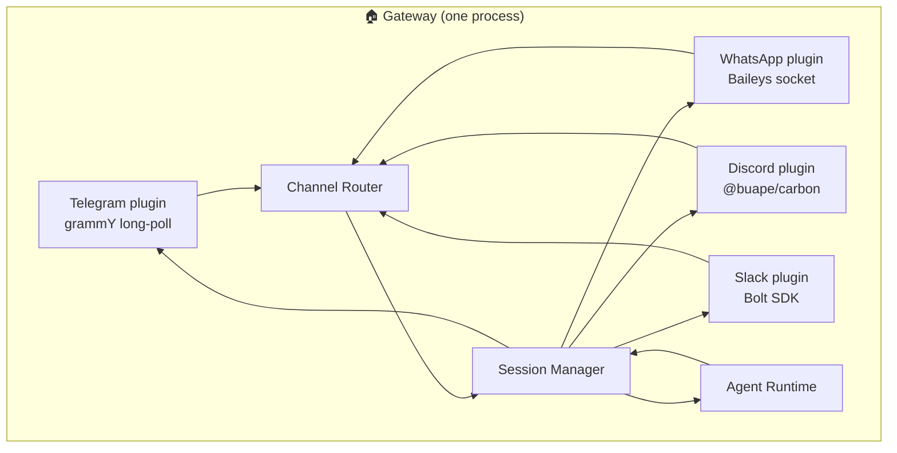
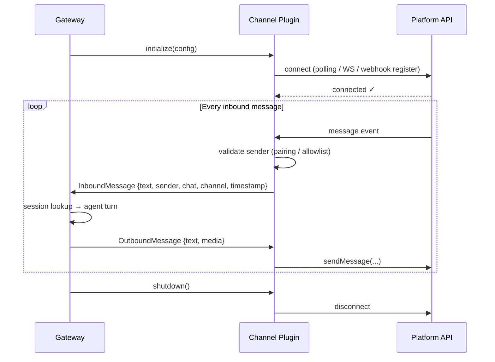

# Channel plugin architecture

Every message that reaches your agent travels through a **channel plugin** — a piece of code that owns the full relationship between OpenClaw and one messaging surface. Before you configure Telegram or WhatsApp, it helps to understand what a channel actually is and how the lifecycle works. That understanding will save you hours of debugging later.

---

## What a channel is

A channel is a messaging surface plugin — a self-contained module that:

1. Maintains a persistent connection to one platform (WebSocket, long-poll, webhook, etc.)
2. Translates incoming platform events into OpenClaw's internal `InboundMessage` envelope
3. Enforces access control (pairing codes, allowlists, group policies)
4. Sends outbound responses back through the platform-specific API

The Gateway owns all channel connections. You don't run separate processes per channel — it's one Node.js process with multiple channel plugins running inside it.



One message in, one channel plugin handles it, agent responds, same plugin sends the reply back. Routing is always deterministic: inbound messages reply on the same channel they arrived from.

---

## Channel lifecycle

Every channel goes through the same four phases on startup:



### Phase 1: Connect

The plugin establishes its connection to the platform. Different channels use different mechanisms:

| Channel | Connection method |
|---------|------------------|
| Telegram | grammY long polling (or webhook if configured) |
| WhatsApp | Baileys WebSocket (maintains linked device session) |
| Discord | Discord Gateway WebSocket |
| Slack | Socket Mode WebSocket (or HTTP Events API) |
| Google Chat | HTTP webhook (inbound only) |
| Signal | JSON-RPC to local signal-cli daemon |

### Phase 2: Receive

When a message arrives, the plugin:

1. Validates the event format — not every platform update is actually a message
2. Checks access control — is this sender approved? Unknown senders get a pairing code (in `pairing` mode) or get dropped silently (in `allowlist` mode)
3. Normalises it into a shared `InboundMessage` envelope
4. Marks content as untrusted — all external text gets wrapped in safety markers before reaching the LLM

### Phase 3: Route

The normalised message passes to the Channel Router, which determines which agent handles it (based on `bindings` config) and which session the message belongs to (based on sender, group, and `dmScope`).

Session keys follow a predictable pattern:

```
agent:<agentId>:<channel>:<type>:<id>

Examples:
  agent:main:telegram:dm:821071206       ← Telegram DM
  agent:main:whatsapp:group:12345@g.us   ← WhatsApp group
  agent:main:discord:channel:987654321   ← Discord channel
  agent:main:main                        ← default (DMs collapse here by default)
```

### Phase 4: Respond

Once the agent finishes its turn, the response flows back through the same channel plugin that received the original message. The plugin translates the generic response into whatever the platform expects: Telegram HTML, Discord embed, Slack blocks, etc.

---

## Built-in vs plugin channels

OpenClaw ships with two tiers of channels:

### Core (bundled, no extra install)

These are compiled into the main OpenClaw package:

| Channel | Library | Notes |
|---------|---------|-------|
| Telegram | grammY | Bot API, polling or webhook |
| WhatsApp | Baileys | WhatsApp Web multi-device |
| Discord | @buape/carbon | Bot + slash commands |
| Slack | @slack/bolt | Socket Mode + HTTP Events |
| Google Chat | Custom HTTP | Webhook-based |
| Signal | signal-cli wrapper | Requires separate CLI |
| iMessage/BlueBubbles | BlueBubbles REST | Requires macOS + BlueBubbles app |
| WebChat | Built-in WS | Always available — the browser UI |

### Plugin (install separately)

These ship as optional plugins to keep the base install lean:

```bash
openclaw plugins install @openclaw/matrix
openclaw plugins install @openclaw/msteams
openclaw plugins install @openclaw/mattermost
openclaw plugins install @openclaw/irc
openclaw plugins install @openclaw/nostr
openclaw plugins install @openclaw/line
openclaw plugins install @openclaw/twitch
```

Plugins register themselves on the same channel lifecycle — they're first-class, not second-tier addons.

---

## Channel configuration in openclaw.json

All channel config lives under the `channels` key in `~/.openclaw/openclaw.json`. Each channel has its own sub-key:

```json5
{
  channels: {
    // Enable/disable Telegram with basic DM policy
    telegram: {
      enabled: true,
      botToken: "123456:ABC-DEF...",
      dmPolicy: "pairing",
      groups: {
        "*": { requireMention: true }
      }
    },

    // WhatsApp with explicit allowlist
    whatsapp: {
      enabled: true,
      dmPolicy: "allowlist",
      allowFrom: ["+15551234567"]
    },

    // Discord with guild allowlist
    discord: {
      enabled: true,
      token: "MTIz...",
      groupPolicy: "allowlist",
      guilds: {
        "123456789012345678": {
          requireMention: false,
          users: ["987654321098765432"]
        }
      }
    },

    // Slack in Socket Mode
    slack: {
      enabled: true,
      mode: "socket",
      appToken: "xapp-1-...",
      botToken: "xoxb-..."
    }
  }
}
```

### Access control defaults

Every channel that isn't explicitly open defaults to allowlist mode at the group level. This is intentional — your agent should only respond to people you trust:

| Policy | Behaviour |
|--------|-----------|
| `pairing` | Unknown senders get a pairing code; you approve them |
| `allowlist` | Only explicitly listed senders can interact |
| `open` | Anyone can message the agent (requires `allowFrom: ["*"]`) |
| `disabled` | Channel accepts no inbound messages |

> Start with `pairing` for DMs (the default). Switch to `allowlist` once you know exactly who should have access. Never use `open` unless you've thought through the implications.

---

## The shared envelope

Once a message passes through a channel plugin, everything the agent sees is identical regardless of where it came from:

```javascript
{
  text: "What's the weather in Sydney?",    // normalised message text
  sender: "telegram:821071206",             // platform:id
  chat: "telegram:dm:821071206",            // session identifier
  channel: "telegram",                      // which plugin handled this
  timestamp: 1709042400000,
  media: null,                              // null or media descriptor
  replyTo: null,                            // quoted reply context
}
```

The agent doesn't know or care which channel it's responding to. That's the channel plugin's job.

---

## Exercise

1. Run `openclaw channels status` to see which channels are currently active on your Gateway.
2. Look at your `~/.openclaw/openclaw.json` and find the `channels` block (or note it's missing).
3. Pick one channel you want to add. What is the minimum config you'd need? Write it out before looking at the next lesson.

---

The next lesson covers the two most popular channels: Telegram and WhatsApp.
