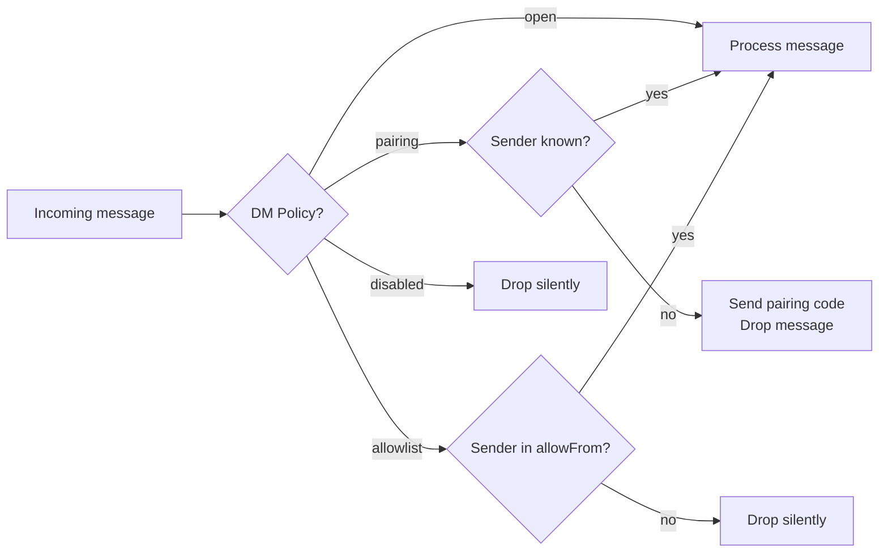

# Telegram and WhatsApp

These are the two channels most people start with. Telegram is the fastest setup — five minutes from zero to a working bot. WhatsApp takes a bit more ceremony but gets your agent into the app half the planet already uses.

---

## Telegram

Telegram connects via the **Bot API** using grammY under the hood. You create a bot token, drop it in config, and the Gateway starts polling for messages.

### Step 1: Create a bot in BotFather

Open Telegram and search for `@BotFather` (the official one — verify it's the real one). Run:

```
/newbot
```

Follow the prompts. At the end, BotFather hands you a token that looks like:

```
123456789:AAF8yXn_AbCdEfGhIjKlMnOpQrStUvWxYz0
```

Save this. It's the only credential Telegram needs.

### Step 2: Configure the token

Add it to `~/.openclaw/openclaw.json`:

```json5
{
  channels: {
    telegram: {
      enabled: true,
      botToken: "123456789:AAF8yXn_AbCdEfGhIjKlMnOpQrStUvWxYz0",
      dmPolicy: "pairing"
    }
  }
}
```

Or use the environment variable (useful on servers where you don't want secrets in config files):

```bash
export TELEGRAM_BOT_TOKEN="123456789:AAF..."
```

### Step 3: Start the Gateway and pair

```bash
openclaw gateway
```

The Gateway connects to Telegram's servers via long polling by default — the Gateway asks "any new messages?" every few seconds. You don't need a public HTTPS endpoint for this.

DM your bot in Telegram. It will reply with a pairing code. Then:

```bash
openclaw pairing list telegram
openclaw pairing approve telegram <CODE>
```

Now you're in.

### Polling vs webhook

Long polling works for most setups. Webhooks are faster but require a public HTTPS URL:

```json5
{
  channels: {
    telegram: {
      botToken: "...",
      webhookUrl: "https://your-domain.com/telegram-webhook",
      webhookSecret: "a-random-secret-string"
    }
  }
}
```

> Use webhooks if you're on a VPS with a domain name, want lower latency, or are handling high message volumes. On a home machine or Pi where your IP isn't stable, stick with long polling.

### Finding your Telegram user ID

The pairing flow handles this automatically, but if you ever need your numeric user ID for the allowlist:

```bash
# Option 1: watch the gateway logs
openclaw logs --follow
# DM your bot — you'll see from.id in the log

# Option 2: call the Bot API directly
curl "https://api.telegram.org/bot<YOUR_TOKEN>/getUpdates"
```

---

## WhatsApp

WhatsApp uses **Baileys**, an open-source library that implements the WhatsApp Web multi-device protocol. OpenClaw acts as a linked device — the same way WhatsApp Web in your browser works.

### Step 1: Configure access policy first

Before scanning the QR code, set up your access policy so the first message from your phone is accepted:

```json5
{
  channels: {
    whatsapp: {
      enabled: true,
      dmPolicy: "allowlist",
      allowFrom: ["+61412345678"]  // your E.164 phone number
    }
  }
}
```

> OpenClaw recommends using a separate WhatsApp number for the bot — a spare SIM or a number from Google Voice. This keeps your personal WhatsApp separate. Personal-number setups work too, but routing is more complex.

### Step 2: Link via QR

```bash
openclaw channels login --channel whatsapp
```

A QR code appears in your terminal. Open WhatsApp on your phone → Linked Devices → Link a Device → scan the QR.

WhatsApp saves the linked session in `~/.openclaw/credentials/whatsapp/`.

### Step 3: Start the Gateway

```bash
openclaw gateway
```

The WhatsApp channel connects and maintains its own reconnect loop. If your internet drops, it reconnects automatically.

---

## DM policies: pairing, allowlist, open

Both Telegram and WhatsApp share the same DM policy system:



| Policy | Best for |
|--------|---------|
| `pairing` | Initial setup, unknown senders — they self-serve with a code |
| `allowlist` | Locked-down setup, you know exactly who should have access |
| `open` | Testing, bots with public access (requires `allowFrom: ["*"]`) |
| `disabled` | You want inbound on this channel fully off |

### Pairing flow (Telegram example)

When an unknown sender DMs your bot in `pairing` mode:

1. Bot sends them: `"Pairing code: ABC123 (expires in 1 hour)"`
2. You run: `openclaw pairing approve telegram ABC123`
3. Their Telegram user ID is added to the approved list
4. Their next message processes normally

---

## Group policies and mention gating

Groups have their own access layer on top of DM policies.

### Telegram groups

```json5
{
  channels: {
    telegram: {
      botToken: "...",
      groups: {
        // Apply defaults to all groups
        "*": {
          requireMention: true  // only respond when @mentioned
        },
        // Override for one specific group
        "-1001234567890": {
          requireMention: false,  // respond to everything
          groupPolicy: "open"
        }
      }
    }
  }
}
```

> Privacy mode: Telegram bots have Privacy Mode enabled by default, which means they only see messages that @mention them. If you want `requireMention: false` to work, go to BotFather → `/setprivacy` → Disable, then remove and re-add the bot to your groups.

Getting a group's chat ID:
```bash
# Watch logs and send a message in the group
openclaw logs --follow
# Look for chat.id in the output
```

### WhatsApp groups

```json5
{
  channels: {
    whatsapp: {
      groupPolicy: "allowlist",
      groupAllowFrom: ["+61412345678"],
      groups: {
        "*": { requireMention: true }
      }
    }
  }
}
```

WhatsApp mention detection covers:
- Real @-mentions (when someone taps a contact)
- Regex patterns (`agents.list[].groupChat.mentionPatterns`)
- The bot's own E.164 number typed anywhere in the message

```json5
{
  agents: {
    list: [
      {
        id: "main",
        groupChat: {
          mentionPatterns: ["@?mybot", "\\+61412345678"]
        }
      }
    ]
  }
}
```

---

## Platform comparison

Telegram and WhatsApp are architecturally similar in OpenClaw, but they differ in ways that matter:

| Feature | Telegram | WhatsApp |
|---------|---------|---------|
| Auth | Bot token (simple, no hardware) | QR scan (links a device session) |
| Setup time | ~5 minutes | ~15 minutes |
| Account type | Separate bot identity | Linked to a phone number |
| Session persistence | Stateless (token is enough) | Session stored in `~/.openclaw/credentials/whatsapp/` |
| Groups | ✅ Full support | ✅ Full support |
| Media (inbound) | ✅ Download + process | ✅ Download + process |
| Streaming preview | ✅ Edit-based streaming | ❌ Not supported |
| Read receipts | ❌ Not supported | ✅ Enabled by default |
| Reaction acks | ✅ | ✅ |
| Polling method | Long poll or webhook | WebSocket (persistent) |
| Number required | ❌ Bot is its own identity | ✅ Requires phone number |

### Which one first?

Go with Telegram if you want something working in the next ten minutes and mainly care about your own workflow.

Go with WhatsApp if you need to reach people who already have it and won't install something new. That's most of the world.

You don't have to choose — both can run simultaneously. The Gateway handles them in parallel.

---

## Exercises

1. Set up Telegram polling: create a bot, add the token, start the gateway, DM the bot, approve pairing. Send a message and get a response.

2. Add your phone number to `channels.telegram.allowFrom` using the numeric ID you find in the logs (not your @username — always use numeric IDs).

3. Challenge: Add the bot to a Telegram group. Set `requireMention: true` for that group. Verify the bot only responds when @mentioned.

4. Challenge: If you have a spare phone number, try the WhatsApp QR link flow. Compare the experience.

---

The next lesson covers Discord, Slack, and the other channels — including when to use each one.
