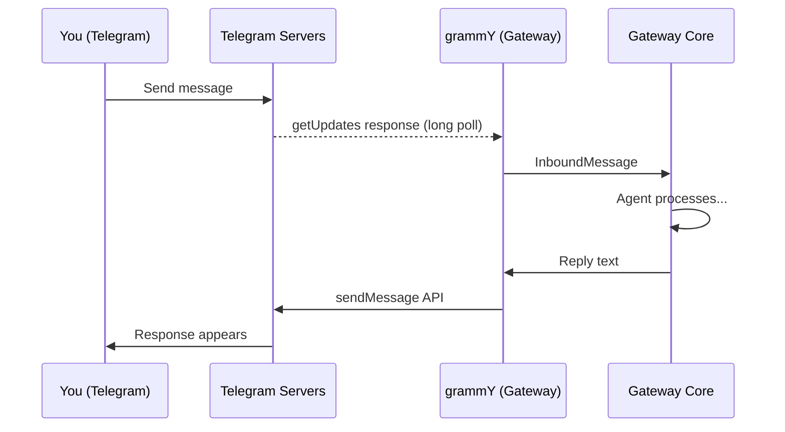
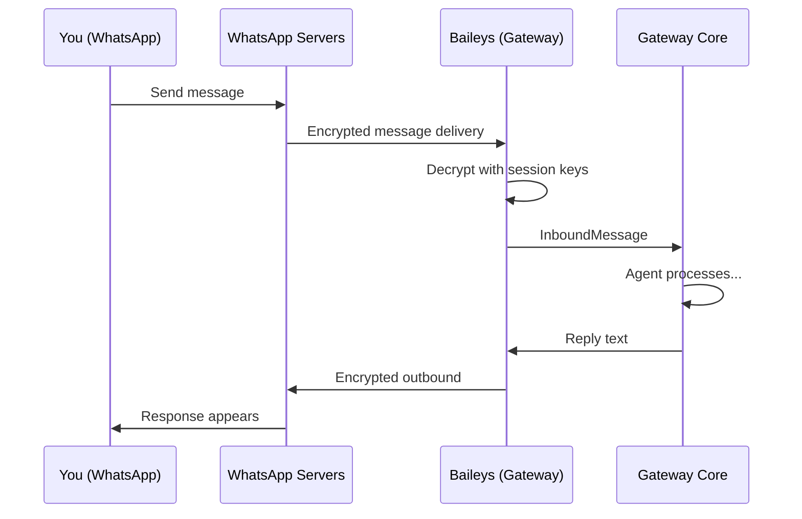

# Telegram & WhatsApp

Telegram and WhatsApp are the two most popular channels for OpenClaw. Together, they cover most personal messaging use cases. But they work very differently under the hood — Telegram uses a bot API, while WhatsApp uses a reverse-engineered web client. Let's dig into both.

---

## Telegram: The Bot API Channel

Telegram is the **easiest channel to set up** — create a bot with BotFather, paste the token, and you're live.

### How it works

OpenClaw uses **grammY**, a TypeScript framework for the Telegram Bot API. The bot connects via long-polling (default) or webhooks.



### Setup

1. **Create a bot** via [@BotFather](https://t.me/BotFather) on Telegram
2. Copy the bot token
3. Add it to your config:

```json5
{
  channels: {
    telegram: {
      botToken: "123456789:ABCdefGHIjklMNOpqrsTUVwxyz",
      dmPolicy: "pairing",
    },
  },
}
```

4. Restart the Gateway: `openclaw gateway restart`
5. Message your bot — it will send you a pairing code

### Polling vs Webhooks

| Mode | How it works | Best for |
|------|-------------|----------|
| **Long polling** (default) | Gateway asks Telegram "any updates?" every few seconds | Home servers, NAT'd networks |
| **Webhooks** | Telegram POSTs updates to your HTTPS endpoint | VPS with public IP, lower latency |

Long polling works behind NAT (no public IP needed) — this is why it's the default. Webhooks are faster but require an HTTPS endpoint:

```json5
{
  channels: {
    telegram: {
      botToken: "...",
      webhookUrl: "https://your-server.com/telegram-webhook",
      webhookSecret: "a-random-secret",
      webhookPath: "/telegram-webhook",
    },
  },
}
```

### Telegram-specific features

**Custom commands**: Register slash commands that appear in Telegram's command menu:

```json5
{
  channels: {
    telegram: {
      customCommands: [
        { command: "backup", description: "Run a git backup" },
        { command: "generate", description: "Create an image" },
      ],
    },
  },
}
```

**Streaming responses**: Telegram supports live response editing — the agent's reply updates in real-time as it generates:

```json5
{
  channels: {
    telegram: {
      streaming: "partial",  // off | partial | block | progress
    },
  },
}
```

This uses Telegram's `editMessageText` API — the bot sends an initial message, then edits it as more text arrives.

**Reply threading**: Control how the bot threads replies:

```json5
{
  channels: {
    telegram: {
      replyToMode: "first",  // off | first | all
    },
  },
}
```

- `off`: don't quote-reply to anything
- `first`: reply to the user's first message in the turn
- `all`: reply to every message

**Forum topics**: Telegram supergroups can have forum topics. Each topic gets its own session:

```json5
{
  channels: {
    telegram: {
      groups: {
        "-1001234567890": {
          topics: {
            "42": {
              requireMention: false,
              skills: ["search"],
              systemPrompt: "Focus on search queries.",
            },
          },
        },
      },
    },
  },
}
```

### Multi-account Telegram

Run multiple Telegram bots (one per agent):

```json5
{
  channels: {
    telegram: {
      accounts: {
        default: {
          botToken: "123456:ABC...",
          dmPolicy: "pairing",
        },
        alerts: {
          botToken: "987654:XYZ...",
          dmPolicy: "allowlist",
          allowFrom: ["tg:123456789"],
        },
      },
    },
  },
}
```

Each account gets its own bot, its own allowlist, and can be bound to a different agent via `bindings`.

---

## WhatsApp: The Baileys Channel

WhatsApp is the **most popular channel** but also the most complex. OpenClaw uses **Baileys** — an open-source library that implements the WhatsApp Web protocol.

### How it works

Unlike Telegram's official bot API, Baileys reverse-engineers WhatsApp Web. Your Gateway acts as a WhatsApp Web client linked to your phone number.



### Setup: QR Code Pairing

WhatsApp requires **linking** your phone:

```bash
openclaw channels login --channel whatsapp
```

This displays a QR code in your terminal. Scan it with WhatsApp on your phone (Settings > Linked Devices > Link a Device). The session state is saved to disk:

```
~/.openclaw/credentials/whatsapp/default/
├── creds.json          ← Session credentials
└── app-state-*.json    ← WhatsApp app state
```

Once linked, the Gateway maintains the connection persistently. The WhatsApp session can survive Gateway restarts — credentials are loaded from disk.

### WhatsApp-specific config

```json5
{
  channels: {
    whatsapp: {
      dmPolicy: "pairing",
      allowFrom: ["+15555550123", "+447700900456"],
      textChunkLimit: 4000,        // Max chars per message chunk
      chunkMode: "length",         // length | newline
      mediaMaxMb: 50,              // Max media download size
      sendReadReceipts: true,      // Blue ticks
      groups: {
        "*": { requireMention: true },
      },
    },
  },
}
```

### DM and group access (WhatsApp)

WhatsApp sender IDs are **E.164 phone numbers**:

```json5
{
  channels: {
    whatsapp: {
      dmPolicy: "allowlist",
      allowFrom: ["+15555550123", "+447700900456"],
      groupAllowFrom: ["+15551234567"],
    },
  },
}
```

### Multi-account WhatsApp

Run multiple WhatsApp numbers on the same Gateway:

```json5
{
  channels: {
    whatsapp: {
      accounts: {
        personal: {},   // Uses ~/.openclaw/credentials/whatsapp/personal/
        biz: {},        // Uses ~/.openclaw/credentials/whatsapp/biz/
      },
    },
  },
}
```

Link each account separately:

```bash
openclaw channels login --channel whatsapp --account personal
openclaw channels login --channel whatsapp --account biz
```

### WhatsApp quirks and gotchas

| Issue | Details |
|-------|---------|
| **Session expiry** | WhatsApp Web sessions can expire (status 409-515). Relink with `openclaw channels logout && openclaw channels login` |
| **No streaming** | WhatsApp doesn't support message editing, so responses appear as a single message |
| **Rate limits** | Send too many messages too fast and WhatsApp may temporarily restrict your number |
| **Multi-device** | Your phone must be online periodically to keep the linked session alive |
| **Blue ticks** | `sendReadReceipts: true` sends read receipts (blue ticks). Set `false` if you don't want senders to know when messages are read |
| **Group JIDs** | WhatsApp group IDs look like `120363403215116621@g.us` — not human-friendly |

### WhatsApp heartbeat

OpenClaw can send periodic heartbeat messages to keep the WhatsApp connection alive:

```json5
{
  web: {
    heartbeatSeconds: 60,
  },
}
```

---

## Telegram vs WhatsApp: Side by Side

| Feature | Telegram | WhatsApp |
|---------|----------|----------|
| **Setup** | Bot token (30 seconds) | QR scan + phone linking |
| **Protocol** | Official Bot API | Reverse-engineered (Baileys) |
| **Library** | grammY | Baileys |
| **Message limit** | 4096 chars | ~4000 chars |
| **Media upload** | 5MB (bot), 50MB (file) | 50MB |
| **Streaming** | Yes (edit message) | No |
| **Reactions** | Yes | Yes |
| **Threads** | Forum topics | No |
| **Custom commands** | Yes (BotFather menu) | No |
| **Read receipts** | No | Yes (configurable) |
| **Multi-account** | One bot per account | One phone per account |
| **Reconnect** | Automatic (polling/webhook) | Automatic (with credential restore) |
| **Session stability** | Very stable | Occasional expiry (409/515) |
| **Sender ID format** | `tg:123456789` | `+15555550123` (E.164) |

### When to use which

- **Telegram** is better for: quick setup, group bots with slash commands, streaming responses, stable connections
- **WhatsApp** is better for: reaching people who already use WhatsApp (most of the world), personal assistant feel, rich media

Many users run **both** — Telegram for power-user interactions and WhatsApp for quick mobile messages. Since DMs collapse to the same session, context is shared between them.

---

## Shared Configuration Patterns

Both channels support the same core patterns:

### Group mention gating

```json5
{
  channels: {
    telegram: {
      groups: { "*": { requireMention: true } },
    },
    whatsapp: {
      groups: { "*": { requireMention: true } },
    },
  },
}
```

### History context for groups

When the agent is @mentioned in a group, it can see recent messages for context:

```json5
{
  channels: {
    telegram: {
      historyLimit: 50,  // Include up to 50 recent messages
    },
  },
}
```

### Retry policy

Both channels support configurable retry on send failures:

```json5
{
  channels: {
    telegram: {
      retry: {
        attempts: 3,
        minDelayMs: 400,
        maxDelayMs: 30000,
        jitter: 0.1,
      },
    },
  },
}
```

---

## Troubleshooting

### Telegram: bot not responding

1. Check the token: `openclaw status --deep`
2. Verify polling: look for `[telegram]` in Gateway logs
3. Check allowlist: is the sender in `allowFrom` or paired?
4. Try sending `/status` to the bot

### WhatsApp: logged out

```bash
# Check connection status
openclaw status --deep

# If logged out, relink
openclaw channels logout --channel whatsapp
openclaw channels login --channel whatsapp --verbose
```

### WhatsApp: messages not arriving

1. Confirm linked phone is online
2. Check `allowFrom` list (uses E.164: `+15555550123`)
3. For groups: check `groupAllowFrom` and mention patterns
4. Look for `web-inbound` in the log files

> **Key Takeaway:** Telegram and WhatsApp are complementary channels. Telegram gives you a clean bot API with streaming and custom commands. WhatsApp gives you reach — billions of users who already have the app. Run both, and your agent becomes truly omni-channel with shared conversation context.

---

## Exercises

1. **Set up Telegram**: If you haven't already, create a bot via BotFather, add the token to your config, and send it a message. Time yourself — it should take under 5 minutes.

2. **Configure groups**: Add your Telegram bot to a group. Configure `requireMention: true` and test that it only responds when @mentioned. Then try `requireMention: false` on a specific group and see the difference.

3. **Inspect WhatsApp credentials**: Look at `~/.openclaw/credentials/whatsapp/default/`. What files exist? Check `creds.json` modification time — is it recent?

---

In the next lesson, we'll cover **Discord, Slack, and other channels** — each with their own personality and integration patterns.
