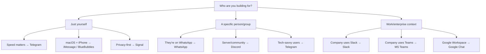

# Discord, Slack, and other channels

Telegram and WhatsApp cover the personal messaging use cases. This lesson covers the channels you'd reach for when the context is a community server, a work team, or a more specialised platform.

---

## Discord

Discord connects via the official Discord Gateway WebSocket, using `@buape/carbon` under the hood. Your bot lives in one or more servers (guilds) and can respond in channels or DMs.

### Step 1: Create a bot in the Developer Portal

1. Go to [discord.com/developers/applications](https://discord.com/developers/applications) → New Application
2. Click Bot in the sidebar → Reset Token (despite the name, this creates your first token)
3. Under Privileged Gateway Intents, enable:
   - Message Content Intent (required — without this the bot can't read messages)
   - Server Members Intent (recommended — needed for user/role allowlists)
4. Copy the bot token. This is your `channels.discord.token`.

### Step 2: Set the token (do not send it in chat)

```bash
openclaw config set channels.discord.token '"YOUR_BOT_TOKEN"' --json
openclaw config set channels.discord.enabled true --json
```

Or in `openclaw.json` directly:

```json5
{
  channels: {
    discord: {
      enabled: true,
      token: "MTIzNDU2Nzg5...",
      dmPolicy: "pairing"
    }
  }
}
```

### Step 3: Generate an invite URL and add the bot

In the Developer Portal → OAuth2 → OAuth2 URL Generator:
- Scopes: `bot`, `applications.commands`
- Bot permissions: View Channels, Send Messages, Read Message History, Embed Links, Attach Files

Paste the generated URL in your browser and add the bot to your server.

### Step 4: Enable Developer Mode and collect IDs

Discord Developer Mode → right-click your server icon → Copy Server ID → right-click your own avatar → Copy User ID.

### Guild allowlists

By default, the bot won't respond in any server channels until you configure a guild allowlist:

```json5
{
  channels: {
    discord: {
      token: "...",
      groupPolicy: "allowlist",
      guilds: {
        "YOUR_SERVER_ID": {
          requireMention: true,           // only respond when @mentioned
          users: ["YOUR_USER_ID"],        // only these users can trigger it
          channels: {
            "general": { allow: true },   // only listed channels allowed
            "bot-commands": { allow: true, requireMention: false }
          }
        }
      }
    }
  }
}
```

> If this is your own private server and it's just you and the bot, set `requireMention: false` and leave `users` empty. The bot will respond to everything in the allowlisted channels.

### requireMention

With `requireMention: true` (the default), the bot only responds when:
- Someone @mentions it explicitly (`@YourBot`)
- A configured `mentionPattern` regex matches
- Someone replies to a bot message

For personal Discord servers, `requireMention: false` is usually what you want.

### Pairing Discord DMs

DM your bot in Discord — it sends a pairing code. Approve it:

```bash
openclaw pairing list discord
openclaw pairing approve discord <CODE>
```

---

## Slack

Slack connects via the Bolt SDK. The default mode is Socket Mode — a persistent WebSocket from your Gateway to Slack's servers, no public URL required.

### Step 1: Create a Slack app

Go to [api.slack.com/apps](https://api.slack.com/apps) → Create New App → From scratch.

In your app settings:
1. Enable Socket Mode → generate an App Token (`xapp-...`) with `connections:write`
2. Install the app → copy the Bot Token (`xoxb-...`)
3. Subscribe to bot events: `app_mention`, `message.channels`, `message.groups`, `message.im`, `message.mpim`
4. Enable App Home → Messages Tab

### Step 2: Configure OpenClaw

```json5
{
  channels: {
    slack: {
      enabled: true,
      mode: "socket",
      appToken: "xapp-1-...",
      botToken: "xoxb-..."
    }
  }
}
```

### Socket Mode vs HTTP Events API

| | Socket Mode | HTTP Events API |
|--|------------|-----------------|
| Public URL needed | ❌ No | ✅ Yes |
| Setup complexity | Lower | Higher (needs reverse proxy) |
| Best for | Local/home/VPS without domain | Production with custom domain |
| Config | `appToken` + `botToken` | `signingSecret` + `webhookPath` |

HTTP mode config:

```json5
{
  channels: {
    slack: {
      mode: "http",
      botToken: "xoxb-...",
      signingSecret: "your-signing-secret",
      webhookPath: "/slack/events"
    }
  }
}
```

### Channel routing in Slack

Slack channels are allowlist-controlled:

```json5
{
  channels: {
    slack: {
      groupPolicy: "allowlist",
      channels: {
        "general": {
          requireMention: false,
          users: ["U0123456789"]
        },
        "C0987654321": {   // channel ID is more reliable than name
          requireMention: true
        }
      }
    }
  }
}
```

> Prefer IDs over names. Channel names can change; IDs never do. Find them with `openclaw channels status --probe` or in the Slack app's channel URL.

---

## Other channels

OpenClaw connects to a wider ecosystem than just the big four. Here's a practical rundown:

### Signal

Signal is end-to-end encrypted messaging via `signal-cli` (a Java-based CLI daemon).

Setup is involved — it requires Java, `signal-cli` installed, and a phone number registered with Signal. Worth it if you prioritise privacy.

```json5
{
  channels: {
    signal: {
      enabled: true,
      account: "+15551234567",
      cliPath: "signal-cli",
      dmPolicy: "pairing",
      allowFrom: ["+15557654321"]
    }
  }
}
```

### iMessage (via BlueBubbles)

iMessage integration via the [BlueBubbles](https://bluebubbles.app) macOS helper app. Requires macOS, BlueBubbles server running, and webhooks configured.

Useful if you're a macOS user who wants iMessage routing through your agent. Group iMessage chats, tapbacks, read receipts, and reactions all work.

```json5
{
  channels: {
    bluebubbles: {
      enabled: true,
      serverUrl: "http://localhost:1234",
      password: "your-bluebubbles-password",
      webhookPath: "/bluebubbles-webhook"
    }
  }
}
```

> macOS 26 Tahoe note: Message editing is currently broken on Tahoe. Everything else works normally.

### Matrix (plugin)

A decentralised, federated messaging protocol. OpenClaw connects as a Matrix user via `@vector-im/matrix-bot-sdk`. Supports DMs, rooms, threads, media, reactions, and E2EE.

```bash
openclaw plugins install @openclaw/matrix
```

Good for self-hosted chat infrastructure, privacy-focused teams, or Beeper users.

### IRC (plugin)

Classic IRC protocol. OpenClaw connects as a bot to channels and can receive DMs. Low setup complexity if you already run an IRC server.

```bash
openclaw plugins install @openclaw/irc
```

```json5
{
  channels: {
    irc: {
      enabled: true,
      host: "irc.libera.chat",
      port: 6697,
      tls: true,
      nick: "openclaw-bot",
      channels: ["#myroom"]
    }
  }
}
```

### Google Chat

Google Workspace chat via a Service Account and HTTP webhook. Requires a Google Cloud project, Service Account, Chat API enablement, and a public webhook URL. Good for teams already running Google Workspace who want an AI assistant in their Spaces.

### Microsoft Teams (plugin)

Teams via the Bot Framework. Requires Azure AD app registration, Bot Framework setup, and tunnelling or a public endpoint. Use this when you're in an enterprise environment and have no other choice.

```bash
openclaw plugins install @openclaw/msteams
```

---

## When to use which channel



| You want to... | Best channel |
|----------------|-------------|
| Get up and running in 5 minutes | Telegram |
| Reach family/friends who won't install new apps | WhatsApp |
| Run a community bot in your Discord server | Discord |
| Integrate with your team's existing Slack | Slack |
| Maximum privacy, E2EE | Signal or Matrix |
| Stay in the Apple ecosystem | BlueBubbles (iMessage) |
| Enterprise compliance | MS Teams or Google Chat |
| Classic, minimal, self-hosted chat | IRC |

> Start with one. Pick the channel you already use most. Get that working first, then add others. Every additional channel runs in parallel with zero performance penalty — but troubleshooting two new channels simultaneously is frustrating.

---

## Exercises

1. If you have a Discord server, create a bot and add it. Configure a guild allowlist with `requireMention: false` for your private server.

2. Run `openclaw channels status` — which channels are currently connected? Which are configured but not connected?

3. Think through it: You want to build a personal assistant that responds in your work Slack AND your personal Telegram. What would the `channels` config look like? Sketch it out. (You'll implement it in Module 7.)

4. Research: Look at the channel index at `/channels` in the OpenClaw docs. Pick one channel not covered in this lesson. What would you need to set it up?

---

## Module 3 summary

You now understand:

- A channel is a messaging surface plugin that owns the connect/receive/route/respond lifecycle
- Session keys are deterministic: `agent:<agentId>:<channel>:<type>:<id>`
- Telegram is the fastest path; WhatsApp requires QR linking but reaches more people
- Discord and Slack both have allowlist-based guild/channel controls
- Plugin channels (Matrix, IRC, MS Teams, etc.) are first-class but require separate install
- Routing is always deterministic — replies go back to the channel they came from
