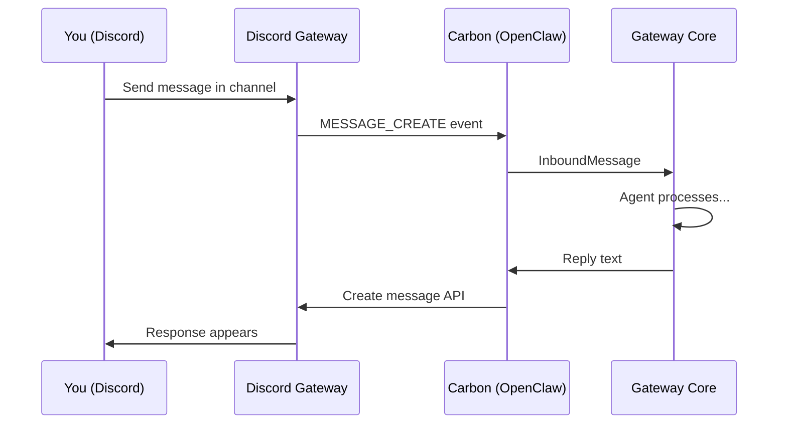
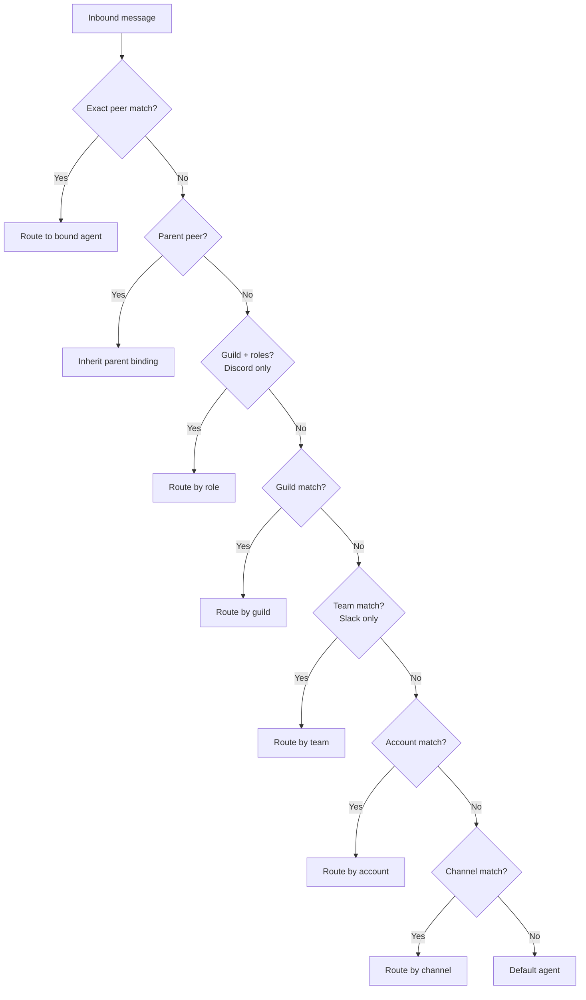

# Discord, Slack & Others

Beyond Telegram and WhatsApp, OpenClaw supports a wide ecosystem of channels — from team communication platforms like Discord and Slack to privacy-focused options like Signal and Matrix. Let's explore how each one works and how to route messages across them.

---

## Discord: The Community Channel

Discord is popular for communities, gaming, and increasingly for work. OpenClaw uses **Carbon** (@buape/carbon), a modern Discord SDK.

### How it works

Unlike Telegram's simple bot token, Discord requires:
1. A **bot application** in the Discord Developer Portal
2. The bot **invited to your server** (guild)
3. **Message Content Intent** enabled (so the bot can read messages)



### Setup

1. Go to the [Discord Developer Portal](https://discord.com/developers/applications)
2. Create a new application, add a bot
3. Enable **Message Content Intent** under Bot settings
4. Copy the bot token
5. Generate an invite URL with these permissions: Send Messages, Read Message History, Add Reactions
6. Configure:

```json5
{
  channels: {
    discord: {
      token: "your-bot-token",
      dmPolicy: "pairing",
      guilds: {
        "123456789012345678": {       // Your server ID
          channels: {
            "222222222222222222": {    // Channel ID
              allow: true,
              requireMention: false,
            },
          },
        },
      },
    },
  },
}
```

### Discord-specific features

**Guild and channel allowlists**: Discord has a three-level hierarchy — guild (server) > channel > thread. You control access at each level:

```json5
{
  channels: {
    discord: {
      guilds: {
        "123456789012345678": {
          channels: {
            "222222222222222222": { allow: true, requireMention: true },
            "333333333333333333": { allow: true, requireMention: false },
          },
        },
      },
    },
  },
}
```

**Bot exclusion**: Prevent the agent from responding to other bots:

```json5
{
  channels: {
    discord: {
      allowBots: false,  // Default: false
    },
  },
}
```

**Rich actions**: Discord supports polls, stickers, permissions, and role management:

```json5
{
  channels: {
    discord: {
      actions: {
        reactions: true,
        stickers: true,
        polls: true,
        permissions: true,
      },
    },
  },
}
```

**Multi-account Discord**: Run one bot per agent:

```json5
{
  channels: {
    discord: {
      accounts: {
        default: {
          token: "BOT_TOKEN_MAIN",
          guilds: { /* ... */ },
        },
        coding: {
          token: "BOT_TOKEN_CODING",
          guilds: { /* ... */ },
        },
      },
    },
  },
  bindings: [
    { agentId: "main", match: { channel: "discord", accountId: "default" } },
    { agentId: "coding", match: { channel: "discord", accountId: "coding" } },
  ],
}
```

### Discord routing with roles

Discord bindings support **role-based routing** — different agents for different server roles:

```json5
{
  bindings: [
    {
      agentId: "admin-agent",
      match: {
        channel: "discord",
        guildId: "123456789012345678",
        roles: ["Admin", "Moderator"],
      },
    },
    {
      agentId: "general-agent",
      match: {
        channel: "discord",
        guildId: "123456789012345678",
      },
    },
  ],
}
```

Members with the Admin or Moderator role get routed to the admin agent; everyone else gets the general agent.

---

## Slack: The Workspace Channel

Slack uses the **Bolt SDK** (@slack/bolt) with Socket Mode or HTTP Events.

### Setup

1. Create a Slack app at [api.slack.com](https://api.slack.com/apps)
2. Enable **Socket Mode** (simpler) or configure Event Subscriptions
3. Add the bot to your workspace
4. Configure:

```json5
{
  channels: {
    slack: {
      appToken: "xapp-...",      // Socket Mode token
      botToken: "xoxb-...",      // Bot token
      dmPolicy: "pairing",
    },
  },
}
```

### Slack-specific features

**Thread support**: Slack threads get their own session keys:

```
agent:main:slack:channel:C1234567890:thread:1706000000.000001
```

**History context**: Slack can include recent channel messages for context:

```json5
{
  channels: {
    slack: {
      historyLimit: 25,
    },
  },
}
```

**Team-based routing**: Route entire Slack workspaces to specific agents:

```json5
{
  bindings: [
    { agentId: "work", match: { channel: "slack", teamId: "T123456" } },
  ],
}
```

---

## Signal: The Privacy Channel

Signal is the most privacy-focused option. OpenClaw connects via **signal-cli**, a command-line client for Signal.

### Setup

Signal requires a separate daemon:

```bash
# Install signal-cli
# (platform-specific — see signal-cli docs)

# Register or link
signal-cli -u +15555550123 register
# or link to an existing Signal account
signal-cli -u +15555550123 link
```

Then configure:

```json5
{
  channels: {
    signal: {
      phoneNumber: "+15555550123",
      dmPolicy: "pairing",
    },
  },
}
```

Signal is end-to-end encrypted by design. Note that while the Gateway decrypts messages to process them (it has to — the agent needs to read them), message storage on your machine is the trust boundary.

---

## iMessage: The Apple Channel

For macOS users, OpenClaw can connect to iMessage via **BlueBubbles** (recommended) or the legacy `imsg` CLI.

### BlueBubbles setup

BlueBubbles is a macOS server that exposes iMessage via a REST API:

```json5
{
  channels: {
    bluebubbles: {
      baseUrl: "http://localhost:1234",
      password: "your-bluebubbles-password",
      dmPolicy: "pairing",
    },
  },
}
```

BlueBubbles supports: text, media, reactions, read receipts, group management, and message effects.

### Legacy iMessage (deprecated)

The older integration uses AppleScript-based automation. It works but is limited:

```json5
{
  channels: {
    imessage: {
      enabled: true,
      dmPolicy: "allowlist",
      allowFrom: ["+15555550123"],
    },
  },
}
```

> For new setups, BlueBubbles is strongly recommended over legacy iMessage.

---

## Other Channels at a Glance

| Channel | Library/Protocol | Install | Key notes |
|---------|-----------------|---------|-----------|
| **Matrix** | matrix-bot-sdk | Plugin | E2EE support, self-hosted |
| **IRC** | irc-framework | Plugin | Classic channels + DMs |
| **Mattermost** | Bot API + WS | Plugin | Self-hosted team chat |
| **MS Teams** | Bot Framework | Plugin | Enterprise, requires Azure app |
| **Google Chat** | HTTP webhooks | Plugin | Workspace apps |
| **Feishu/Lark** | WebSocket | Plugin | Popular in Asia |
| **LINE** | Messaging API | Plugin | Popular in Japan/SE Asia |
| **Nostr** | NIP-04 DMs | Plugin | Decentralized, encrypted |
| **Twitch** | IRC connection | Plugin | Chat integration |
| **Synology Chat** | Webhooks | Plugin | NAS-native chat |
| **Nextcloud Talk** | REST API | Plugin | Self-hosted |
| **WebChat** | Gateway WS | Bundled | Browser-based, always available |

Plugin channels are installed separately:

```bash
npm install -g openclaw-channel-matrix
npm install -g openclaw-channel-irc
```

---

## Channel Routing: Bringing It All Together

With multiple channels running, you need to control which messages go to which agent. This is where **bindings** come in.

### How routing works

Routing is deterministic — the Gateway evaluates bindings in priority order:



### Priority rules

1. **Peer match** — most specific (exact DM or group ID)
2. **Parent peer** — thread inherits from parent
3. **Guild + roles** — Discord role routing
4. **Guild** — Discord server-level
5. **Team** — Slack workspace-level
6. **Account** — channel account instance
7. **Channel** — any account on that channel
8. **Default** — fallback agent

When multiple bindings match at the same priority level, **first in config order wins**.

### Real-world routing example

Split your agent by channel purpose:

```json5
{
  agents: {
    list: [
      {
        id: "everyday",
        model: "anthropic/claude-sonnet-4-6",
        workspace: "~/.openclaw/workspace",
      },
      {
        id: "deepwork",
        model: "anthropic/claude-opus-4-6",
        workspace: "~/.openclaw/workspace-deep",
      },
    ],
  },
  bindings: [
    // Telegram goes to Opus for deep work
    { agentId: "deepwork", match: { channel: "telegram" } },
    // WhatsApp stays on Sonnet for quick replies
    { agentId: "everyday", match: { channel: "whatsapp" } },
    // Discord coding channel goes to deep work
    {
      agentId: "deepwork",
      match: {
        channel: "discord",
        peer: { kind: "channel", id: "333333333333333333" },
      },
    },
  ],
}
```

### Per-peer routing

Route a specific person to a different agent while keeping everyone else on the default:

```json5
{
  bindings: [
    // This person gets Opus
    {
      agentId: "opus-agent",
      match: {
        channel: "whatsapp",
        peer: { kind: "direct", id: "+15551234567" },
      },
    },
    // Everyone else on WhatsApp gets Sonnet
    { agentId: "sonnet-agent", match: { channel: "whatsapp" } },
  ],
}
```

Peer bindings always win over channel-wide rules — keep them above the broader rules in your config.

---

## Channel Comparison Matrix

| Feature | Telegram | WhatsApp | Discord | Slack | Signal |
|---------|----------|----------|---------|-------|--------|
| Setup difficulty | Easy | Medium | Medium | Medium | Hard |
| Bot API type | Official | Reverse-eng | Official | Official | CLI daemon |
| Streaming | Yes | No | Limited | No | No |
| Threading | Forum topics | No | Threads | Threads | No |
| Max msg length | 4096 | ~4000 | 2000 | 40000 | ~2000 |
| Reactions | Yes | Yes | Yes | Yes | Yes |
| Slash commands | Yes (custom) | No | Yes (native) | Yes (native) | No |
| Multi-account | Yes | Yes | Yes | Yes | Yes |
| Group support | Supergroups | Groups | Guilds | Channels | Groups |
| Media max | 5-50MB | 50MB | 8MB | Varies | Varies |
| E2E encryption | Secret chats | Always | No | No | Always |

> **Key Takeaway:** OpenClaw's channel system is designed for **omni-channel operation**. You're not locked into one platform. Run Telegram + WhatsApp + Discord simultaneously, with intelligent routing that sends the right messages to the right agent. The binding system gives you fine-grained control — from channel-level routing down to individual conversations.

---

## Exercises

1. **Add a second channel**: If you only have one channel set up, add another. Try Discord or Slack. Send messages on both and verify they reach the same agent session (for DMs).

2. **Set up routing**: Create a binding that routes one specific group or channel to a different agent (even if you only have one agent, the binding config is still valid). Verify with `openclaw agents list --bindings`.

3. **Test cross-channel context**: Send a message on Channel A, then reference it on Channel B. Does the agent remember? (It should — DMs share a session.)

---

This wraps up Module 3 on the Channel System. You now understand how channel plugins work, how Telegram and WhatsApp differ, and how to route messages across any combination of channels. In Module 4, we'll dive into the **Agent System** — the turn model, tools, memory, and multi-agent orchestration.
