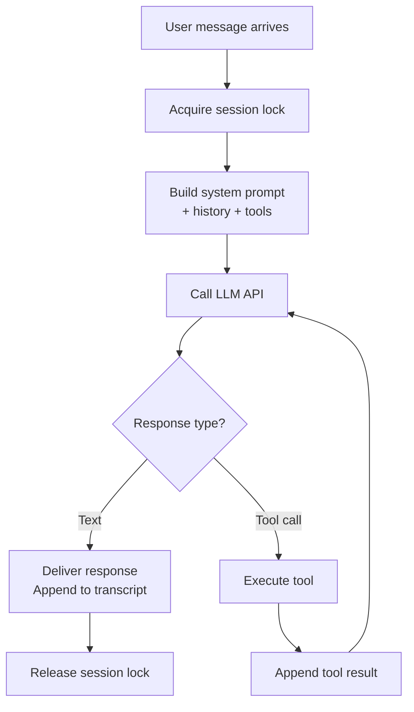
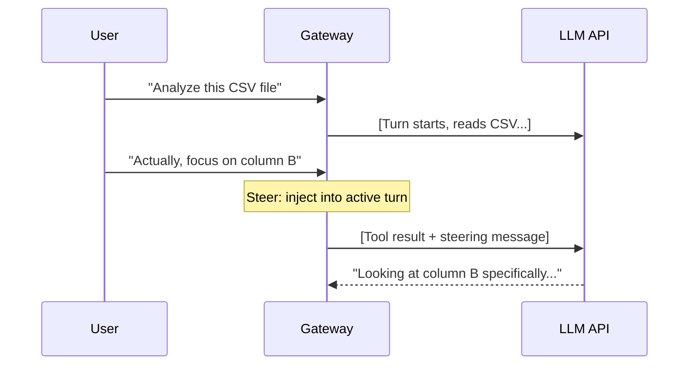
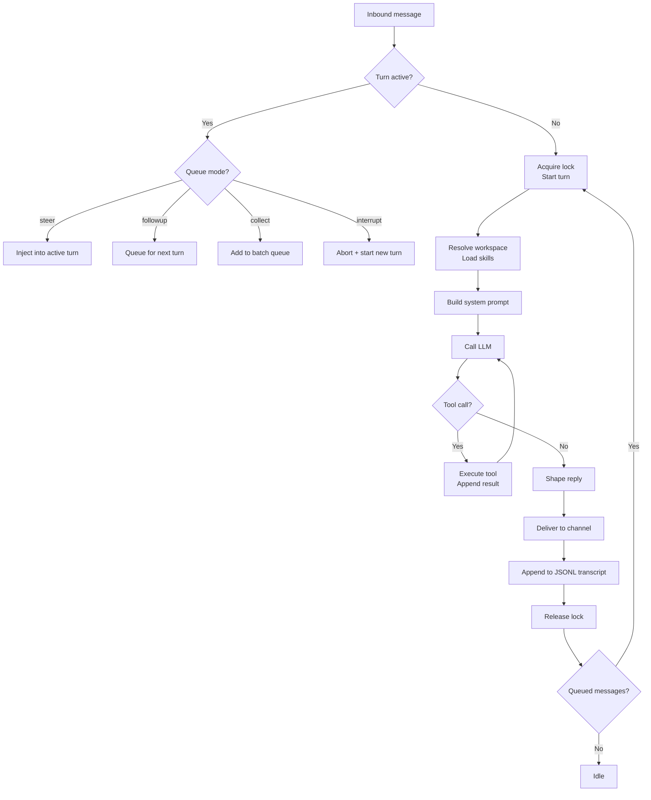

# Agent Lifecycle

The agent is what makes OpenClaw *intelligent* — it's the component that takes your message, thinks about it, calls tools, and produces a response. But how does a single turn actually work? What happens when you send a message while the agent is already thinking? How does streaming work?

This lesson covers the full agent lifecycle: the turn model, queueing, steering, streaming, and how turns begin and end.

---

## The Turn Model

OpenClaw runs **one turn at a time per session**. This is the fundamental concurrency rule.

A "turn" is the complete cycle of:
1. Receive user message
2. Build context (system prompt + history + tools)
3. Call the LLM
4. Execute any tool calls
5. Call the LLM again (with tool results)
6. Repeat steps 4-5 until the model produces a final text response
7. Deliver the response
8. Persist the turn to the transcript



### Why one turn at a time?

- **Consistency**: the session transcript is append-only during a turn. No race conditions.
- **Context integrity**: the model sees a clean conversation history without interleaved responses
- **Tool safety**: tool calls (especially `exec`) shouldn't race against each other

This doesn't mean the agent is slow — turns are typically 2-10 seconds. But it does mean that **new messages arriving during a turn need special handling**. That's where queue modes come in.

---

## Queue Modes

When a new message arrives while a turn is active, OpenClaw has several options:

| Mode | What happens | Best for |
|------|-------------|----------|
| `steer` | Inject the new message into the running turn | Interactive conversations |
| `followup` | Queue and run after current turn completes | Sequential requests |
| `collect` | Batch all queued messages into one followup turn | Rapid-fire messaging |
| `interrupt` | Abort current turn, start new one | Urgent overrides |

### Steer mode (default)

This is the most interesting mode. When you send a message while the agent is mid-turn, OpenClaw **injects it into the active context** as a "steering" message.



The agent sees the steering message as additional context and adapts its behavior mid-turn. It's like tapping someone on the shoulder while they're working.

### Followup mode

New messages wait in a queue. When the current turn finishes, the next message starts a new turn:

```
Turn 1: "Analyze this CSV"  → [processing...] → "Here's the analysis"
Turn 2: "Now focus on column B"  → [processing...] → "Column B shows..."
```

### Collect mode

All queued messages are batched into a single followup turn. Great for users who send many short messages rapidly:

```
Turn 1: "Analyze this CSV"  → [processing...]
  (queued: "focus on column B")
  (queued: "and compare with last month")
Turn 1 completes → "Here's the analysis"
Turn 2: ["focus on column B", "and compare with last month"]  → [processing...]
```

### Configuration

```json5
{
  messages: {
    queue: "steer",              // Default queue mode
    byChannel: {
      whatsapp: "collect",       // WhatsApp users tend to rapid-fire
      slack: "followup",
    },
  },
}
```

---

## Agent Entry Points

Turns can start from two paths:

### 1. Gateway RPC (`agent` method)

This is how channel messages trigger turns. The Gateway receives a normalized inbound message, resolves the session, and calls the agent:

```json
{
  "type": "req",
  "method": "agent",
  "params": {
    "message": "What's the weather?",
    "sessionKey": "agent:main:main"
  }
}
```

The response is immediate — just an acceptance:

```json
{
  "ok": true,
  "payload": { "runId": "run_abc123", "status": "accepted" }
}
```

The actual agent output comes via **stream events** (covered below).

### 2. CLI (`openclaw agent` command)

You can run single agent turns from the command line:

```bash
openclaw agent "What files are in my workspace?"
```

This connects to the running Gateway, sends the message, waits for the turn to complete, and prints the response.

---

## Session and Workspace Preparation

Before the LLM is called, the agent runtime prepares the context:

### 1. Workspace resolution

The agent's workspace directory is resolved:
```
~/.openclaw/workspace/         (default agent)
~/.openclaw/workspace-work/    (named agent)
```

### 2. Skills loading

Skills are loaded (or reused from a snapshot) and their tools + prompt instructions are injected.

### 3. Bootstrap injection

On the first turn of a session (or after a reset), workspace files are injected into the system prompt:

| File | Purpose |
|------|---------|
| `AGENTS.md` | Operating instructions, capabilities, rules |
| `SOUL.md` | Persona, tone, personality boundaries |
| `TOOLS.md` | Tool-specific notes (SSH hosts, API endpoints) |
| `USER.md` | Notes about the user (preferences, context) |
| `IDENTITY.md` | Agent name, emoji, vibe |

These files are your primary lever for controlling agent behavior. Edit them and the agent changes immediately (on the next session reset or new session).

### 4. System prompt assembly

The full system prompt is built from:
- Base OpenClaw prompt (safety rules, tool instructions)
- Skills prompt (tool descriptions, usage guidance)
- Bootstrap context (workspace files)
- Per-run overrides (group system prompts, topic prompts)
- Current date/time and timezone

---

## Streaming: How Responses Arrive

Agent output is streamed via WebSocket events. There are three stream types:

### Assistant stream

Text deltas from the model:

```json
{"type":"event","event":"agent","payload":{"stream":"assistant","delta":"Here's what I found"}}
{"type":"event","event":"agent","payload":{"stream":"assistant","delta":" in the data..."}}
```

### Tool stream

Tool execution progress:

```json
{"type":"event","event":"agent","payload":{"stream":"tool","phase":"start","name":"exec","input":{"command":"ls -la"}}}
{"type":"event","event":"agent","payload":{"stream":"tool","phase":"end","name":"exec","result":"total 42\n-rw-r--..."}}
```

### Lifecycle stream

Turn boundaries:

```json
{"type":"event","event":"agent","payload":{"stream":"lifecycle","phase":"start"}}
{"type":"event","event":"agent","payload":{"stream":"lifecycle","phase":"end"}}
```

### Block streaming

For chat channels, responses can be delivered as blocks (paragraphs) rather than waiting for the full response:

```json5
{
  agents: {
    defaults: {
      blockStreamingDefault: "on",           // on | off
      blockStreamingBreak: "text_end",       // text_end | message_end
    },
  },
}
```

With block streaming **on**, Telegram (for example) sends each text block as it's produced, so the user sees responses appearing paragraph by paragraph. With it **off**, the full response is sent as a single message after the turn completes.

---

## Abort and Stop

### User-initiated stop

Send `/stop` in chat to abort the current turn:

```
/stop
```

This sends an abort signal. The agent stops after the current LLM call completes (it can't interrupt a mid-flight API request, but it won't start new tool calls).

### Timeout

Each agent has a configurable timeout:

```json5
{
  agents: {
    defaults: {
      timeoutSeconds: 600,  // Default: 10 minutes
    },
  },
}
```

If a turn exceeds this, it's forcefully aborted. This prevents runaway turns (imagine a tool call that triggers an infinite loop).

### Where turns end early

- **Agent timeout**: forced abort after `timeoutSeconds`
- **Abort signal**: `/stop` command
- **Gateway disconnect**: client drops the WebSocket
- **RPC timeout**: `agent.wait` times out (but this doesn't stop the agent — it just stops waiting)

---

## Reply Shaping

Before the response reaches the user, it goes through shaping:

### NO_REPLY suppression

If the model outputs `NO_REPLY`, the response is suppressed — nothing is sent to the user. This is used for silent operations (memory flush, background tasks).

### Messaging tool dedup

If the agent already sent a message via the `message` tool during the turn, duplicate text is removed from the final reply to avoid sending the same content twice.

### Error fallback

If no renderable text remains and a tool errored, a fallback error message is emitted so the user knows something went wrong.

---

## The Full Lifecycle Diagram



> **Key Takeaway:** The agent lifecycle is a serialized pipeline — one turn at a time, with clear boundaries between message intake, LLM calls, tool execution, and response delivery. Queue modes give you control over what happens when reality is messier than one-message-at-a-time. Steer mode is the most natural for interactive use; collect mode handles rapid-fire messaging; followup mode keeps things strictly sequential.

---

## Exercises

1. **Test queue modes**: Set `messages.queue: "steer"` and send a message followed by a correction while the agent is still processing. Does the agent adapt? Now try `"followup"` and see the difference.

2. **Watch the lifecycle**: Run `openclaw gateway --verbose` and send a message. Identify the lifecycle events: `start`, any tool calls, assistant deltas, and `end`. How long did the turn take?

3. **Test the timeout**: Set `agents.defaults.timeoutSeconds: 10` temporarily. Ask the agent to do something that takes a while (like reading a large file and summarizing it). Does the timeout kick in?

---

In the next lesson, we'll explore the **Tool System** — how the agent gains its superpowers.
