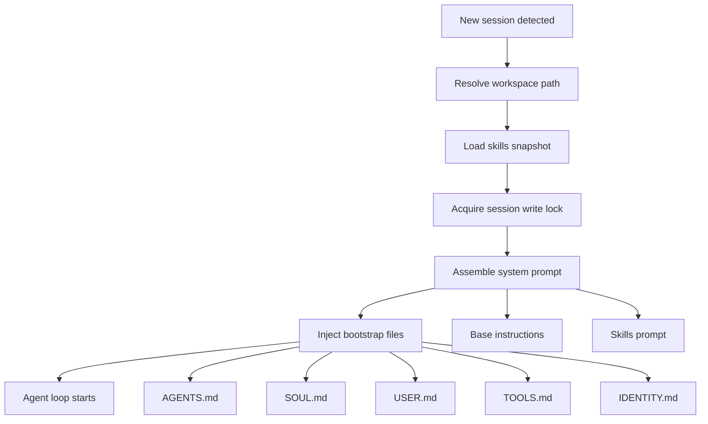
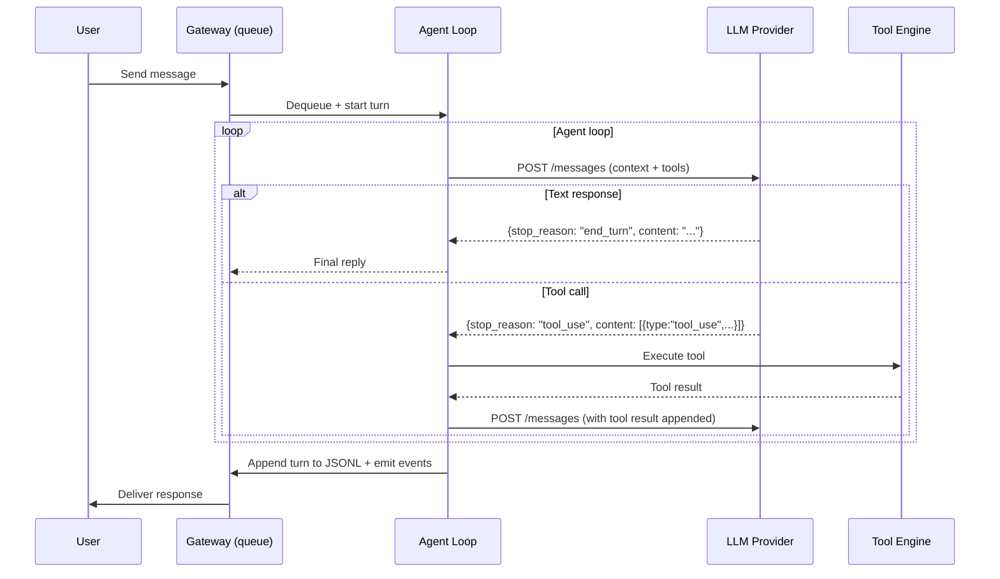

# Agent lifecycle

Every message you send goes through the same fundamental sequence: the agent receives it, thinks about it, possibly calls some tools, and replies. Simple in outline. Surprisingly deep in the details.

This lesson is about what the agent _is_, how it boots, and what the loop looks like from the inside.

---

## What is an agent?

An agent in OpenClaw is the combination of:

| Component | What it is |
|-----------|-----------|
| LLM | The model that does the reasoning (Claude, GPT, Gemini, etc.) |
| Tools | Capabilities the model can invoke (exec, read, browser, etc.) |
| Workspace | The directory containing AGENTS.md, SOUL.md, USER.md, etc. |
| Sessions | Conversation context — the transcript and memory of past turns |
| Skills | Bundled capabilities loaded at startup |

Remove any one of these and you have something less than an agent. The LLM without tools is just a chatbot. The LLM with tools but no session memory forgets everything between messages. OpenClaw ties them all together into a coherent, persistent entity.

The agent runtime is built on **pi-mono**, a coding agent framework. OpenClaw wraps pi-mono with its own tool wiring, workspace management, skill loading, and compaction system.

---

## Agent boot: what happens at session start

When a new session starts (first message from a new conversation, or after `/new`), the agent goes through a boot sequence:

### Bootstrap file injection

Inside `agents.defaults.workspace`, OpenClaw expects these user-editable files:

| File | Purpose |
|------|---------|
| `AGENTS.md` | Operating instructions — how the agent should behave, priorities, rules |
| `SOUL.md` | Persona, tone, voice, and boundaries |
| `USER.md` | Notes about the user — name, timezone, preferences |
| `TOOLS.md` | Notes about local tools and conventions (does NOT control availability) |
| `IDENTITY.md` | The agent's name, vibe, and emoji |
| `HEARTBEAT.md` | Optional checklist for periodic heartbeat runs |
| `BOOT.md` | Optional startup checklist (runs on gateway restart with hooks enabled) |

On the first turn of a new session, all these files are injected into the system prompt. Edit any of these files and the changes take effect on the next session start. No Gateway restart needed.

Blank files are skipped. Large files are truncated with a marker (configurable via `bootstrapMaxChars`, default 20,000 chars per file; `bootstrapTotalMaxChars`, default 150,000 total).

> **Tip:** If a bootstrap file is missing, OpenClaw injects a single "missing file" marker line and continues. Run `openclaw setup` to recreate any missing defaults without overwriting existing files.

---

## Agent identity and persona

The agent's identity comes from `SOUL.md` and `IDENTITY.md`. Name and emoji live in `IDENTITY.md`. Everything else — tone, personality quirks, characteristic phrases, what the agent won't do — lives in `SOUL.md`.

This isn't a system prompt override — it's a structured set of files that the agent reads and internalizes. You can make your agent be anyone: a no-nonsense engineering assistant, a warm and playful companion, a formal research analyst.

The persona is **per-workspace**. Multiple agents can have completely different personalities by pointing to different workspace directories.

---

## The agent loop

Once the session is set up, every incoming message goes through the same loop:

The key insight: **the agent loop continues until the LLM stops requesting tools**. A single user message might trigger three tool calls before the model produces a final text response. All of that is one "turn."

### What happens at each LLM call

1. **Context assembly**: system prompt + full session history + pending message
2. **Tool definitions**: all available tools described in the model's tool format
3. **Model call**: POST to the provider's API (Anthropic, OpenAI, etc.)
4. **Parse response**:
   - `stop_reason: "end_turn"` → extract text, end loop
   - `stop_reason: "tool_use"` → execute tool calls, add results, loop again

### Serialized per session

Runs are **serialized per session**. If a new message arrives while a turn is running, it queues (in `followup`, `collect`, or `steer` mode — see Module 2). This prevents race conditions and keeps the session transcript consistent.

### Global concurrency

Across _different_ sessions, the Gateway can run multiple turns in parallel, up to `agents.defaults.maxConcurrent` (default: 1). Set it higher to allow simultaneous conversations across multiple sessions.

---

## Steering a running turn

When `messages.queue.mode: "steer"`, inbound messages during a running turn are handled differently:

- The queued message is checked **after each tool call**
- If a message is queued, remaining tool calls from the current assistant response are **skipped** (with "Skipped due to queued user message" error results)
- The queued message is injected before the next LLM call

This lets you interrupt and redirect the agent mid-turn — useful for "stop, I changed my mind" scenarios.

---

## Where things can end early

An agent turn can terminate before producing a normal response:

| Scenario | Behavior |
|----------|----------|
| Agent timeout | Turn is aborted after `agents.defaults.timeoutSeconds` (default 600s) |
| AbortSignal | Turn cancelled programmatically (e.g., `/stop` command) |
| Gateway restart | In-progress turn is lost; session resumes cleanly on next message |
| Context window full | Auto-compaction triggers; turn may retry after compaction |
| Tool error | Error returned as tool result; model decides whether to retry or give up |

The Gateway emits a `lifecycle` event with `phase: "error"` when a turn ends abnormally. Control clients surface this appropriately (CLI prints the error, Web UI shows it inline).

---

## Agents vs. sessions

It's easy to conflate agents and sessions. They're different:

- **Agent**: the brain. Runtime, workspace, persona, tools. Persistent as long as the config exists.
- **Session**: a specific conversation. A transcript, a session key. Created per conversation context.

One agent can have many sessions (one per DM, per group, per channel). One session belongs to exactly one agent. When you run multiple agents, each gets its own session namespace.

---

## Summary

| Aspect | Detail |
|--------|--------|
| Agent = | LLM + tools + workspace + sessions + skills |
| Boot | Workspace files injected into system prompt on first turn |
| Persona | SOUL.md + IDENTITY.md define voice, tone, boundaries |
| Loop | Receive → assemble context → LLM call → execute tools → repeat until done |
| Serialized | One turn at a time per session; parallel across sessions |
| Termination | End turn, tool error, timeout, abort, or context compaction |

---

> **Exercise:** Personalize your agent's identity.
> 1. Open `~/.openclaw/workspace/SOUL.md` in your editor
> 2. Add one specific speech pattern your agent should use — something distinctive
> 3. Add one thing the agent should never do
> 4. Start a new session (`/new` in any chat) and see if the changes take effect
> 5. Then open `~/.openclaw/workspace/IDENTITY.md` and change the agent's name or emoji
>
> Notice that you didn't restart the Gateway — the persona change only needs a new session.

---

In the next lesson, we'll explore the tool system in depth — what tools exist, how policies work, and how elevated mode affects security.
