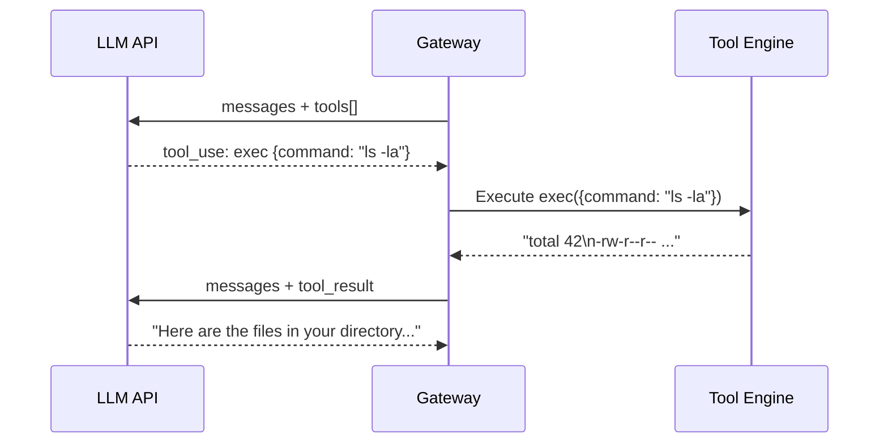
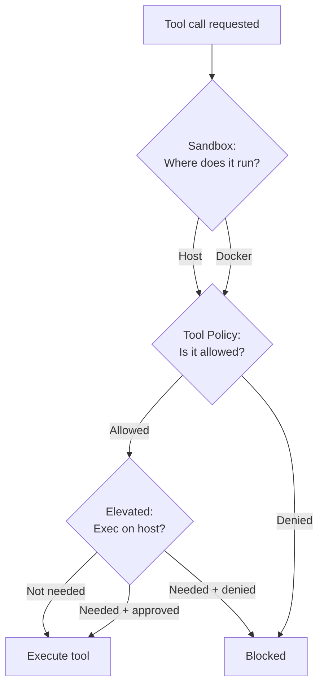

# Tool System

Tools are what make OpenClaw's agent more than a chatbot. Without tools, it can only generate text. With tools, it can **read files, run commands, browse the web, control a browser, send messages across channels, manage cron jobs, and interact with paired devices**. Tools are the agent's hands.

This lesson covers how tools work, how they're controlled by policy, and the security model that keeps things safe.

---

## How Tools Work

Tools follow the standard LLM tool-calling pattern:

1. The agent sees a list of available tools (name, description, input schema)
2. The LLM decides to call a tool (returns a `tool_use` block)
3. OpenClaw executes the tool
4. The result is fed back to the LLM
5. The LLM continues (more tool calls or final text response)



A single turn can involve **zero or many** tool calls. The agent keeps calling tools until it has enough information to produce a final text response.

---

## Core Tools

OpenClaw ships with a rich set of built-in tools:

### Filesystem tools

| Tool | What it does |
|------|-------------|
| `read` | Read file contents |
| `write` | Write/create files |
| `edit` | Precise text replacement in files |
| `apply_patch` | Multi-file structured patches |

### Runtime tools

| Tool | What it does |
|------|-------------|
| `exec` | Run shell commands |
| `process` | Manage background processes (poll, log, kill) |

### Web tools

| Tool | What it does |
|------|-------------|
| `web_search` | Search the web (Brave Search API) |
| `web_fetch` | Fetch and extract content from URLs |
| `browser` | Full browser control (Playwright-based) |

### Communication tools

| Tool | What it does |
|------|-------------|
| `message` | Send messages across channels (Discord, Slack, Telegram, WhatsApp, etc.) |
| `sessions_list` | List active sessions |
| `sessions_history` | Read session transcript |
| `sessions_send` | Send to another session |
| `sessions_spawn` | Start a sub-agent task |

### Device and automation tools

| Tool | What it does |
|------|-------------|
| `nodes` | Control paired iOS/Android/macOS devices |
| `canvas` | Drive the visual Canvas workspace |
| `cron` | Manage scheduled jobs |
| `gateway` | Restart Gateway, apply config changes |

### Memory tools

| Tool | What it does |
|------|-------------|
| `memory_search` | Semantic search over memory files |
| `memory_get` | Read specific memory file content |

### Other tools

| Tool | What it does |
|------|-------------|
| `image` | Analyze images with a vision model |
| `tts` | Text-to-speech |
| `session_status` | Current session info, model switching |

---

## Tool Policy: The Three Layers

OpenClaw has three distinct control layers for tools. Understanding which one is blocking you is the key to debugging "tool not available" issues.



### Layer 1: Sandbox (where tools run)

Sandboxing controls whether tools execute on your host machine or inside a Docker container:

| Mode | Behavior |
|------|----------|
| `off` | Everything runs on the host (default) |
| `non-main` | Only non-main sessions are sandboxed (groups, channels) |
| `all` | Everything is sandboxed |

```json5
{
  agents: {
    defaults: {
      sandbox: {
        mode: "non-main",  // Sandbox group sessions
      },
    },
  },
}
```

Why `non-main`? Your private DM session is trusted (it's you). But group sessions might have messages from other people — sandboxing them limits blast radius.

### Layer 2: Tool Policy (which tools exist)

Tool policy controls **what tools the agent can see and call**. If a tool isn't in the policy, the LLM never knows it exists.

```json5
{
  tools: {
    // Global allow/deny
    allow: ["group:fs", "group:runtime", "exec"],
    deny: ["browser"],  // Deny always wins

    // Tool profiles (base allowlist)
    profile: "coding",  // minimal | coding | messaging | full
  },
}
```

**Tool profiles** are convenient presets:

| Profile | What's included |
|---------|----------------|
| `minimal` | `session_status` only |
| `coding` | File ops, runtime, sessions, memory, image |
| `messaging` | Message tool, session list/history/send |
| `full` | Everything (same as no restriction) |

**Tool groups** are shorthands for multiple tools:

| Group | Expands to |
|-------|-----------|
| `group:runtime` | `exec`, `bash`, `process` |
| `group:fs` | `read`, `write`, `edit`, `apply_patch` |
| `group:sessions` | `sessions_list`, `sessions_history`, `sessions_send`, `sessions_spawn`, `session_status` |
| `group:memory` | `memory_search`, `memory_get` |
| `group:web` | `web_search`, `web_fetch` |
| `group:ui` | `browser`, `canvas` |
| `group:automation` | `cron`, `gateway` |
| `group:messaging` | `message` |
| `group:nodes` | `nodes` |

**Deny always wins.** If a tool is in both `allow` and `deny`, it's denied.

### Layer 3: Elevated (exec escape hatch)

Elevated mode is **exec-only** — it lets the agent run shell commands on the host even when sandboxed. It doesn't grant any other tools.

```json5
{
  tools: {
    elevated: {
      enabled: true,
      allowFrom: {
        whatsapp: ["+15555550123"],
        telegram: ["tg:123456789"],
      },
    },
  },
}
```

In chat, toggle elevated mode:
```
/elevated on       ← Enable host exec for this session
/elevated full     ← Enable + skip exec approvals
/elevated off      ← Back to sandbox
```

### Per-agent tool policy

Different agents can have different tool access:

```json5
{
  agents: {
    list: [
      {
        id: "personal",
        // Full access — this is your trusted agent
        tools: { profile: "full" },
      },
      {
        id: "family",
        // Restricted — limited tools for safety
        tools: {
          allow: ["read", "sessions_list", "session_status"],
          deny: ["exec", "write", "edit", "browser"],
        },
        sandbox: { mode: "all" },
      },
    ],
  },
}
```

### Provider-specific tool policy

You can restrict tools for specific LLM providers:

```json5
{
  tools: {
    profile: "coding",
    byProvider: {
      "openai/gpt-4.1-mini": { profile: "minimal" },
    },
  },
}
```

---

## The exec Tool in Depth

`exec` is the most powerful (and most dangerous) tool. It runs shell commands in the agent's workspace.

### Key parameters

| Parameter | Default | Description |
|-----------|---------|-------------|
| `command` | (required) | Shell command to run |
| `timeout` | 1800s | Kill process if exceeded |
| `yieldMs` | 10000ms | Auto-background after this time |
| `background` | false | Run immediately in background |
| `elevated` | false | Run on host when sandboxed |
| `pty` | false | Allocate a pseudo-TTY |

### Auto-backgrounding

If a command takes longer than `yieldMs` (default 10s), OpenClaw automatically moves it to the background. The agent gets a `sessionId` to check on it later via the `process` tool:

```json
// Initial response
{"status": "running", "sessionId": "proc_abc123"}

// Agent polls later
{"action": "poll", "sessionId": "proc_abc123"}
// → {"status": "exited", "exitCode": 0, "output": "..."}
```

### Exec approvals

For commands that need human approval:

```json5
{
  tools: {
    exec: {
      security: "allowlist",  // deny | allowlist | full
      ask: "on-miss",         // off | on-miss | always
    },
  },
}
```

When `ask: "on-miss"`, commands not in the allowlist trigger an approval request. An operator client (CLI, macOS app) must approve before execution continues.

---

## How Tools Are Presented to the LLM

Tools are exposed to the model in **two parallel channels**:

1. **System prompt text**: human-readable descriptions and usage guidance
2. **Tool schema**: structured function definitions (JSON Schema)

```
System prompt:
  "You have access to the following tools:
   - exec: Run shell commands in the workspace
   - read: Read file contents
   ..."

Tool definitions:
  [{name: "exec", description: "...", input_schema: {type: "object", ...}},
   {name: "read", description: "...", input_schema: {type: "object", ...}}]
```

If a tool doesn't appear in either place, the model cannot call it.

---

## Skills: Tool Bundles

Skills are curated bundles of tools + prompt instructions. They can add custom tools beyond the core set:

```bash
# List available skills
openclaw skills list

# Install a managed skill
openclaw skills install weather
```

Skills can be:
- **Bundled**: shipped with OpenClaw
- **Managed**: installed via `openclaw skills install`
- **Workspace**: custom skills in your workspace `skills/` directory

Each skill contributes:
- Tool definitions (registered with the LLM)
- System prompt additions (usage guidance)
- Optional CLI commands

---

## Loop Detection

If the agent gets stuck in a repetitive pattern (calling the same tool with the same params over and over), loop detection can break the cycle:

```json5
{
  tools: {
    loopDetection: {
      enabled: true,
      warningThreshold: 10,          // Warn after 10 repeated calls
      criticalThreshold: 20,         // Force-stop after 20
      globalCircuitBreakerThreshold: 30,
      detectors: {
        genericRepeat: true,         // Same tool + same params
        knownPollNoProgress: true,   // Polling without new output
        pingPong: true,              // A/B/A/B pattern
      },
    },
  },
}
```

---

## Quick Debug: sandbox explain

When a tool is unexpectedly blocked, use the inspector:

```bash
openclaw sandbox explain
openclaw sandbox explain --agent work
openclaw sandbox explain --session agent:main:main
```

This prints:
- Effective sandbox mode and scope
- Whether the current session is sandboxed
- Tool allow/deny lists (and where they came from)
- Elevated gates and how to fix them

> **Key Takeaway:** OpenClaw's tool system is built on defense in depth — sandbox controls *where* tools run, tool policy controls *which* tools exist, and elevated mode provides a controlled escape hatch. For most personal use, `sandbox.mode: "off"` with full tools is fine. For shared or group-facing agents, layer sandbox + tool policy + per-agent restrictions to limit blast radius.

---

## Exercises

1. **Inspect available tools**: Ask your agent "What tools do you have?" and see the list. Compare it to what you'd expect based on your `tools` config.

2. **Test tool policy**: Temporarily add `tools: { deny: ["exec"] }` to your config, restart, and ask the agent to run a command. What happens? Remove the denial and test again.

3. **Use sandbox explain**: Run `openclaw sandbox explain` and read the output. What sandbox mode is active? What tools are allowed? Is elevated mode configured?

---

In the next lesson, we'll cover **Memory and Compaction** — how the agent manages its context window and what happens when conversations get long.
