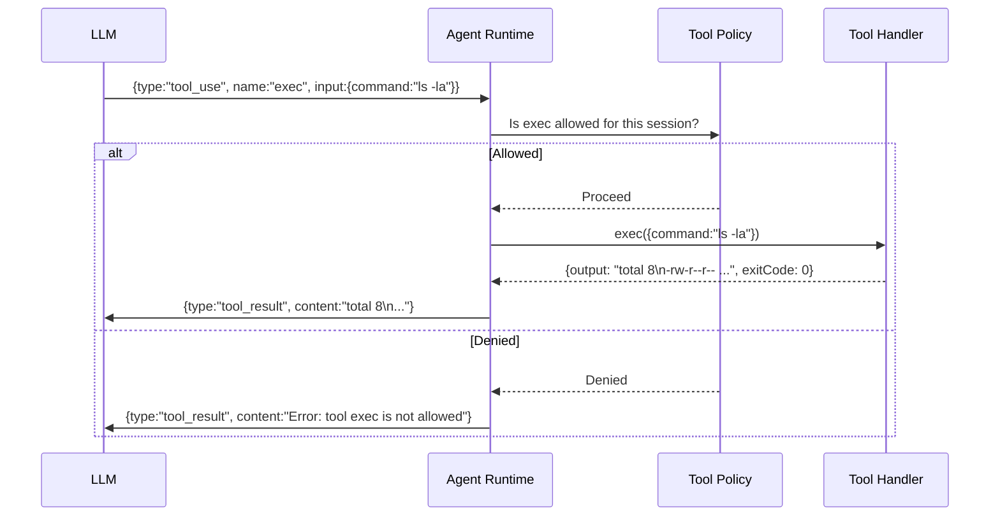

# Tool system

Tools are what make the agent actually useful. Without tools, it's just a very smart chatbot that can write text and reason about things. With tools, it can read your files, run shell commands, browse websites, control your phone, and send messages on your behalf.

This lesson covers what tools exist, how access is controlled, and why the elevated mode distinction matters.

---

## Built-in tools

OpenClaw ships with a core set of tools that are always available (subject to policy):

| Tool | Category | What it does |
|------|---------|-------------|
| `read` | Files | Read file contents (text or images) |
| `write` | Files | Create or overwrite files |
| `edit` | Files | Precise text replacement (surgical edits) |
| `exec` | System | Run shell commands |
| `process` | System | Manage background exec sessions (poll, kill, write stdin) |
| `browser` | Web | Control a browser via Playwright (click, type, screenshot) |
| `web_search` | Web | Search the web |
| `web_fetch` | Web | Fetch and extract content from a URL |
| `canvas` | UI | Control the visual Canvas (agent-driven UI) |
| `nodes` | Devices | Control paired iOS/Android nodes (camera, screen, location) |
| `message` | Messaging | Send messages to channels |
| `image` | Vision | Analyze images with a vision model |
| `tts` | Audio | Text-to-speech output |
| `subagents` | Agents | List, steer, or kill sub-agent runs |
| `apply_patch` | Files | Apply unified diffs (optional; gated by `tools.exec.applyPatch`) |

> **Note:** `TOOLS.md` does NOT control which tools are available. It's a human-readable notes file — guidance for the agent on how to use local tools and conventions. Tool availability is controlled by config and policy.

---

## Tool policy: allow and deny lists

Not every agent should have access to every tool. OpenClaw supports per-agent and per-sandbox tool policies:

```json5
{
  agents: {
    list: [
      {
        id: "family",
        tools: {
          allow: ["read", "exec", "sessions_list", "sessions_history"],
          deny: ["write", "edit", "browser", "canvas", "nodes"]
        }
      }
    ]
  }
}
```

Rules:
- **`allow`**: only these tools are available (all others denied)
- **`deny`**: these tools are blocked (all others allowed)
- If both are set, `allow` is evaluated first, then `deny` removes from the allowed set
- If neither is set: all tools are available (the default)

> **Warning:** `allow` lists are tools, not skills. If a skill needs `exec` to run a binary, `exec` must be in the allow list.

### Global sandbox tool policy

For sandboxed sessions, there's a separate `tools.sandbox` block:

```json5
{
  tools: {
    sandbox: {
      tools: {
        allow: ["exec", "process", "read", "write", "edit"],
        deny: ["browser", "canvas", "nodes", "cron"]
      }
    }
  }
}
```

---

## How tools are executed

When the LLM decides to call a tool, the agent runtime:

1. **Parses** the tool call from the model's response
2. **Validates** it against the tool schema (type-checking parameters)
3. **Applies policy** — checks allow/deny lists
4. **Executes** the tool handler
5. **Returns** the result as a tool result message appended to the conversation



Tool events stream back to WebSocket clients in real time — you can watch the agent use tools as it works.

---

## Sandboxed vs. host execution

This is one of the most important distinctions in the tool system.

### Host execution (default)

By default, `exec` runs commands directly on your host machine with your user permissions. The agent can access any file you can access, run any command you can run.

This is powerful and convenient. It's also why the allowlist/pairing system matters — you don't want random strangers triggering `exec` calls.

### Sandboxed execution

When `agents.defaults.sandbox.mode` is set, the agent runs inside a **Docker container** with restricted access:

```json5
{
  agents: {
    defaults: {
      sandbox: {
        mode: "non-main",     // off | non-main | all
        scope: "agent",        // session | agent | shared
        workspaceAccess: "none",  // none | ro | rw
        docker: {
          network: "none",    // no internet by default
          readOnlyRoot: true,
          memory: "1g",
          cpus: 1
        }
      }
    }
  }
}
```

| Mode | Effect |
|------|--------|
| `off` | No sandbox — all sessions run on host |
| `non-main` | Sandbox all sessions except the main session |
| `all` | Sandbox everything, including the main session |

| Scope | Effect |
|-------|--------|
| `session` | Each session gets its own container |
| `agent` | One container shared across all sessions for this agent |
| `shared` | All agents share one container (least isolation) |

In sandbox mode, `exec` commands run inside the container. Files written by the agent land in the container's workspace, not your host filesystem (unless `workspaceAccess: "rw"`).

---

## Elevated mode

Elevated mode punches a hole through sandboxing for specific trusted senders:

```json5
{
  tools: {
    elevated: {
      enabled: true,
      allowFrom: {
        telegram: ["tg:821071206"],
        whatsapp: ["+61400000000"]
      }
    }
  }
}
```

When a message arrives from a sender in `elevated.allowFrom`:
- `exec` runs on the **host** (bypassing sandbox)
- The agent has full host access for that turn

This is a per-turn elevation based on sender identity, not a permanent mode.

> **Warning:** Elevated mode is high-trust. A sender in `elevated.allowFrom` can effectively run any shell command on your machine through the agent. Only include senders you absolutely trust. Never use `allowFrom: ["*"]` for elevated mode.

The distinction between sandboxed and elevated execution is documented in detail at:
```
docs/gateway/sandbox-vs-tool-policy-vs-elevated.md
```

---

## The `exec` tool in depth

`exec` is the most powerful and most used tool. Key parameters:

| Parameter | Default | Effect |
|-----------|---------|--------|
| `command` | (required) | Shell command to run |
| `yieldMs` | 10000 | Auto-background after this many ms |
| `background` | false | Background immediately |
| `timeout` | 1800s | Kill process after this duration |
| `pty` | false | Run in a pseudo-terminal (for interactive CLIs) |
| `elevated` | false | Run on host even in sandbox mode |
| `workdir` | workspace | Working directory |
| `env` | {} | Extra environment variables |

Long-running commands automatically background after `yieldMs` and return a `sessionId` for later polling via the `process` tool:

```
exec({command:"npm run build", yieldMs:5000})
→ {status:"running", sessionId:"proc_abc", tail:"...first 5s of output..."}

process({action:"poll", sessionId:"proc_abc"})
→ {output:"...new output...", done:false}

process({action:"poll", sessionId:"proc_abc"})
→ {output:"Build complete!", exitCode:0, done:true}
```

---

## Skills and custom tools

Skills can register additional tools beyond the built-ins. A skill's SKILL.md file describes the tool and how to use it; the skill's runtime code provides the implementation.

Skills load from three locations (workspace wins on name conflict):
1. **Bundled** — shipped with OpenClaw install
2. **Managed** — `~/.openclaw/skills/` (installed via `clawhub` or manually)
3. **Workspace** — `<workspace>/skills/`

Skills can gate their tools with config or environment variable checks — a skill might only activate its tool when an API key is present.

---

## Summary

| Aspect | Detail |
|--------|--------|
| Core tools | ~15 built-ins: read, write, edit, exec, browser, web_search, nodes, message, etc. |
| Policy | Allow/deny lists per agent; sandbox tool policy separately |
| Execution | Host (default) or Docker sandbox (when enabled) |
| Elevated | Per-sender host bypass for trusted users |
| Skills | Can add custom tools; workspace skills override bundled ones |
| `TOOLS.md` | Guidance only — does NOT control tool availability |

---

> **Exercise:** Audit your agent's tool access.
> 1. Start a session and ask your agent: "What tools do you have available?"
> 2. Compare the list to the table in this lesson — are any missing?
> 3. Find your `tools` section in `openclaw.json` (or confirm there isn't one — meaning all tools are available)
> 4. If you have a sandboxed setup, try running `openclaw doctor` and look for any sandbox-related warnings
>
> **Bonus:** Try running `exec({command:"echo hello from $(whoami)"})` by asking your agent to run a shell command. Notice where it runs and what user it shows.

---

In the next lesson, we'll look at memory and compaction — how the agent maintains long-term knowledge and how the context window is managed.
