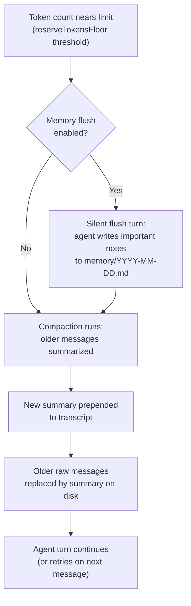

# Memory and compaction

LLMs have context windows — finite amounts of text they can hold in mind at once. Long conversations eventually exceed that limit. And even within the limit, you want some information to persist beyond a single session.

This lesson covers how OpenClaw handles both problems: long-term memory through workspace files, and context management through session compaction.

---

## Two kinds of memory

OpenClaw handles memory at two distinct levels:

| Level | What it is | How it persists |
|-------|-----------|----------------|
| Session memory | The conversation transcript — everything said in this session | JSONL file on disk |
| Long-term memory | Notes the agent writes explicitly to survive session boundaries | Workspace markdown files |

Session memory is automatic. Long-term memory requires the agent to actively write it — the discipline of "what's worth remembering beyond today?"

---

## Long-term memory: the workspace files

### Daily memory logs

The recommended pattern is a daily log file:

```
~/.openclaw/workspace/
└── memory/
    ├── 2026-02-25.md
    ├── 2026-02-26.md
    └── 2026-02-27.md    ← today
```

The agent writes important things here: decisions made, context the user shared, ongoing tasks, facts to remember. The next day, a new file starts.

The agent should read today's and yesterday's memory at session start (per AGENTS.md instructions). This is convention, not magic — the agent reads these files using the `read` tool.

### MEMORY.md: curated long-term memory

For things that should last indefinitely (user preferences, important facts, recurring patterns), use `MEMORY.md`:

```markdown
# Long-Term Memory

## About the User
- Prefers concise replies
- Lives in Sydney, Australia (AEDT timezone)
- Primary projects: openclaw-academy, blog content pipeline

## Established Patterns
- Always use pyenv Python (not system Python)
- Commits use author: "Benjamin Locutus Dookeran"
- Blog posts should be reviewed with humanizer before publishing
```

> **Warning:** Only load `MEMORY.md` in private sessions (your own DMs). Never inject it into group sessions where other people can read it.

### Pre-compaction memory flush

Before a compaction happens, OpenClaw can trigger a silent "memory flush" agent turn:

```json5
{
  agents: {
    defaults: {
      compaction: {
        memoryFlush: {
          enabled: true,
          softThresholdTokens: 6000,
          prompt: "Write any lasting notes to memory/YYYY-MM-DD.md; reply NO_REPLY if nothing to store."
        }
      }
    }
  }
}
```

This runs a full agent turn with no user message, giving the agent a chance to save anything important before older history gets summarized away. Think of it as insurance against losing valuable context mid-session.

---

## Memory backends

### Built-in (default)

The default backend uses simple file search. The agent manually reads `MEMORY.md` and `memory/*.md` using the `read` tool.

```json5
{
  memory: {
    backend: "builtin"
  }
}
```

Works well for simple setups, small memory stores, and when you don't need semantic search.

### QMD: semantic vector search

QMD (Query Memory Database) adds a local vector embedding layer for semantic search. Instead of reading entire files, the agent can query for relevant snippets:

```json5
{
  memory: {
    backend: "qmd",
    qmd: {
      paths: [
        { "path": "/path/to/vault", "pattern": "**/*.md" },
        { "path": "/path/to/memory", "pattern": "**/*.md" }
      ],
      sessions: { "enabled": true, "retentionDays": 60 },
      limits: { "maxResults": 12 }
    }
  }
}
```

QMD indexes your markdown files with local vector embeddings and returns the most semantically relevant results for a given query — without the agent having to know which file contains the answer.

Worth using when your memory store has grown to hundreds of notes, or when you maintain a vault and want the agent to find things without navigating files manually.

---

## Session compaction

When a session transcript grows large enough to approach the model's context window, compaction triggers automatically. This is how OpenClaw keeps conversations going indefinitely.

### Why compaction is necessary

Models have a fixed context window — Claude Sonnet might handle 200,000 tokens; GPT-4 models vary. A months-long conversation can easily exceed any limit. Without compaction, the agent would eventually fail with a "context too long" error.

### How compaction works



Compaction modes:

| Mode | Behavior |
|------|----------|
| `default` | Standard summarization — older messages condensed into a summary block |
| `safeguard` | Chunked summarization for very long histories — handles edge cases more robustly |

```json5
{
  agents: {
    defaults: {
      compaction: {
        mode: "safeguard",           // recommended
        reserveTokensFloor: 24000    // headroom to keep free before compacting
      }
    }
  }
}
```

### What the agent sees after compaction

Before compaction:
```
[200 messages of conversation history]
[new user message]
```

After compaction:
```
[Summary: "The user asked about X, Y, Z. Key decisions: A, B. Ongoing tasks: C."]
[Recent 10-20 messages kept verbatim]
[new user message]
```

The agent has summarized context rather than the full transcript. It can answer new questions and work on ongoing tasks, but it won't have verbatim recall of something said two months ago.

### Context pruning (tool result pruning)

Separately from compaction, OpenClaw also prunes oversized **tool results** from the in-memory context before sending to the LLM:

```json5
{
  agents: {
    defaults: {
      contextPruning: {
        mode: "cache-ttl",          // off | cache-ttl
        ttl: "1h",                  // how often pruning can run
        keepLastAssistants: 3,      // never prune recent turns
        softTrim: {
          maxChars: 4000,
          headChars: 1500,
          tailChars: 1500
        },
        hardClear: {
          enabled: true,
          placeholder: "[Old tool result content cleared]"
        }
      }
    }
  }
}
```

This is different from compaction: it only trims tool result content from older turns, without summarizing the conversation itself. It doesn't modify the JSONL on disk — only the in-memory context before LLM calls.

---

## Compaction hook points

Plugins can observe and annotate compaction cycles:

- **`before_compaction`**: called before compaction runs — observe the state, inject extra context to summarize
- **`after_compaction`**: called after compaction completes — log the event, update external systems

```json5
// In a plugin:
{
  "before_compaction": async (ctx) => {
    ctx.extraContext = "Remember: the user is working on the openclaw-academy project.";
  }
}
```

---

## Practical memory management

Here's a workflow that works well:

**1. Session instructions in AGENTS.md**

```markdown
## Memory
- At session start, read today's and yesterday's memory log (memory/YYYY-MM-DD.md)
- At session end (or before /reset), summarize key decisions to today's memory log
- Keep MEMORY.md for permanent facts only
```

**2. Periodic manual review**

Once a week, review `memory/` files and prune anything no longer relevant. Keep `MEMORY.md` tight — it gets injected every session.

**3. Let compaction handle the rest**

Don't try to manually manage context window limits. Set a reasonable `reserveTokensFloor` and let compaction handle long sessions automatically.

---

## Summary

| Concept | Detail |
|---------|--------|
| Session memory | Automatic — full JSONL transcript on disk |
| Daily logs | `memory/YYYY-MM-DD.md` — agent writes, reads at session start |
| MEMORY.md | Curated permanent facts — loaded explicitly by agent |
| Memory flush | Silent pre-compaction turn to save important context |
| Compaction | Automatic — summarizes old history when context window fills |
| Context pruning | Trims old tool results in-memory (doesn't touch disk) |
| QMD backend | Semantic search over markdown files (optional, powerful) |

---

> **Exercise:** Set up a daily memory log workflow.
> 1. Create `~/.openclaw/workspace/memory/` if it doesn't exist
> 2. Create today's memory file: `touch ~/.openclaw/workspace/memory/$(date +%Y-%m-%d).md`
> 3. Add this instruction to your AGENTS.md: "At the start of each session, read today's memory log at memory/YYYY-MM-DD.md (using today's date)."
> 4. Start a new session and ask the agent to check if it can find the memory file
> 5. Tell the agent something important about you, then ask it to write it to today's memory log
>
> **Bonus:** Review `~/.openclaw/agents/main/sessions/sessions.json` and find your current session's token count. This tells you how close you are to compaction.

---

In the next lesson, we'll explore multi-agent routing — how to run multiple isolated agents in one Gateway and route different conversations to different brains.
