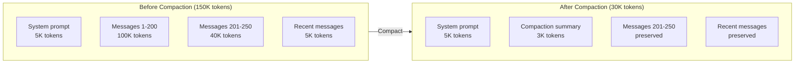
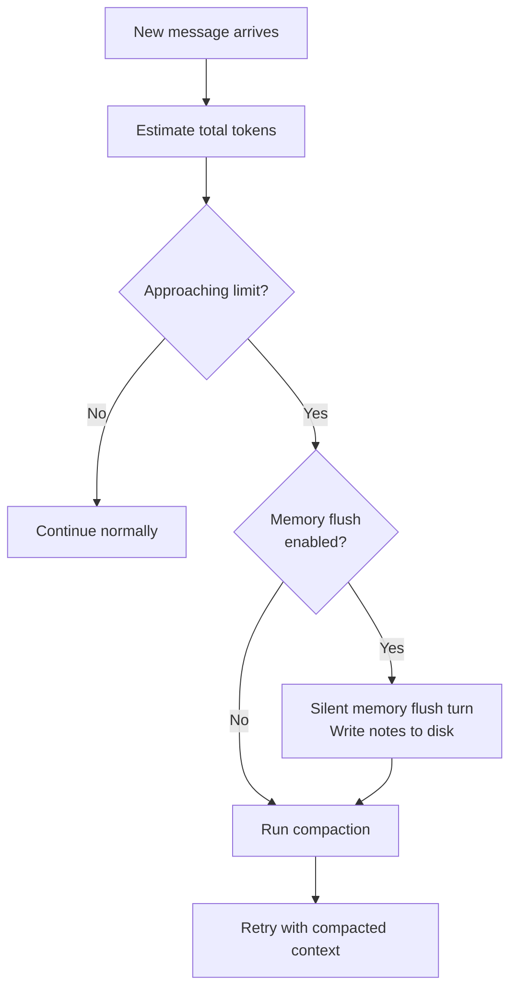
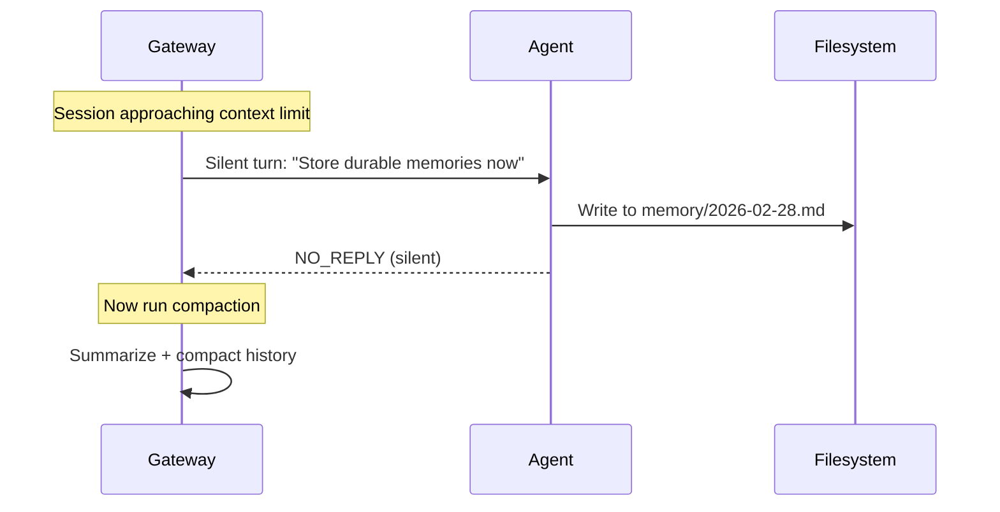
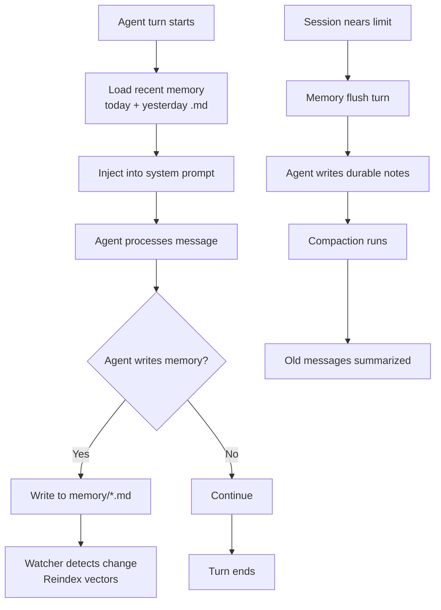

# Memory & Compaction

LLMs have a **context window** — a maximum number of tokens they can process in a single request. Long-running conversations will eventually exceed this limit. OpenClaw handles this with two complementary systems: **compaction** (summarizing old history) and **memory** (persisting important information to disk).

Understanding these systems is essential for anyone running persistent, always-on agents.

---

## The Context Window Problem

Every model has a limit:

| Model | Context window |
|-------|---------------|
| Claude Sonnet 4.6 | 200K tokens |
| Claude Opus 4.6 | 200K tokens |
| GPT-4.1 | 1M tokens |
| Claude Haiku 4.5 | 200K tokens |

Sounds like a lot, right? But consider what fills the window:

| Component | Typical size |
|-----------|-------------|
| System prompt (AGENTS.md, SOUL.md, etc.) | 2K-8K tokens |
| Skills instructions | 1K-5K tokens |
| Per-turn user message | 50-500 tokens |
| Per-turn assistant response | 100-2000 tokens |
| Per-turn tool calls + results | 500-10000 tokens |

A session with heavy tool usage (reading files, running commands, browsing the web) can accumulate **50-100K tokens per hour** of active use. Even a 200K window fills up in a couple of hours.

---

## What Is Compaction?

Compaction **summarizes older conversation history** into a compact summary, then keeps only recent messages at full fidelity. It's like a historian writing a summary of yesterday's events so you don't have to re-read every transcript.



### What compaction preserves

- A **summary** of the compacted messages (key decisions, facts, context)
- All **recent messages** after the compaction point (full fidelity)
- The **system prompt** (always stays)

### What compaction loses

- The exact wording of old messages
- Detailed tool call inputs and outputs from old turns
- Nuances that the summarization model didn't capture

Compaction is **lossy** — that's the tradeoff. You gain space, you lose detail.

---

## Auto-Compaction

By default, OpenClaw triggers compaction automatically when the session approaches the model's context limit.



When auto-compaction fires, you'll see in verbose mode:

```
🧹 Auto-compaction complete
```

And in `/status`:

```
🧹 Compactions: 3
```

### Configuration

```json5
{
  agents: {
    defaults: {
      compaction: {
        reserveTokensFloor: 20000,  // Keep this much room for new turns
      },
    },
  },
}
```

The `reserveTokensFloor` ensures there's always room for a new turn after compaction. Without it, a compacted session might immediately trigger another compaction on the next message.

---

## Manual Compaction

You can force compaction at any time:

```
/compact
```

Or with instructions to guide the summary:

```
/compact Focus on the database migration decisions and open questions
```

This is useful when:
- The session feels "stale" (agent keeps referencing old, irrelevant context)
- You want a clean summary before diving into a new topic
- Context is bloated from a long debugging session with lots of tool output

---

## Memory: What Survives Compaction

Compaction summarizes — but summaries are imperfect. **Memory files** are your safety net. They persist important information to disk where it survives any number of compactions.

### Memory file layout

```
~/.openclaw/workspace/
├── MEMORY.md                    ← Curated long-term memory
└── memory/
    ├── 2026-02-27.md           ← Yesterday's daily log
    ├── 2026-02-28.md           ← Today's daily log
    ├── projects.md             ← Evergreen project notes
    └── network.md              ← Evergreen network config
```

| File | Purpose | Loaded when |
|------|---------|-------------|
| `MEMORY.md` | Curated long-term facts | Session start (main/private only) |
| `memory/YYYY-MM-DD.md` | Daily append-only log | Today + yesterday at session start |
| `memory/*.md` (other) | Evergreen topic files | Indexed for semantic search |

### How the agent uses memory

The agent has two memory tools:

- **`memory_search`**: Semantic search across all memory files. "What do I know about Rod's work schedule?" finds relevant snippets even if the wording differs.
- **`memory_get`**: Direct read of a specific memory file and line range.

### When to write memory

The agent writes to memory when:
- You say "remember this" or "save this for later"
- The automatic memory flush triggers (pre-compaction)
- The agent decides something is important enough to persist

You can also directly edit memory files yourself — they're just Markdown.

---

## Memory Flush: The Pre-Compaction Safety Net

This is one of OpenClaw's cleverest features. **Before compaction runs, a silent agent turn writes important context to memory files.**



### How it works

1. Session token count crosses a **soft threshold** (configurable)
2. OpenClaw runs a **silent agentic turn** with a memory flush prompt
3. The agent writes important notes to `memory/YYYY-MM-DD.md`
4. The agent responds with `NO_REPLY` (nothing sent to the user)
5. Compaction runs, summarizing the now-preserved context

### Configuration

```json5
{
  agents: {
    defaults: {
      compaction: {
        reserveTokensFloor: 20000,
        memoryFlush: {
          enabled: true,
          softThresholdTokens: 4000,
          systemPrompt: "Session nearing compaction. Store durable memories now.",
          prompt: "Write any lasting notes to memory/YYYY-MM-DD.md; reply with NO_REPLY if nothing to store.",
        },
      },
    },
  },
}
```

The soft threshold fires when:
```
tokenCount > contextWindow - reserveTokensFloor - softThresholdTokens
```

Memory flush runs **once per compaction cycle** — tracked in `sessions.json` via `memoryFlushDone`.

---

## Session Pruning: The Other Optimization

While compaction summarizes old messages permanently, **session pruning** is a transient optimization that trims tool results before each LLM call.

### Compaction vs Pruning

| | Compaction | Session Pruning |
|-|-----------|----------------|
| **What it does** | Summarizes old messages | Trims old tool results |
| **Persistent?** | Yes (written to JSONL) | No (in-memory only) |
| **What's affected** | All old messages | Only `toolResult` messages |
| **When it runs** | Near context limit | Each LLM request (when enabled) |
| **Can be reversed?** | No (lossy) | Yes (transcript unchanged) |

### How pruning works

Pruning has two levels:

**Soft-trim**: Oversized tool results are truncated. Head + tail are kept, middle is replaced with `...`:

```
Original: [10000 chars of exec output]
Pruned:   [first 1500 chars] ... [last 1500 chars]
          (Original: 10000 chars)
```

**Hard-clear**: Old tool results are replaced entirely:

```
Original: [Full file contents from `read` tool]
Pruned:   [Old tool result content cleared]
```

### Configuration

```json5
{
  agents: {
    defaults: {
      contextPruning: {
        mode: "cache-ttl",    // off | cache-ttl
        ttl: "5m",            // Only prune after 5 minutes idle
        keepLastAssistants: 3, // Protect tools from last 3 responses
        softTrim: { maxChars: 4000, headChars: 1500, tailChars: 1500 },
        hardClear: { enabled: true, placeholder: "[Old tool result content cleared]" },
      },
    },
  },
}
```

Pruning is particularly useful with Anthropic's prompt caching — it reduces cache-write costs when sessions go idle past the cache TTL.

---

## Vector Memory Search

OpenClaw can build a **vector index** over your memory files, enabling semantic search that finds related notes even when wording differs.

### How it works

1. Memory files are split into chunks (~400 tokens each)
2. Each chunk is embedded using an embedding model
3. When you search, your query is embedded and compared to stored chunks
4. Most similar chunks are returned

### Embedding providers

| Provider | Type | Notes |
|----------|------|-------|
| OpenAI | Remote | `text-embedding-3-small` (default) |
| Gemini | Remote | `gemini-embedding-001` |
| Voyage | Remote | High quality |
| Local | On-device | `node-llama-cpp` + GGUF model |

### Hybrid search (BM25 + vectors)

OpenClaw combines two retrieval strategies:

- **Vector similarity**: finds semantically related content (good for paraphrases)
- **BM25 keyword search**: finds exact matches (good for IDs, code symbols, error strings)

```json5
{
  agents: {
    defaults: {
      memorySearch: {
        query: {
          hybrid: {
            enabled: true,
            vectorWeight: 0.7,
            textWeight: 0.3,
          },
        },
      },
    },
  },
}
```

### Temporal decay

Newer memories can be ranked higher than older ones:

```json5
{
  agents: {
    defaults: {
      memorySearch: {
        query: {
          hybrid: {
            temporalDecay: {
              enabled: true,
              halfLifeDays: 30,  // Score halves every 30 days
            },
          },
        },
      },
    },
  },
}
```

With a 30-day half-life:
- Today's notes: **100%** of original score
- 7 days ago: **~84%**
- 30 days ago: **50%**
- 90 days ago: **12.5%**

Evergreen files (`MEMORY.md`, non-dated files in `memory/`) are never decayed.

---

## The Full Memory Pipeline



> **Key Takeaway:** Memory and compaction work together to give the agent persistent, long-term recall despite finite context windows. Compaction keeps sessions within limits. Memory flush saves important context before compaction discards it. Vector search lets the agent recall information across sessions. The result is an agent that can maintain coherent, months-long relationships with its users — something no vanilla LLM can do.

---

## Exercises

1. **Check your compaction count**: Send `/status` in chat and look for the compaction count. If it's 0, your sessions haven't hit the context limit yet. Try `/compact` manually and see what changes.

2. **Write a memory**: Tell your agent "Remember that my preferred programming language is Rust." Then start a new session (`/new`) and ask "What's my favorite programming language?" Does it remember?

3. **Inspect memory files**: Open `~/.openclaw/workspace/memory/` and look at the daily logs. What has the agent written? Is there a `MEMORY.md`? What's in it?

4. **Test the flush**: If you have a long-running session, check `sessions.json` for the `memoryFlushDone` flag. Has memory flush triggered? What did it write to the daily log?

---

In the next lesson, we'll explore **Multi-Agent Routing** — running multiple isolated agents with different personalities, tools, and session stores.
