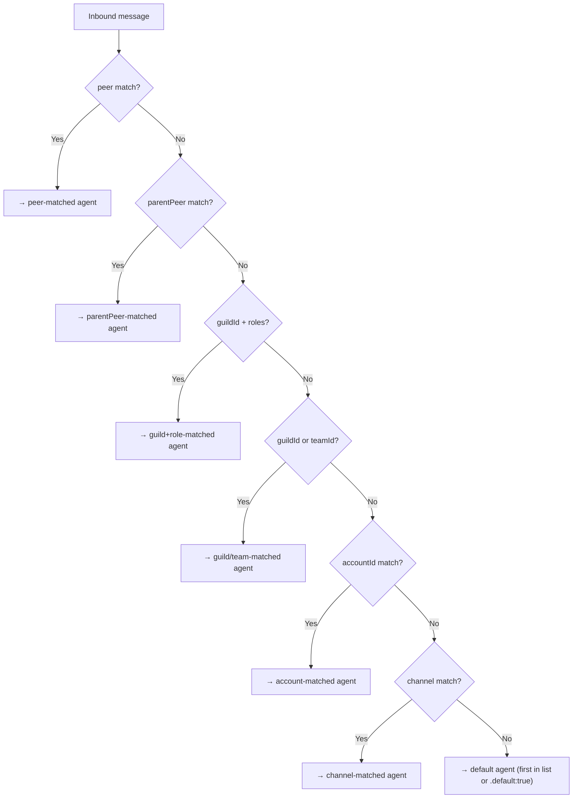
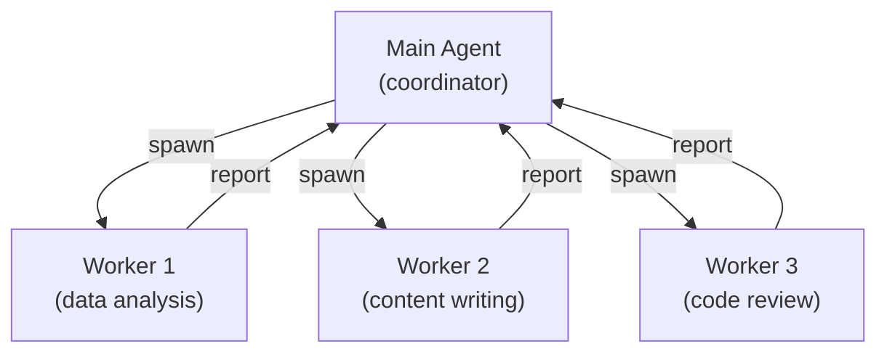

# Multi-Agent Routing

One Gateway, many brains. OpenClaw can host multiple isolated agents simultaneously — each with its own personality, workspace, and conversation history. A fast everyday assistant on WhatsApp; a deep-work research agent on Telegram; a family bot on a WhatsApp group — all running on the same machine, managed by the same config file.

---

## What "Multiple Agents" Actually Means

Each agent in OpenClaw is a fully scoped entity with its own:

| Component | Isolation |
|-----------|----------|
| **Workspace** | Separate directory (AGENTS.md, SOUL.md, etc.) |
| **Session store** | Separate `~/.openclaw/agents/<agentId>/sessions/` |
| **Auth profiles** | Separate `~/.openclaw/agents/<agentId>/agent/auth-profiles.json` |
| **Model config** | Can use different LLM providers per agent |
| **Tool policy** | Can have different allow/deny lists |
| **Persona** | Completely different personality from SOUL.md |

There is **no cross-talk** between agents unless explicitly configured. Agent Alice's sessions are invisible to Agent Bob. Their workspaces, credentials, and conversation histories are fully isolated.

> **Important:** Never reuse `agentDir` across agents — that path stores auth profiles and model registry. Shared `agentDir` causes auth collisions.

---

## Single-Agent vs. Multi-Agent

By default, OpenClaw runs a **single agent** called `main`:

```
Sessions: agent:main:<mainKey>
Workspace: ~/.openclaw/workspace
AgentDir: ~/.openclaw/agents/main/agent
```

You don't need to configure anything for single-agent mode — it's the default. The `agents.list` section is only needed when you want multiple agents.

---

## Adding a Second Agent

Use the wizard to add a new isolated agent:

```bash
openclaw agents add work
```

Or configure it manually in `openclaw.json`:

```json5
{
  agents: {
    list: [
      {
        id: "main",
        workspace: "~/.openclaw/workspace-main",
        default: true   // fallback when no binding matches
      },
      {
        id: "work",
        workspace: "~/.openclaw/workspace-work",
        model: {
          primary: "anthropic/claude-opus-4-6"  // different model for work agent
        }
      }
    ]
  }
}
```

Each workspace needs its own `AGENTS.md`, `SOUL.md`, etc. Run `openclaw setup --workspace ~/.openclaw/workspace-work` to seed missing files.

---

## Bindings: How Messages Get Routed

Bindings connect inbound messages to agents. Each binding has a `match` condition and an `agentId`:

```json5
{
  bindings: [
    // Route all Telegram messages to "work" agent
    { agentId: "work", match: { channel: "telegram" } },

    // Route all WhatsApp messages to "main" agent
    { agentId: "main", match: { channel: "whatsapp" } },

    // Per-peer override: one specific Telegram DM goes to "main"
    {
      agentId: "main",
      match: {
        channel: "telegram",
        peer: { kind: "direct", id: "821071206" }
      }
    }
  ]
}
```

### Routing priority (most-specific wins)



Peer-level bindings always win. Channel-level bindings are the fallback. This means you can put channel-wide rules at the bottom and add exceptions above them.

**Example: WhatsApp everyday, Telegram deep-work, one special DM to Opus**

```json5
{
  agents: {
    list: [
      { id: "chat", workspace: "~/.openclaw/workspace-chat", model: "anthropic/claude-sonnet-4-6" },
      { id: "opus", workspace: "~/.openclaw/workspace-opus", model: "anthropic/claude-opus-4-6" }
    ]
  },
  bindings: [
    // This specific WhatsApp DM goes to opus (peer wins over channel)
    {
      agentId: "opus",
      match: { channel: "whatsapp", peer: { kind: "direct", id: "+15551234567" } }
    },
    // Rest of WhatsApp → chat
    { agentId: "chat", match: { channel: "whatsapp" } },
    // All Telegram → opus
    { agentId: "opus", match: { channel: "telegram" } }
  ]
}
```

---

## Multiple Channel Accounts

Channels like Telegram and WhatsApp support **multiple accounts** (multiple bots or phone numbers) per Gateway:

```json5
{
  channels: {
    telegram: {
      accounts: {
        default: { botToken: "123456:ABC..." },
        alerts: { botToken: "987654:XYZ...", dmPolicy: "allowlist", allowFrom: ["tg:12345"] }
      }
    }
  },
  bindings: [
    { agentId: "main", match: { channel: "telegram", accountId: "default" } },
    { agentId: "alerts-agent", match: { channel: "telegram", accountId: "alerts" } }
  ]
}
```

Each `accountId` is a separate bot/login. Binding by `accountId` routes specific accounts to specific agents.

---

## Agent Workspaces and Isolation

Each agent's workspace is its home directory for file operations. The agent's `exec` and `read` tools default to this workspace as their working directory.

This is a **default cwd** — not a hard sandbox. Relative paths resolve inside the workspace; absolute paths can still reach the host filesystem unless sandboxing is enabled.

For true isolation between agents (e.g., a family agent that shouldn't be able to read your personal workspace), combine workspace isolation with Docker sandboxing:

```json5
{
  agents: {
    list: [
      {
        id: "family",
        workspace: "~/.openclaw/workspace-family",
        sandbox: {
          mode: "all",
          scope: "agent",
          workspaceAccess: "rw"   // family agent only sees its own workspace
        },
        tools: {
          deny: ["nodes", "browser", "canvas"]
        }
      }
    ]
  }
}
```

---

## Agent-to-Agent Communication

By default, agents are siloed. To allow them to message each other:

```json5
{
  tools: {
    agentToAgent: {
      enabled: true,
      allow: ["main", "work"]   // which agents can message each other
    }
  }
}
```

Once enabled, an agent can use the `message` tool to send a message to another agent's session, or use `sessions_spawn` to create a sub-agent.

---

## Sub-Agents via `sessions_spawn`

The most powerful form of agent-to-agent collaboration is spawning sub-agents. A main agent can delegate a complex task to a sub-agent running a different workspace:

```
sessions_spawn({
  sessionKey: "agent:worker:task-123",
  message: "Analyze this CSV and return the top 10 rows by revenue",
  workspace: "~/.openclaw/workspace-worker",
  model: "openai/gpt-5.2"
})
```

Sub-agents:
- Run in their own session (separate transcript)
- Can use any available tools
- Report completion back to the parent via push-based events
- Can be monitored via the `subagents` tool

This is how you build pipelines: a coordinator agent that breaks down complex tasks and dispatches them to specialized workers.



---

## Verifying Your Multi-Agent Setup

After configuring multiple agents:

```bash
# List agents with their bindings
openclaw agents list --bindings

# Verify channels are connected
openclaw channels status --probe

# Full health check
openclaw doctor
```

The `--bindings` flag shows which agents are configured and which bindings point to them.

---

## Common Patterns

### Pattern 1: Split by channel

Route WhatsApp to a fast everyday agent, Telegram to a powerful research agent.

```json5
{
  bindings: [
    { agentId: "fast", match: { channel: "whatsapp" } },
    { agentId: "deep", match: { channel: "telegram" } }
  ]
}
```

### Pattern 2: Split by person (shared phone number)

One WhatsApp number, two people, two agents:

```json5
{
  bindings: [
    { agentId: "alice", match: { channel: "whatsapp", peer: { kind: "direct", id: "+15551230001" } } },
    { agentId: "bob", match: { channel: "whatsapp", peer: { kind: "direct", id: "+15551230002" } } }
  ]
}
```

### Pattern 3: Group to a dedicated agent

One WhatsApp group routes to a specialized family bot:

```json5
{
  bindings: [
    { agentId: "family", match: { channel: "whatsapp", peer: { kind: "group", id: "120363...@g.us" } } },
    { agentId: "main", match: { channel: "whatsapp" } }  // everything else
  ]
}
```

---

## Summary

| Concept | Detail |
|---------|--------|
| Agent | Fully isolated: workspace, sessions, auth, persona |
| Single-agent | Default — one `main` agent, no bindings needed |
| Multi-agent | Configure `agents.list` + `bindings` in `openclaw.json` |
| Bindings | Route by channel, accountId, or peer; most-specific wins |
| Workspace | Per-agent default cwd; sandbox for true isolation |
| Sub-agents | `sessions_spawn` for task delegation and pipelines |
| Agent-to-agent | Off by default; enable via `tools.agentToAgent` |

---

> **Exercise:** Plan a two-agent setup (you don't need to implement it to learn).
> 1. What two different personas would make sense for your usage? (e.g., "quick assistant" vs "deep researcher")
> 2. Which channels would you route to each?
> 3. What model would you use for each? (cheaper/faster vs more capable)
> 4. Would you need different tool policies for each?
>
> Write your plan in a comment in your `openclaw.json`. Even if you don't have two agents yet, designing the architecture is good practice.
>
> **If you're ready to implement it:** Run `openclaw agents add <name>`, configure your `bindings`, and test with `openclaw agents list --bindings`.

---

This completes Module 4. You now understand agent lifecycle, the tool system, memory and compaction, and multi-agent routing. Take the quiz to lock in the key concepts before moving on to Module 5: Skills.
