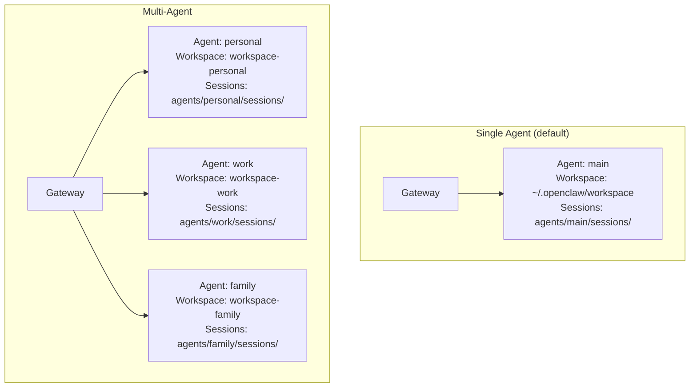
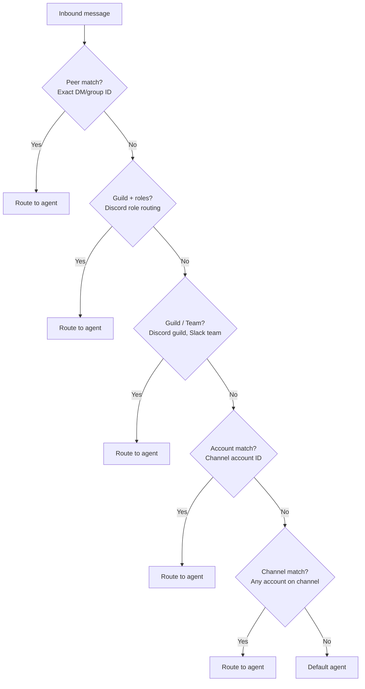

# Multi-Agent Routing

So far, we've mostly talked about a single agent — one workspace, one personality, one session store. But OpenClaw supports **multiple isolated agents** running side by side in the same Gateway process. Each agent is a fully separate brain with its own persona, tools, sessions, and even its own model.

This is how you go from "personal assistant" to "a team of specialized assistants."

---

## What Is an Agent?

An agent is a **fully scoped brain** with its own:

| Component | Purpose | Location |
|-----------|---------|----------|
| **Workspace** | Files that define behavior (AGENTS.md, SOUL.md, USER.md) | `~/.openclaw/workspace-<id>` |
| **Agent directory** | Auth profiles, model registry, per-agent config | `~/.openclaw/agents/<id>/agent/` |
| **Session store** | Conversation transcripts + metadata | `~/.openclaw/agents/<id>/sessions/` |
| **Skills** | Per-agent skills in workspace `skills/` folder | Workspace-relative |

### Single vs multi-agent



In single-agent mode, OpenClaw runs one agent with `agentId: "main"`. Everything goes to this agent. You don't need to configure anything special.

Multi-agent mode lets you run many agents, each with completely isolated state.

---

## Why Multiple Agents?

| Use case | What you set up |
|----------|----------------|
| **Work vs personal** | Different personas, different models, different tools |
| **Family sharing** | One Gateway, each family member gets their own agent |
| **Channel specialization** | Everyday chat on Sonnet, deep work on Opus |
| **Security isolation** | Sandboxed agents for group chats, full access for DMs |
| **Different personalities** | Friendly assistant + technical coder + creative writer |

---

## Setting Up Multiple Agents

### Using the wizard

The easiest way to add an agent:

```bash
openclaw agents add work
```

This creates:
- A workspace at `~/.openclaw/workspace-work`
- An agent directory at `~/.openclaw/agents/work/agent`
- A session store at `~/.openclaw/agents/work/sessions`
- Default SOUL.md, AGENTS.md, and USER.md files

### Manual config

Or configure directly in `openclaw.json`:

```json5
{
  agents: {
    list: [
      {
        id: "personal",
        default: true,
        name: "Personal",
        workspace: "~/.openclaw/workspace-personal",
        model: "anthropic/claude-sonnet-4-6",
      },
      {
        id: "work",
        name: "Work",
        workspace: "~/.openclaw/workspace-work",
        model: "anthropic/claude-opus-4-6",
      },
      {
        id: "family",
        name: "Family",
        workspace: "~/.openclaw/workspace-family",
        model: "anthropic/claude-haiku-4-5",
        sandbox: { mode: "all" },
        tools: {
          allow: ["read", "sessions_list", "session_status"],
          deny: ["exec", "write", "browser"],
        },
      },
    ],
  },
}
```

### Verify setup

```bash
openclaw agents list --bindings
```

This shows all configured agents and their routing rules.

---

## Routing: Which Messages Go Where

The **bindings** array routes inbound messages to agents. Without bindings, everything goes to the default agent.

### Routing priority

Bindings are evaluated **most-specific first**:



When multiple bindings match at the same priority, **first in config order wins**. Keep more specific bindings above broader ones.

### Common routing patterns

**Route by channel** — split Telegram and WhatsApp to different agents:

```json5
{
  bindings: [
    { agentId: "deepwork", match: { channel: "telegram" } },
    { agentId: "everyday", match: { channel: "whatsapp" } },
  ],
}
```

**Route by account** — one Discord bot per agent:

```json5
{
  bindings: [
    { agentId: "main", match: { channel: "discord", accountId: "default" } },
    { agentId: "coding", match: { channel: "discord", accountId: "coding" } },
  ],
}
```

**Route by peer** — specific conversations to specific agents:

```json5
{
  bindings: [
    // This person gets Opus
    {
      agentId: "opus",
      match: { channel: "whatsapp", peer: { kind: "direct", id: "+15551234567" } },
    },
    // This group gets the family agent
    {
      agentId: "family",
      match: { channel: "whatsapp", peer: { kind: "group", id: "120363...@g.us" } },
    },
    // Everything else
    { agentId: "everyday", match: { channel: "whatsapp" } },
  ],
}
```

**Route by Slack team:**

```json5
{
  bindings: [
    { agentId: "work", match: { channel: "slack", teamId: "T123456789" } },
  ],
}
```

---

## Per-Agent Configuration

Each agent can override global defaults:

### Model

```json5
{
  agents: {
    list: [
      { id: "everyday", model: "anthropic/claude-sonnet-4-6" },
      { id: "deepwork", model: "anthropic/claude-opus-4-6" },
      { id: "cheap", model: "anthropic/claude-haiku-4-5" },
    ],
  },
}
```

### Workspace

Each agent's workspace contains its personality and operating instructions:

```
~/.openclaw/workspace-personal/
├── AGENTS.md     ← "You are a personal assistant..."
├── SOUL.md       ← "Warm, helpful, concise"
└── USER.md       ← "User prefers dark humor, lives in Sydney"

~/.openclaw/workspace-work/
├── AGENTS.md     ← "You are a technical coding assistant..."
├── SOUL.md       ← "Professional, thorough, no small talk"
└── USER.md       ← "Senior engineer working on a Rust project"

~/.openclaw/workspace-family/
├── AGENTS.md     ← "You help with household tasks..."
├── SOUL.md       ← "Friendly, patient, safe for all ages"
└── USER.md       ← "Family of four, two kids"
```

### Sandbox and tools

```json5
{
  agents: {
    list: [
      {
        id: "personal",
        sandbox: { mode: "off" },        // Full host access
      },
      {
        id: "family",
        sandbox: { mode: "all", scope: "agent" },  // Always sandboxed
        tools: {
          allow: ["read", "session_status"],
          deny: ["exec", "write", "edit", "browser", "canvas"],
        },
      },
    ],
  },
}
```

### Identity

Each agent can have a distinct name and identity:

```json5
{
  agents: {
    list: [
      {
        id: "family",
        identity: { name: "Family Bot" },
        groupChat: {
          mentionPatterns: ["@family", "@familybot"],
        },
      },
    ],
  },
}
```

---

## Session Isolation

Each agent has **completely isolated sessions**:

```
~/.openclaw/agents/personal/sessions/
├── sessions.json
└── ses_abc123.jsonl    ← Personal conversations

~/.openclaw/agents/work/sessions/
├── sessions.json
└── ses_def456.jsonl    ← Work conversations

~/.openclaw/agents/family/sessions/
├── sessions.json
└── ses_ghi789.jsonl    ← Family conversations
```

There is **no cross-talk** between agents unless explicitly enabled. The personal agent cannot read the work agent's sessions, and vice versa.

### Auth isolation

Auth profiles are per-agent too:

```
~/.openclaw/agents/personal/agent/auth-profiles.json
~/.openclaw/agents/work/agent/auth-profiles.json
```

Main agent credentials are **not shared automatically**. If you want a second agent to use the same API keys, copy the auth profile file.

---

## Multiple Channel Accounts

Multi-agent works best with multiple channel accounts — each agent gets its own bot/number:

### Telegram: one bot per agent

```json5
{
  channels: {
    telegram: {
      accounts: {
        default: { botToken: "TOKEN_PERSONAL" },
        work: { botToken: "TOKEN_WORK" },
      },
    },
  },
  bindings: [
    { agentId: "personal", match: { channel: "telegram", accountId: "default" } },
    { agentId: "work", match: { channel: "telegram", accountId: "work" } },
  ],
}
```

### WhatsApp: one number per agent

```bash
openclaw channels login --channel whatsapp --account personal
openclaw channels login --channel whatsapp --account work
```

```json5
{
  channels: {
    whatsapp: {
      accounts: {
        personal: {},
        work: {},
      },
    },
  },
  bindings: [
    { agentId: "personal", match: { channel: "whatsapp", accountId: "personal" } },
    { agentId: "work", match: { channel: "whatsapp", accountId: "work" } },
  ],
}
```

### One number, multiple people (DM split)

You can route different DMs to different agents on the same WhatsApp account:

```json5
{
  bindings: [
    {
      agentId: "alex",
      match: { channel: "whatsapp", peer: { kind: "direct", id: "+15551230001" } },
    },
    {
      agentId: "mia",
      match: { channel: "whatsapp", peer: { kind: "direct", id: "+15551230002" } },
    },
  ],
}
```

Replies still come from the same WhatsApp number — you can't change the sender identity per-agent on a single account.

---

## Agent-to-Agent Communication

By default, agents **cannot** communicate with each other. This is intentional — isolation is the default.

To enable cross-agent messaging:

```json5
{
  tools: {
    agentToAgent: {
      enabled: true,
      allow: ["personal", "work"],  // Only these agents can talk to each other
    },
  },
}
```

With this enabled, agents can use `sessions_send` to message other agents. This is useful for delegation — a "manager" agent that spawns tasks to a "worker" agent.

---

## Real-World Multi-Agent Configurations

### Personal + Deep Work (channel split)

```json5
{
  agents: {
    list: [
      { id: "chat", model: "anthropic/claude-sonnet-4-6", workspace: "~/.openclaw/workspace-chat" },
      { id: "opus", model: "anthropic/claude-opus-4-6", workspace: "~/.openclaw/workspace-opus" },
    ],
  },
  bindings: [
    { agentId: "chat", match: { channel: "whatsapp" } },
    { agentId: "opus", match: { channel: "telegram" } },
  ],
}
```

### Family Gateway (per-person agents)

```json5
{
  agents: {
    list: [
      { id: "parent", default: true, workspace: "~/.openclaw/workspace-parent" },
      { id: "kid1", workspace: "~/.openclaw/workspace-kid1", sandbox: { mode: "all" }, tools: { deny: ["exec", "browser"] } },
      { id: "kid2", workspace: "~/.openclaw/workspace-kid2", sandbox: { mode: "all" }, tools: { deny: ["exec", "browser"] } },
    ],
  },
  bindings: [
    { agentId: "kid1", match: { channel: "whatsapp", peer: { kind: "direct", id: "+15551111111" } } },
    { agentId: "kid2", match: { channel: "whatsapp", peer: { kind: "direct", id: "+15552222222" } } },
  ],
  channels: {
    whatsapp: { dmPolicy: "allowlist", allowFrom: ["+15551111111", "+15552222222", "+15550000000"] },
  },
}
```

### Work team (role-based Discord routing)

```json5
{
  agents: {
    list: [
      { id: "admin", workspace: "~/.openclaw/workspace-admin" },
      { id: "general", workspace: "~/.openclaw/workspace-general" },
    ],
  },
  bindings: [
    { agentId: "admin", match: { channel: "discord", guildId: "123456", roles: ["Admin"] } },
    { agentId: "general", match: { channel: "discord", guildId: "123456" } },
  ],
}
```

> **Key Takeaway:** Multi-agent is OpenClaw's answer to "one size doesn't fit all." Different channels, different people, different use cases all get their own isolated AI brain — with its own personality, tools, security policy, and conversation history. The routing system is deterministic and composable: start with channel-level routing, add peer-level overrides as needed, and keep the most specific rules at the top.

---

## Exercises

1. **Add a second agent**: Run `openclaw agents add test` to create a new agent. Edit its `SOUL.md` to give it a different personality. Set up a binding to route one channel to it and verify the personality is different.

2. **Test isolation**: Send a message to your main agent mentioning a fact. Then send a message to your second agent asking about that fact. Does it know? (It shouldn't — sessions are isolated.)

3. **Inspect routing**: Run `openclaw agents list --bindings` and read the output. Draw out the routing tree for your setup. What happens to a message with no matching binding?

4. **Per-agent tools**: Configure one agent with `tools: { deny: ["exec"] }` and verify it can't run commands. Then verify your other agent still can.

---

This wraps up Module 4 on the Agent System. You now understand the full agent lifecycle — from message intake to tool execution, from memory persistence to multi-agent routing. In the next module, we'll explore **Skills and Automation** — extending your agent's capabilities with custom tools and scheduled tasks.
