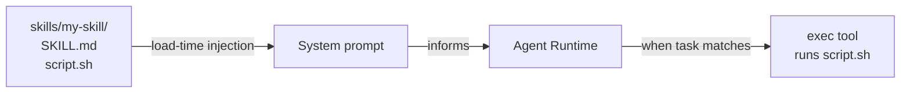

# Skill Anatomy

The agent doesn't know how to use `peekaboo` or `clawhub` or `himalaya` out of the box. Skills teach it.

A **skill** is a directory containing a `SKILL.md` file. That file tells the agent what capability exists, how to invoke it, and when it applies. Nothing more is required — though real skills usually add scripts, reference configs, and supporting assets alongside.

When OpenClaw starts a session, it scans the skill directories, filters down to eligible skills, and injects a compact XML block into the system prompt. The agent reads that list and knows what it can do.

---

## The Simplest Possible Skill

```
~/.openclaw/workspace/skills/hello-world/
└── SKILL.md
```

```markdown
---
name: hello-world
description: Say hello when the user asks for a greeting.
---

# Hello World

When the user asks for a greeting, respond with: "Hello from your custom skill!"
```

That's it. Two required frontmatter keys — `name` and `description` — and some instructions. On the next session, the agent sees it.

---

## Skill Directory Structure

Real skills grow beyond a single file. Here's a complete layout:

```
skills/
└── weather/
    ├── SKILL.md          ← Required. The skill descriptor.
    ├── get-weather.sh    ← A script the skill instructs the agent to call.
    ├── config.json       ← Default config referenced in SKILL.md.
    └── README.md         ← Human-readable docs (not injected).
```

The `SKILL.md` can reference other files in its directory using the `{baseDir}` placeholder:

```markdown
---
name: weather
description: Get current weather and forecasts for any location.
---

# Weather Skill

Use `exec` to run `{baseDir}/get-weather.sh <location>` for current conditions.
```

When OpenClaw injects this skill into the prompt, `{baseDir}` is replaced with the skill's absolute path. The agent can now call the right script — no guessing.

---

## SKILL.md Frontmatter Reference

The frontmatter is YAML and must use **single-line values only** (the agent's parser is strict about this).

### Required

| Key | What it does |
|-----|-------------|
| `name` | Unique skill identifier. Used for config overrides and precedence resolution. |
| `description` | One-line summary injected into the skills list. Write it like an API description — the agent reads it to decide *if* a skill applies. |

### Optional

| Key | Default | What it does |
|-----|---------|-------------|
| `homepage` | — | URL shown in the macOS Skills UI as "Website" |
| `user-invocable` | `true` | When `true`, the skill appears as a slash command the *user* can invoke directly (e.g., `/weather Sydney`) |
| `disable-model-invocation` | `false` | When `true`, the skill is excluded from the model prompt but still available via user slash command |
| `command-dispatch` | — | Set to `tool` to bypass the model entirely and call a tool directly on slash command |
| `command-tool` | — | Tool name to invoke when `command-dispatch: tool` is set |
| `metadata` | — | Single-line JSON object for gating rules (see below) |

### The `metadata` field

This is where load-time gating lives:

```markdown
---
name: peekaboo
description: Capture and automate macOS UI screenshots.
metadata: {"openclaw": {"requires": {"bins": ["peekaboo"], "os": ["darwin"]}, "emoji": "👁️"}}
---
```

Fields under `metadata.openclaw`:

| Field | What it does |
|-------|-------------|
| `requires.bins` | List of binaries that must exist on `PATH`. If any are missing, the skill is not loaded. |
| `requires.anyBins` | At least one of these must exist on `PATH`. |
| `requires.env` | Environment variables that must be set (or supplied via config). |
| `requires.config` | `openclaw.json` config paths that must be truthy (e.g., `browser.enabled`). |
| `os` | Platform filter: `darwin`, `linux`, `win32`. |
| `always: true` | Skip all gating — always load this skill. |
| `primaryEnv` | The env var name this skill's API key maps to (for `skills.entries.<name>.apiKey`). |

> **The gating is a courtesy to the agent, not a security boundary.** It prevents the agent from being told it can use a tool that isn't installed. The real security is in tool policy and sandboxing — covered in Module 6.

---

## How the Agent Sees Skills

When a session starts, OpenClaw builds a compact XML block and injects it into the system prompt:

```xml
<available_skills>
  <skill>
    <name>weather</name>
    <description>Get current weather and forecasts for any location.</description>
    <location>/Users/you/.openclaw/workspace/skills/weather/SKILL.md</location>
  </skill>
  <skill>
    <name>peekaboo</name>
    <description>Capture and automate macOS UI screenshots.</description>
    <location>/opt/homebrew/lib/node_modules/openclaw/skills/peekaboo/SKILL.md</location>
  </skill>
</available_skills>
```

The agent is told: if a task matches a skill's description, read the `SKILL.md` at the given path for detailed instructions, then follow them.

The token cost is predictable: roughly **24 tokens per skill** (plus field lengths). A typical install with 10–15 skills adds ~400–600 tokens to the system prompt.

---

## Skills Extend the Agent Without Changing Core Code

This is the elegant part. You don't need to modify OpenClaw to add a new capability. You just:

1. Create a directory with a `SKILL.md`
2. Put any scripts or assets alongside it
3. Start a new session

The agent discovers it automatically and knows when to use it.



Skills are also how OpenClaw's bundled tools (browser control, ClawHub, peekaboo, sag) announce their capabilities. Even first-party features ship as `SKILL.md` files, following the same pattern you'd use for your own custom skill.

---

## A Real Skill: Dissecting `clawhub`

The bundled `clawhub` skill shows what a production-quality `SKILL.md` looks like:

```markdown
---
name: clawhub
description: Use the ClawHub CLI to search, install, update, and publish agent skills from clawhub.com.
metadata: {"openclaw": {"requires": {"bins": ["clawhub"]}, "install": [{"id": "npm", "kind": "node", "pkg": "clawhub", "bins": ["clawhub"], "label": "Install ClawHub CLI (npm)"}]}}
---

# ClawHub

Use `clawhub` to manage skills...
```

Notice:
- `requires.bins: ["clawhub"]` gates the skill — it won't load if the CLI isn't installed
- `install` tells the macOS Skills UI how to install it (npm package, one click)
- The description is precise enough for the agent to know when to activate this skill

---

## Summary

| Concept | Detail |
|---------|--------|
| Minimum skill | A directory + `SKILL.md` with `name` + `description` |
| Gating | `metadata.openclaw.requires` — bins, env, os, config |
| Runtime reference | `{baseDir}` placeholder resolves to the skill directory |
| Injection cost | ~24 tokens per skill + field lengths |
| Skill discovery | Scanned at session start from three locations (covered in the next lesson) |

---

> **Exercise:** Browse one bundled skill you find interesting. Its location is inside the OpenClaw npm package:
> ```bash
> ls ~/.npm-global/lib/node_modules/openclaw/skills/
> cat ~/.npm-global/lib/node_modules/openclaw/skills/weather/SKILL.md
> ```
> Read the instructions section (after the frontmatter). Notice how it guides the agent without over-specifying.
