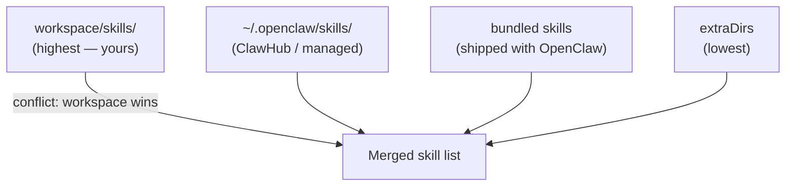
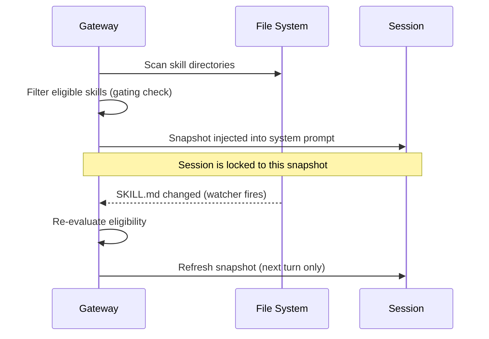

# Skill Loading

Where does OpenClaw find skills? How does it decide which ones are eligible? And what happens when the same skill name exists in two places?

These questions matter as soon as you start adding your own skills — because the precedence rules determine which version wins.

---

## Three Skill Locations

OpenClaw loads skills from three places, in this order of precedence (highest first):

```
1. <workspace>/skills/       ← Your custom skills (win all conflicts)
2. ~/.openclaw/skills/       ← Managed/local skills (ClawHub installs here by default)
3. bundled skills            ← Shipped with the npm package
```

Plus an optional fourth source, at the lowest precedence:

```
4. skills.load.extraDirs     ← Extra folders configured in openclaw.json
```

If the same skill `name` appears in more than one location, the highest-precedence copy wins. Workspace skills always beat managed skills, which always beat bundled skills.



> **Practical use case:** You want to tweak a bundled skill without touching the OpenClaw package. Copy it into `~/.openclaw/skills/<name>/`, modify the `SKILL.md`, and your version wins. On the next session OpenClaw uses your copy.

---

## Per-Agent vs Shared Skills

In a single-agent setup you won't notice the distinction. In multi-agent setups, it matters.

| Skill location | Visible to |
|---------------|-----------|
| `<workspace>/skills/` | That agent only |
| `~/.openclaw/skills/` | All agents on this machine |
| Bundled skills | All agents |

Each agent has its own `workspace` directory (configured via `agents.list[].workspace`). Skills in that workspace are **per-agent** — the family agent and the personal agent can have different skill sets even on the same Gateway.

Example config:

```json5
{
  agents: {
    list: [
      {
        id: "personal",
        workspace: "~/.openclaw/workspace-personal"
        // picks up workspace-personal/skills/
      },
      {
        id: "work",
        workspace: "~/.openclaw/workspace-work"
        // picks up workspace-work/skills/
      }
    ]
  }
}
```

Skills in `~/.openclaw/skills/` are shared — both agents see them.

---

## Load-Time Gating

Not every discovered skill makes it into the system prompt. At session start, OpenClaw runs each skill through a gating check based on its `metadata.openclaw` frontmatter.

A skill is **eligible** if:
- `always: true` is set, **or**
- all `requires.bins` are present on `PATH`, **and**
- all `requires.env` variables are set (or configured), **and**
- all `requires.config` paths are truthy in `openclaw.json`, **and**
- the current OS matches `os` (if specified)

If a skill fails any gate, it is silently skipped. The agent never knows it exists.

```bash
# See which skills passed and which were skipped
openclaw hooks list --eligible
```

This behavior is intentional: there's no point telling the agent it can use `peekaboo` if `peekaboo` isn't installed.

---

## ClawHub: The Skill Registry

[ClawHub](https://clawhub.ai) is the public registry for OpenClaw skills. Install the CLI once:

```bash
npm i -g clawhub
```

Then the common workflows:

### Search

```bash
clawhub search "postgres backups"
clawhub search "calendar"
```

ClawHub uses vector search — it understands synonyms and descriptions, not just keywords.

### Install

```bash
clawhub install <skill-slug>
```

By default this installs into `./skills` under your current directory, falling back to the configured OpenClaw workspace. Start a new session and the skill is live.

### Update

```bash
clawhub update <skill-slug>
clawhub update --all
```

### Publish your own skill

```bash
clawhub login
clawhub publish ./skills/my-skill --slug my-skill --name "My Skill" --version 1.0.0 --tags latest
```

### Sync (scan + publish)

If you have multiple skills to back up or publish:

```bash
clawhub sync --all
```

This scans your skills directory, compares each skill to the registry by content hash, and offers to publish anything that's new or changed.

---

## Config Overrides

Even bundled skills can be toggled or configured without touching their files:

```json5
{
  skills: {
    entries: {
      "peekaboo": { enabled: true },
      "sag": { enabled: false },
      "nano-banana-pro": {
        enabled: true,
        apiKey: "your-gemini-key-here",
        env: {
          GEMINI_API_KEY: "your-gemini-key-here"
        }
      }
    }
  }
}
```

Rules:
- `enabled: false` disables the skill even if it's bundled and installed
- `apiKey` is a shorthand for skills that declare `metadata.openclaw.primaryEnv` — it maps to that env variable
- `env` injects environment variables for the duration of the agent run only (scoped, not global)
- `config` holds custom per-skill config values (skill-specific keys live here)

> **Env injection is scoped.** When the agent run ends, the original environment is restored. Your shell stays clean.

---

## Skills Watcher (Hot Reload)

By default, OpenClaw watches skill folders for changes. When you edit a `SKILL.md`, the skill snapshot is refreshed before the next agent turn — no Gateway restart needed.

Configure the watcher:

```json5
{
  skills: {
    load: {
      watch: true,
      watchDebounceMs: 250
    }
  }
}
```

This is how iterating on a custom skill works in practice:
1. Edit the `SKILL.md`
2. Ask the agent something that triggers it
3. The agent reads the updated instructions

---

## Skill Lifecycle

The session snapshot is locked when a session **starts**. Changes mid-session aren't picked up until the next new session starts — except for the watcher refresh path, which bumps the snapshot before the next turn.



---

## Security: Treat Third-Party Skills as Code

Skills are instructions to the agent. A malicious `SKILL.md` could instruct the agent to do almost anything. Before installing a skill from ClawHub or anywhere else:

- **Read the SKILL.md** before enabling it. It's plain text.
- Prefer skills from authors you recognize or that have community activity.
- Skills can be gated to require your explicit `enabled: true` in config before they load.
- ClawHub requires a GitHub account at least one week old to publish. Skills with >3 unique reports are auto-hidden.

When in doubt, review the full skill directory contents. The instructions are always visible — there's no compiled code, no binaries, just markdown.

---

## Summary

| Concept | Detail |
|---------|--------|
| Precedence | workspace > managed > bundled > extraDirs |
| Per-agent | `<workspace>/skills/` — visible to one agent only |
| Shared | `~/.openclaw/skills/` — visible to all agents |
| Gating | `metadata.openclaw.requires` — skips ineligible skills silently |
| ClawHub | Public registry: `clawhub install/update/publish/search` |
| Config override | `skills.entries.<name>.enabled/apiKey/env/config` |
| Hot reload | Skills watcher refreshes on next turn after SKILL.md changes |

---

> **Exercise:** Install a skill from ClawHub (if you don't have one yet), then check what OpenClaw loaded:
> ```bash
> clawhub search "weather"
> clawhub install weather
> openclaw hooks list --eligible  # or restart and check the session
> ```
> Then look at the lock file that records what's installed:
> ```bash
> cat .clawhub/lock.json
> ```
