# Skill Loading & Precedence

You've seen how a single skill is structured. But where do skills come from? OpenClaw loads skills from **three locations**, and the order matters — a lot. In this lesson we'll walk through the loading system, name conflicts, and how to control exactly which skills your agent sees.

---

## The Three Tiers

Skills are discovered from three directories, checked in this order:

```mermaid
graph TB
    subgraph Priority["Loading Priority (highest → lowest)"]
        direction TB
        WS["🏠 Workspace Skills<br/><code>&lt;workspace&gt;/skills/</code><br/>Highest priority"]
        MG["📦 Managed Skills<br/><code>~/.openclaw/skills/</code><br/>Medium priority"]
        BN["🔧 Bundled Skills<br/>Ships with OpenClaw<br/>Lowest priority"]
    end

    WS --> MG --> BN

    style WS fill:#2d5a2d,stroke:#4a4a4a,color:#fff
    style MG fill:#2d4a5a,stroke:#4a4a4a,color:#fff
    style BN fill:#5a4a2d,stroke:#4a4a4a,color:#fff
```



| Tier | Location | Who puts skills here | Use case |
|------|----------|---------------------|----------|
| **Workspace** | `<workspace>/skills/` | You (manually or via ClawHub) | Personal customizations, project-specific skills |
| **Managed** | `~/.openclaw/skills/` | ClawHub (`clawhub install`) | Community skills, shared across workspaces |
| **Bundled** | Inside the OpenClaw package | OpenClaw maintainers | Core capabilities (oracle, spotify, etc.) |

The default workspace is `~/.openclaw/workspace/`, so workspace skills live at `~/.openclaw/workspace/skills/` unless you've configured a different workspace path.

---

## How Discovery Works

At Gateway startup (and on hot-reload if `skills.load.watch` is enabled), OpenClaw scans each tier:

1. Walk the directory looking for subdirectories containing `SKILL.md`
2. Parse the YAML frontmatter to extract `name`
3. Run eligibility checks (`requires.bins`, `requires.env`, `requires.config`, `os`)
4. Register the skill in an internal map keyed by `name`

```
Scan order:
  1. ~/.openclaw/workspace/skills/**/SKILL.md
  2. ~/.openclaw/skills/**/SKILL.md
  3. <openclaw-package>/skills/**/SKILL.md
  + any paths in skills.load.extraDirs
```

### Extra Directories

You can add additional scan paths via config:

```json5
{
  skills: {
    load: {
      extraDirs: [
        "/home/me/work-skills",
        "/shared/team-skills"
      ]
    }
  }
}
```

Extra directories are scanned **after** the three standard tiers but **before** bundled skills in the precedence order.

---

## Name Conflicts & Shadowing

Here's the critical rule:

> **When two skills share the same `name`, the higher-priority tier wins. The lower-priority skill is completely invisible.**

This is called **shadowing**. It's intentional and powerful — it lets you override bundled skills with your own version.

### Example: Overriding the Bundled `oracle` Skill

Say you want to customize how web search works. The bundled `oracle` skill lives deep inside the OpenClaw package. You can't (and shouldn't) edit it there. Instead:

1. Create `~/.openclaw/workspace/skills/oracle/SKILL.md`
2. Use `name: oracle` in the frontmatter
3. Write your custom instructions

Your workspace version **shadows** the bundled one completely. The agent never sees the original.

```
Bundled: oracle (SHADOWED — not loaded)
Workspace: oracle ← This one wins
```

### Shadowing Table

| Scenario | Winner | Loser |
|----------|--------|-------|
| Workspace `foo` + Managed `foo` | Workspace | Managed |
| Workspace `foo` + Bundled `foo` | Workspace | Bundled |
| Managed `foo` + Bundled `foo` | Managed | Bundled |
| Workspace `foo` + Managed `foo` + Bundled `foo` | Workspace | Both others |

### Detecting Shadows

Use the CLI to see what's happening:

```bash
# List all skills with their source tier
openclaw skills list --verbose

# Output shows:
# NAME       SOURCE      STATUS     SHADOWED-BY
# oracle     bundled     active     —
# weather    workspace   active     —
# spotify    managed     active     —
# oracle     workspace   active     (shadows bundled:oracle)
```

---

## Eligibility vs Enabled

A skill can be **ineligible** (requirements not met) or **disabled** (explicitly turned off). These are different:

```mermaid
graph TD
    SKILL[Skill discovered] --> REQ{Requirements met?}
    REQ -->|No| INELIGIBLE[❌ Ineligible<br/>Not shown to agent]
    REQ -->|Yes| EN{Enabled in config?}
    EN -->|No| DISABLED[⏸️ Disabled<br/>Not shown to agent]
    EN -->|Yes| SHADOW{Shadowed by<br/>higher tier?}
    SHADOW -->|Yes| SHADOWED[👻 Shadowed<br/>Not shown to agent]
    SHADOW -->|No| ACTIVE[✅ Active<br/>Available to agent]
```



### Disabling a Skill

```json5
{
  skills: {
    entries: {
      "some-skill": { enabled: false }
    }
  }
}
```

Or via CLI:

```bash
openclaw skills disable some-skill
```

### Allowlisting Bundled Skills

If you only want specific bundled skills, use `allowBundled`:

```json5
{
  skills: {
    allowBundled: ["oracle", "weather"]
    // All other bundled skills are excluded
  }
}
```

This is useful when you want a minimal agent with only the capabilities you've explicitly chosen.

---

## ClawHub: The Skills Registry

[ClawHub](https://clawhub.ai) is the public registry for community-built skills. Think npm for OpenClaw skills.

### Installing from ClawHub

```bash
# Install the ClawHub CLI
npm i -g clawhub

# Search for skills
clawhub search "calendar"

# Install a skill (goes to ./skills/ or ~/.openclaw/skills/)
clawhub install @someone/calendar-skill

# Update all managed skills
clawhub update --all

# List installed skills
clawhub list
```

### Where ClawHub Installs

By default, `clawhub install` places skills in the **current directory's** `skills/` folder. If you're in your workspace, they become workspace skills. If you want them managed (shared across workspaces), specify the path:

```bash
clawhub install @someone/calendar-skill --dir ~/.openclaw/skills/
```

### Publishing Your Own

```bash
cd my-awesome-skill/
clawhub publish
```

ClawHub enforces:
- Valid `SKILL.md` with required frontmatter fields
- 50MB maximum bundle size
- Path sanitization (no `../` escapes)
- Pattern-based moderation scans

---

## Skill Loading at Runtime

When a conversation turn begins, the agent sees skills in two phases:

### Phase 1: Available Skills List

All eligible, enabled, non-shadowed skills appear as a compact list in the system prompt:

```xml
<available_skills>
  <skill name="oracle">Search the web and fetch page content
    Load when: The user asks about current events or needs web info</skill>
  <skill name="weather">Get weather conditions and forecasts
    Load when: The user asks about weather or temperature</skill>
  <skill name="spotify">Control Spotify playback
    Load when: The user asks about music or playlists</skill>
</available_skills>
```

This is cheap — just ~97 characters per skill entry.

### Phase 2: Full Skill Loading

When the agent decides a skill is relevant (based on `read_when` and context), it "reads" the full SKILL.md body. The instructions are then injected into the active context for that turn.

This two-phase approach keeps the base context lean while still giving the agent access to detailed instructions when needed.

---

## Hot Reloading

If `skills.load.watch` is enabled, the Gateway watches for changes to SKILL.md files:

```json5
{
  skills: {
    load: {
      watch: true   // Default: false
    }
  }
}
```

When a SKILL.md is created, modified, or deleted:
1. The skill is re-parsed
2. Eligibility is re-checked
3. The internal skill map is updated
4. New sessions pick up the change immediately

Existing sessions continue with their loaded skills until the next session reset.

---

## Debugging Skill Loading Issues

Common problems and how to diagnose them:

| Symptom | Likely cause | Fix |
|---------|-------------|-----|
| Skill doesn't appear in `skills list` | Missing `SKILL.md` or wrong directory | Check path with `ls <workspace>/skills/<name>/SKILL.md` |
| Skill shows as "ineligible" | Missing binary, env var, or config | Run `openclaw skills check` for details |
| Skill loaded but agent ignores it | `read_when` doesn't match context | Rephrase `read_when` to be broader |
| Wrong version of skill loading | Name shadowing | Run `openclaw skills list --verbose` to check |
| Skill changes not taking effect | Hot reload disabled | Set `skills.load.watch: true` or restart Gateway |

---

## Summary

| Concept | Details |
|---------|---------|
| **Three tiers** | Workspace > Managed > Bundled |
| **Shadowing** | Same-name skills: higher tier wins completely |
| **Eligibility** | Requirements (bins, env, config, os) must all pass |
| **Enabled/disabled** | Config toggle via `skills.entries.<name>.enabled` |
| **ClawHub** | Public registry — `clawhub install/search/publish` |
| **Two-phase loading** | Compact listing first, full instructions on demand |
| **Hot reload** | `skills.load.watch: true` for live updates |

---

> **Exercise:**
> 1. Run `openclaw skills list --verbose` and note which skills are bundled vs managed vs workspace
> 2. Pick a bundled skill and create a workspace override: copy its `SKILL.md` to `~/.openclaw/workspace/skills/<name>/SKILL.md`, modify the description, and verify the shadow with `openclaw skills list --verbose`
> 3. After testing, delete your override so the bundled version takes over again

---

In the next lesson, we'll explore **hooks and workspace files** — the automation layer that lets your agent run scheduled tasks, respond to events, and maintain persistent state.
