# Hooks & Workspace Files

Skills teach the agent what it *can* do. Workspace files tell it *who* it is and *how* to behave. Hooks wire up automations that trigger when things happen.

These three systems work together to shape an agent that feels genuinely personal — not just a generic LLM with a prompt.

---

## Workspace Files: The Agent's Identity

Every agent has a **workspace directory** (default: `~/.openclaw/workspace`). At the start of each new session, OpenClaw reads the files in this directory and injects their contents into the system prompt. The agent starts every conversation already knowing who it is, who it's talking to, and what it should care about.

```
~/.openclaw/workspace/
├── AGENTS.md     ← Operating instructions (how to behave, what to prioritize)
├── SOUL.md       ← Persona, tone, and boundaries
├── USER.md       ← Who the user is, how to address them
├── IDENTITY.md   ← Agent name, emoji, personality vibe
├── TOOLS.md      ← Notes about local tools (SSH hosts, API keys doc, etc.)
├── HEARTBEAT.md  ← Tiny checklist for periodic check-ins
├── BOOT.md       ← Startup checklist run on gateway restart
├── MEMORY.md     ← (optional) Curated long-term memory
└── memory/       ← Daily memory logs (YYYY-MM-DD.md)
    └── 2026-02-27.md
```

### What each file does

**AGENTS.md** — The rules document. What the agent should do every session (check inbox, read voice guide), what it can and can't do, how to communicate, how to handle edge cases. This is where you put standing instructions that should survive across every conversation.

**SOUL.md** — Persona. Tone. The agent's voice. If you want the agent to feel like a specific character (warm, dry, precise, playful), write it here. Changing SOUL.md changes how the agent sounds on the next session.

**USER.md** — Context about the person. Name, timezone, location, preferences. The agent reads this so it can address you correctly and apply relevant defaults without you repeating yourself.

**IDENTITY.md** — Created during first-run setup. Contains the agent's chosen name, emoji, and vibe. Lightweight, mostly cosmetic.

**TOOLS.md** — A personal cheat sheet. Not tool config — that lives in `openclaw.json`. This is where you document your local setup: SSH host aliases, camera names, which voice to use, device nicknames. The agent uses it as working memory about your specific environment.

**HEARTBEAT.md** — A short checklist the agent follows during periodic heartbeat runs (scheduled check-ins). Keep it very short — this fires every 30–60 minutes.

**BOOT.md** — A startup checklist the `boot-md` hook runs once when the Gateway starts. Good for "send me a morning summary", "check the weather", "remind me about today's meetings". Executed once per Gateway boot, not every session.

**MEMORY.md** — Long-term curated memory. Notes the agent writes about important context — preferences, decisions, ongoing projects — that should persist across session resets.

---

## The Boot Sequence

When a new session starts, here's the order of injection:


The system prompt for a fully configured agent looks something like:

```
[AGENTS.md content]
[SOUL.md content]
[USER.md content]
[TOOLS.md content]
[MEMORY.md content — if present]

## Available Skills
<available_skills>
  <skill>...</skill>
  ...
</available_skills>

## Current Date & Time
Time zone: Australia/Sydney
...
```

> **Large files are truncated.** Individual bootstrap files are truncated at 20,000 characters; total bootstrap injection is capped at 150,000 characters. Keep your workspace files focused and concise — especially HEARTBEAT.md.

---

## Hooks: Event-Driven Automations

Skills add capabilities. Hooks wire up behavior to events.

A **hook** is a directory containing a `HOOK.md` file (and optional handler scripts). When a registered event fires, OpenClaw runs the hook's handler.

Think of hooks as the plumbing that connects gateway events to agent behavior — without you having to write any server code.

### Built-in Events

| Event | When it fires |
|-------|--------------|
| `gateway:startup` | After the gateway starts and channels come online |
| `command:new` | When the user issues a `/new` command (session reset) |
| `agent:bootstrap` | At the start of each agent turn (session bootstrap) |

### Bundled Hooks

OpenClaw ships four bundled hooks:

**`boot-md`** — Runs `BOOT.md` as a startup checklist on `gateway:startup`. Enable it once and your agent will greet you every morning, check the weather, or do anything else you put in BOOT.md.

```bash
openclaw hooks enable boot-md
```

**`session-memory`** — On `/new` (session reset), saves a summary of the ending session to a dated memory file in `memory/YYYY-MM-DD.md`. This is how the agent accumulates long-term context over time.

```bash
openclaw hooks enable session-memory
```

**`bootstrap-extra-files`** — Injects additional files into the system prompt at `agent:bootstrap`. Useful for monorepos where you want a project-local `AGENTS.md` or `TOOLS.md` added alongside the workspace defaults.

```bash
openclaw hooks enable bootstrap-extra-files
```

**`command-logger`** — Logs all command events (`/new`, `/reset`, etc.) to `~/.openclaw/logs/commands.log` as JSON. Good for auditing and debugging.

```bash
openclaw hooks enable command-logger
```

---

## Managing Hooks

```bash
# See what's available and what's ready
openclaw hooks list
openclaw hooks list --eligible

# Get details on a specific hook
openclaw hooks info session-memory

# Enable / disable
openclaw hooks enable session-memory
openclaw hooks disable command-logger

# Check status summary
openclaw hooks check
```

After enabling or disabling hooks, restart the Gateway for changes to take effect.

---

## Hook Precedence (Just Like Skills)

Hooks follow the same three-location model as skills:

1. `<workspace>/hooks/` — your custom hooks (highest precedence)
2. `~/.openclaw/hooks/` — managed/installed hooks
3. Bundled hooks — shipped with OpenClaw

Install a hook pack:

```bash
openclaw hooks install ./my-hook-pack
openclaw hooks install @openclaw/my-hook-pack   # from npm
```

---

## Putting It All Together

Here's how these systems interact in a typical day:

```mermaid
graph TB
    BOOT["🌅 Gateway starts"]
    BOOTMD["boot-md hook fires\nRuns BOOT.md:\n'Check weather, say good morning'"]
    SESSION["🗣 User sends a message\nNew session starts"]
    INJECT["Workspace injection:\nAGENTS.md, SOUL.md, USER.md,\nTOOLS.md, MEMORY.md"]
    SKILLS["Skills injected:\nweather, peekaboo, clawhub..."]
    TURN["Agent turn runs with full context"]
    RESET["User sends /new\nSession reset"]
    MEMORY["session-memory hook:\nSaves session summary to\nmemory/2026-02-27.md"]

    BOOT --> BOOTMD
    BOOTMD --> SESSION
    SESSION --> INJECT
    SESSION --> SKILLS
    INJECT --> TURN
    SKILLS --> TURN
    TURN --> RESET
    RESET --> MEMORY
    MEMORY -->|"next session reads\ntoday's memory file"| SESSION
```



The workspace files provide identity. The hooks provide persistence and automation. The skills provide capability. Together they make the agent feel more like a continuous assistant than a stateless chatbot.

---

## Summary

| File / System | What it provides |
|--------------|-----------------|
| `AGENTS.md` | Operating instructions, standing rules |
| `SOUL.md` | Persona and tone |
| `USER.md` | Context about the user |
| `TOOLS.md` | Notes about the local environment |
| `MEMORY.md` / `memory/` | Long-term and daily memory |
| `BOOT.md` + `boot-md` hook | Startup checklist automation |
| `HEARTBEAT.md` | Periodic check-in checklist |
| `session-memory` hook | Auto-saves session summaries to memory |
| `bootstrap-extra-files` hook | Inject extra files into the system prompt |

---

> **Exercise:** Try the session memory loop yourself.
> 1. Enable the `session-memory` hook: `openclaw hooks enable session-memory`
> 2. Start a new session and have a conversation
> 3. Issue `/new` to reset the session
> 4. Check what was saved: `cat ~/.openclaw/workspace/memory/$(date +%Y-%m-%d)*.md`
>
> The agent now has a record of that session to draw from next time.
