# Trust Hierarchy

OpenClaw is a **personal assistant**, not a multi-tenant platform. That distinction shapes its entire security model. There's one trusted operator (you), a small set of approved contacts, and everyone else is untrusted. In this lesson we'll map out exactly who has what level of trust and how the Gateway enforces it.

---

## The Three Trust Zones

```mermaid
graph TB
    subgraph OWNER["🔑 Owner (Full Trust)"]
        direction LR
        O1["Gateway config access"]
        O2["Shell access on host"]
        O3["WebSocket control plane"]
    end

    subgraph APPROVED["✅ Approved (Limited Trust)"]
        direction LR
        A1["Paired devices"]
        A2["Allowlisted users"]
        A3["DM conversations"]
    end

    subgraph UNTRUSTED["⚠️ Untrusted (No Trust)"]
        direction LR
        U1["Random Telegram users"]
        U2["Group chat members"]
        U3["Fetched web content"]
        U4["Webhook payloads"]
    end

    OWNER --- APPROVED --- UNTRUSTED

    style OWNER fill:#1a4a1a,stroke:#4a4a4a,color:#fff
    style APPROVED fill:#1a3a5a,stroke:#4a4a4a,color:#fff
    style UNTRUSTED fill:#5a1a1a,stroke:#4a4a4a,color:#fff
```



| Trust Level | Who | What they can do | How they're gated |
|-------------|-----|-----------------|-------------------|
| **Owner** | You — the person who runs the Gateway | Everything: config, tools, shell, all channels | Physical/SSH access to the host machine |
| **Approved** | Paired devices, allowlisted chat users | Send messages, trigger agent responses | Pairing flow or explicit allowlist |
| **Untrusted** | Everyone and everything else | Nothing, unless explicitly granted | Blocked by default |

> **Key Takeaway:** OpenClaw's security model is "deny by default." If someone isn't explicitly approved, they can't interact with your agent.

---

## Owner Trust

The owner is whoever has access to:

1. **The config file** (`~/.openclaw/openclaw.json`) — can change any setting
2. **The host machine** — can read/write the entire `~/.openclaw/` directory
3. **The WebSocket control plane** — can issue any Gateway command

OpenClaw is designed for **one trusted operator per Gateway**. It explicitly does NOT support:

- Mutually untrusted users sharing one Gateway
- Multi-tenant deployments where users shouldn't see each other's data
- Session keys as authorization tokens (they're routing selectors, not auth)

> **If you need multiple untrusted users, run separate Gateway instances.** One per user, one per trust boundary.

### Protecting Owner Access

The Gateway WebSocket binds to `127.0.0.1:18789` by default (localhost only). If you expose it to a network, you **must** configure auth:

```json5
{
  gateway: {
    mode: "local",                    // or "remote"
    bind: "loopback",                 // Only accept localhost connections
    auth: {
      mode: "token",                  // or "password"
      token: "a-long-random-string"   // Required for WebSocket connections
    }
  }
}
```

| Config | Security Implication |
|--------|---------------------|
| `bind: "loopback"` | Only local connections — safest |
| `bind: "tailscale"` | Tailscale VPN only — good for remote access |
| `bind: "0.0.0.0"` | All interfaces — **requires** `auth.token` |
| `auth.mode: "none"` | No auth on WebSocket — **only safe with loopback** |

---

## DM Access Policies

When someone sends your bot a direct message on Telegram, WhatsApp, or any channel, the Gateway needs to decide: should this person be allowed to talk to the agent?

### The Four DM Modes

```json5
{
  channels: {
    telegram: {
      dmPolicy: "pairing"   // Default
    }
  }
}
```

| Mode | Behavior | Use case |
|------|----------|----------|
| `"pairing"` | Unknown senders get a one-time pairing code to approve | Personal use — approve new contacts one by one |
| `"allowlist"` | Only users in `allowFrom` list can DM | Strict access — no discovery |
| `"open"` | Anyone can DM the bot | Public bot (dangerous with tools enabled!) |
| `"disabled"` | Ignore all inbound DMs | Channel used for outbound only |

### The Pairing Flow

Pairing is the default and recommended mode. Here's how it works:

```mermaid
sequenceDiagram
    participant STRANGER as 👤 Unknown User
    participant GW as Gateway
    participant OWNER as 🔑 Owner

    STRANGER->>GW: "Hey, can you help me?"
    GW->>GW: Sender not in allowlist
    GW->>STRANGER: "Pairing required. Code: ABC-123"
    GW->>OWNER: "Someone wants to pair: [user info] Code: ABC-123"
    OWNER->>GW: Approve pairing (or deny)
    GW->>STRANGER: "You're paired! How can I help?"
```



Pairing safeguards:
- Codes expire after **1 hour**
- Maximum **3 pending** pairing requests at once
- Once paired, the device gets a token for future connections

### AllowFrom Lists

For explicit control, use allowlists per channel:

```json5
{
  channels: {
    telegram: {
      dmPolicy: "allowlist",
      allowFrom: [123456789, 987654321]   // Telegram user IDs
    },
    whatsapp: {
      dmPolicy: "allowlist",
      allowFrom: ["+1234567890"]          // Phone numbers
    }
  }
}
```

You can also maintain allowlists in separate files:

```json5
{
  channels: {
    telegram: {
      allowFromFile: "~/.openclaw/credentials/telegram-allowFrom.json"
    }
  }
}
```

---

## Group Chat Policies

Groups add another trust dimension — you might be in a group with people who shouldn't have full access to your agent.

```json5
{
  channels: {
    telegram: {
      groups: {
        "*": {                          // Default for all groups
          requireMention: true,         // Only respond when @mentioned
          groupPolicy: "allowlist"      // Only approved groups
        },
        "-100123456789": {              // Specific group override
          requireMention: false,        // Respond to everything
          groupPolicy: "allow"
        }
      }
    }
  }
}
```

| Group Policy | Behavior |
|-------------|----------|
| `"allowlist"` | Only explicitly listed groups |
| `"pairing"` | Auto-approve groups where the bot is added by an approved user |
| `"open"` | Any group (use with `requireMention: true`!) |

> **Key Takeaway:** The safest group config is `groupPolicy: "allowlist"` + `requireMention: true`. This means the agent only responds in approved groups and only when directly addressed.

### Why Mention Gating Matters

In a group chat, every message from every member hits the Gateway. Without mention gating:
- The agent processes every message (LLM costs add up)
- Any group member can inject prompts
- The agent might respond inappropriately to unrelated conversations

With `requireMention: true`, the agent only activates when someone says `@YourBot do something`.

---

## Session Isolation

### DM Scope

By default, all DMs from all channels share a single session (`dmScope: "main"`). This is convenient but has security implications — a compromised channel could access context from other channels.

```json5
{
  session: {
    dmScope: "per-channel-peer"   // Recommended for security
  }
}
```

| DM Scope | Session key pattern | Trade-off |
|----------|-------------------|-----------|
| `"main"` | `agent:main:main` | All DMs share context — convenient, less isolated |
| `"per-channel-peer"` | `agent:main:telegram:dm:123` | Separate session per user per channel — more secure |
| `"per-account-channel-peer"` | `agent:acct1:telegram:dm:123` | Maximum isolation |

### Why This Matters

If you use `dmScope: "main"` and someone gains access to your WhatsApp bot, they can see conversation context from your Telegram chats too. With `per-channel-peer`, each channel+user combination is isolated.

---

## The Security Audit

OpenClaw includes a built-in security auditor:

```bash
# Quick audit (checks config + file permissions)
openclaw security audit

# Deep audit (includes live Gateway probes)
openclaw security audit --deep

# Auto-fix safe issues
openclaw security audit --fix
```

### What the Audit Checks

| Check ID | Severity | What it looks for |
|----------|----------|-------------------|
| `fs.state_dir.perms_world_writable` | Critical | `~/.openclaw/` is world-writable |
| `fs.config.perms_writable` | Critical | Config file writable by others |
| `gateway.bind_no_auth` | Critical | WS bound to network without auth |
| `security.exposure.open_groups_with_elevated` | Critical | Open groups + elevated tool access |
| `discovery.mdns_full_mode` | Warning | mDNS broadcasting full Gateway info |

### What `--fix` Does (and Doesn't)

**Will fix:**
- Tighten file permissions on state/config
- Flip `groupPolicy: "open"` to `"allowlist"`
- Enable `logging.redactSensitive`

**Won't fix (you must do manually):**
- Rotate tokens or API keys
- Change `gateway.bind` settings
- Disable tools
- Remove untrusted skills

---

## The Hardened Baseline

If you're setting up a new Gateway and want to start secure, here's the recommended config:

```json5
{
  gateway: {
    mode: "local",
    bind: "loopback",
    auth: { mode: "token", token: "generate-a-long-random-string" },
  },
  session: {
    dmScope: "per-channel-peer",
  },
  tools: {
    profile: "messaging",    // Restrictive tool set
    deny: ["group:automation", "group:runtime", "group:fs"],
  },
  channels: {
    whatsapp: {
      dmPolicy: "pairing",
      groups: { "*": { requireMention: true } }
    },
    telegram: {
      dmPolicy: "pairing",
      groups: { "*": { requireMention: true, groupPolicy: "allowlist" } }
    }
  },
}
```

You can always loosen restrictions as needed — but it's much easier to start tight and open up than the reverse.

---

## Summary

| Layer | Default | Recommended |
|-------|---------|-------------|
| **Gateway bind** | `loopback` | Keep `loopback` unless remote needed |
| **Gateway auth** | None (safe with loopback) | `token` if any network exposure |
| **DM policy** | `pairing` | Keep `pairing` or use `allowlist` |
| **Group policy** | Varies | `allowlist` + `requireMention: true` |
| **DM scope** | `main` | `per-channel-peer` for isolation |
| **File permissions** | OS default | Run `openclaw security audit --fix` |

---

> **Exercise:**
> 1. Run `openclaw security audit` on your Gateway. Note any Critical or Warning findings.
> 2. Review your `dmPolicy` for each channel — are any set to `"open"`? If so, is that intentional?
> 3. Check your `dmScope` setting. If it's `"main"`, consider the trade-off of switching to `"per-channel-peer"`.
> 4. Generate a strong auth token and add it to your Gateway config: `gateway.auth.token`.

---

In the next lesson, we'll tackle **prompt injection** — how attackers try to hijack your agent through crafted messages, and how OpenClaw defends against it.
