# Sandboxing & Execution Security

When your agent runs `exec("rm -rf /")`, what happens? The answer depends on three overlapping controls: **sandbox mode** (where commands run), **tool policy** (which tools are available), and **elevated mode** (the escape hatch for host access). Understanding how these interact is critical for running a secure Gateway.

---

## Three Controls, Three Questions

```mermaid
graph LR
    subgraph Controls
        TP["🛡️ Tool Policy<br/><b>WHICH</b> tools<br/>can the agent use?"]
        SB["📦 Sandbox<br/><b>WHERE</b> do tools<br/>execute?"]
        EL["⬆️ Elevated<br/><b>WHEN</b> can tools<br/>escape the sandbox?"]
    end

    style TP fill:#2d4a5a,stroke:#4a4a4a,color:#fff
    style SB fill:#2d5a2d,stroke:#4a4a4a,color:#fff
    style EL fill:#5a4a2d,stroke:#4a4a4a,color:#fff
```



| Control | Answers | Config key |
|---------|---------|-----------|
| **Tool policy** | Which tools are available/denied | `tools.*` |
| **Sandbox** | Docker container or host OS | `agents.defaults.sandbox.*` |
| **Elevated** | Exec-only escape hatch from sandbox to host | `tools.elevated.*` |

They're independent — you can use any combination:

- Sandbox ON + restrictive tool policy = maximum security
- Sandbox OFF + permissive tool policy = maximum capability (least secure)
- Sandbox ON + elevated for specific commands = balanced

---

## Sandbox Modes

### Enabling the Sandbox

```json5
{
  agents: {
    defaults: {
      sandbox: {
        mode: "all",          // Sandbox every session
        scope: "session",     // One container per session
        workspace: "none"     // No workspace access from sandbox
      }
    }
  }
}
```

### Mode Options

| Mode | Behavior | Use case |
|------|----------|----------|
| `"off"` | No sandboxing — tools run on host | Dev/trusted environments |
| `"non-main"` | Sandbox all sessions except main DM | Personal use (trust yourself, not groups) |
| `"all"` | Every session is sandboxed | Maximum isolation |

### Scope Options

| Scope | Containers created | Isolation level |
|-------|-------------------|----------------|
| `"session"` | One per session | Strongest — each conversation is isolated |
| `"agent"` | One per agent | Moderate — agent's sessions share a container |
| `"shared"` | One for all sandboxed sessions | Weakest — all sessions share one container |

### Workspace Access from Sandbox

| Setting | What the sandbox sees |
|---------|----------------------|
| `"none"` | Isolated filesystem under `~/.openclaw/sandboxes/` |
| `"ro"` | Agent workspace mounted read-only at `/agent` |
| `"rw"` | Agent workspace mounted read/write at `/workspace` |

> **Key Takeaway:** Start with `workspace: "none"` and only open access if a specific skill or workflow requires it.

---

## What Happens Inside the Sandbox

When sandbox is active, the `exec` tool runs commands inside a Docker container with these defaults:

```
Network:     none (no internet access)
Filesystem:  isolated (no host access)
User:        non-root
Capabilities: dropped
Time limit:  configurable (default: 60s)
```

The agent can still:
- Run shell commands (inside the container)
- Read/write files (inside the container's filesystem)
- Use non-exec tools normally (they run on the host regardless)

The agent **cannot**:
- Access host files (unless workspace mounted)
- Make network requests (unless `network` is changed)
- Access Docker socket
- Escape to host OS

### Custom Bind Mounts

Need the sandbox to access specific host directories?

```json5
{
  agents: {
    defaults: {
      sandbox: {
        mode: "all",
        binds: [
          "/home/user/projects:/projects:ro",    // Read-only project access
          "/home/user/data:/data:rw"             // Read-write data access
        ]
      }
    }
  }
}
```

Format: `host_path:container_path:mode`

**Blocked bind sources** (for safety):
- `/var/run/docker.sock` — container escape
- `/etc` — system configuration
- `/proc`, `/sys`, `/dev` — kernel interfaces

---

## Tool Policy

Tool policy controls **which tools** the agent can use, regardless of sandbox status.

### Tool Profiles

```json5
{
  tools: {
    profile: "messaging"   // Preset tool set
  }
}
```

Profiles are predefined bundles of tool permissions:

| Profile | Includes | Use case |
|---------|----------|----------|
| `"full"` | All tools | Trusted personal assistant |
| `"coding"` | read, write, edit, exec, browser | Development work |
| `"messaging"` | message, web_search, web_fetch | Chat-only assistant |
| `"minimal"` | web_search only | Maximum restriction |

### Custom Allow/Deny Lists

```json5
{
  tools: {
    profile: "coding",
    deny: [
      "browser",              // Specific tool
      "group:automation",     // Tool group
      "cron",
      "gateway"
    ],
    allow: [
      "web_search"            // Re-enable something denied by profile
    ]
  }
}
```

### Tool Groups

| Group | Tools included |
|-------|---------------|
| `group:fs` | read, write, edit |
| `group:runtime` | exec |
| `group:automation` | cron, gateway, sessions_spawn, sessions_send |
| `group:browser` | browser |
| `group:network` | web_fetch, web_search |
| `group:media` | image, tts |
| `group:messaging` | message |

### Deny Is Absolute

If a tool is in the `deny` list, it's gone. No prompt, no injection, no clever trick can make the agent call it. This is a **hard security boundary** — the tool literally isn't registered for that session.

---

## Elevated Mode: The Escape Hatch

Sometimes you need the sandbox for most commands but need specific operations to run on the host. That's what elevated mode is for.

### How It Works


### Configuration

```json5
{
  tools: {
    elevated: {
      enabled: true,
      patterns: [
        "brew *",          // Homebrew commands need host access
        "git push *",      // Push needs host SSH keys
        "docker *"         // Docker commands need host daemon
      ],
      requireApproval: true   // Always ask user first
    }
  }
}
```

When the agent runs a command matching an elevated pattern:
1. The sandbox intercepts it
2. The user is prompted for approval (if `requireApproval: true`)
3. If approved, the command runs on the host instead of in the container
4. The result goes back to the agent as normal

### When to Use Elevated

| Scenario | Why elevated is needed |
|----------|----------------------|
| Installing system packages | `brew`/`apt` need host access |
| Git operations with SSH | SSH keys are on the host |
| Docker management | Docker socket is on the host |
| System administration | Host-level commands by definition |

> **Key Takeaway:** Elevated is exec-only. It doesn't affect other tools — just shell command execution. And with `requireApproval: true`, the user always gets to decide.

---

## Putting It All Together

### Scenario 1: Personal Dev Machine (Trusted)

```json5
{
  agents: {
    defaults: {
      sandbox: { mode: "off" }       // No sandbox needed
    }
  },
  tools: {
    profile: "full"                   // All tools available
  }
}
```

You trust yourself. No sandbox. Full tool access. This is fine when you're the only one talking to the bot via DMs.

### Scenario 2: Personal + Group Chats (Mixed Trust)

```json5
{
  agents: {
    defaults: {
      sandbox: { mode: "non-main" }   // Sandbox everything except main DM
    }
  },
  tools: {
    profile: "coding",
    deny: ["group:automation"]
  }
}
```

Your main DM runs on the host (you trust yourself). Group chat sessions run in sandboxes (you don't trust everyone in the group).

### Scenario 3: Remote Server (Cautious)

```json5
{
  agents: {
    defaults: {
      sandbox: {
        mode: "all",
        scope: "session",
        workspace: "ro"
      }
    }
  },
  tools: {
    profile: "messaging",
    deny: ["group:runtime", "group:fs"],
    elevated: {
      enabled: true,
      patterns: ["systemctl status *", "journalctl *"],
      requireApproval: true
    }
  }
}
```

Everything sandboxed. Minimal tools. Only specific monitoring commands can escape to host, with approval.

---

## Debugging with `openclaw sandbox explain`

When you can't figure out why a command is running in the sandbox (or not), use the explain command:

```bash
openclaw sandbox explain

# Output:
# Sandbox mode:     non-main
# Sandbox scope:    session
# Workspace access: none
#
# Session "agent:main:main" → HOST (main session exempted)
# Session "agent:main:telegram:group:-100123" → SANDBOX
#
# Elevated patterns:
#   brew *     → host (with approval)
#   git push * → host (with approval)
#
# Tool policy:
#   Profile: coding
#   Denied: group:automation
#   Effective tools: read, write, edit, exec, web_search, web_fetch, image
```

---

## The Security Spectrum

```
← MORE SECURE                                  LESS SECURE →

sandbox:all     sandbox:non-main    sandbox:off
profile:minimal profile:messaging   profile:coding   profile:full
deny everything  deny dangerous      deny automation  deny nothing
elevated:off    elevated+approval   elevated:auto

Recommended:    ←─── find your spot ───→
```

There's no single right answer. The right config depends on:
- Who can talk to your bot (trust level of senders)
- What your bot needs to do (required capabilities)
- Where it's running (personal laptop vs cloud server)

---

## Summary

| Control | What it does | Config key | Type |
|---------|-------------|-----------|------|
| **Sandbox mode** | WHERE commands execute | `agents.defaults.sandbox.mode` | Hard |
| **Sandbox scope** | How many containers | `agents.defaults.sandbox.scope` | Hard |
| **Workspace access** | What sandbox can see | `agents.defaults.sandbox.workspace` | Hard |
| **Tool policy** | WHICH tools are available | `tools.profile`, `tools.deny` | Hard |
| **Elevated** | WHEN exec escapes sandbox | `tools.elevated.*` | Hard (with approval) |
| **Bind mounts** | Specific host dirs in sandbox | `agents.defaults.sandbox.binds` | Hard |

---

> **Exercise:**
> 1. Run `openclaw sandbox explain` and review the effective policy for each of your sessions.
> 2. If you're running `sandbox: "off"`, try switching to `"non-main"` for a day. Note which operations break and whether elevated patterns would fix them.
> 3. Create a test configuration with `sandbox: "all"`, `profile: "minimal"`, and try to interact with your agent. Notice what's possible and what's blocked.
> 4. Add one elevated pattern (e.g., `"git status"`) and test that the approval flow works.

---

In the next module, we'll dive into **configuration** — the JSON5 config file, schema validation, providers, models, and authentication profiles.
