# Tool policy and sandboxing

Prompt injection defenses depend on the model making good decisions. Tool policy and sandboxing do not. These are hard controls, enforced by the Gateway regardless of what the model wants to do.

This lesson covers three distinct but related systems:

1. **Tool policy** — which tools are available at all
2. **Sandboxing** — where tool execution happens
3. **Exec approvals** — who can authorize what, with what level of trust

Plus the pairing and allowlist system that controls who can even reach the agent.

---

## Three controls, one mental model

Before diving in, get this distinction clear:

| Control | Question it answers | Layer |
|---------|-------------------|-------|
| Tool policy | Which tools can the agent call? | Allow/deny list |
| Sandbox | Where do tools run? (Docker vs host) | Execution environment |
| Elevated / exec approvals | Can this command run on the real host? | Escape hatch + guardrail |

They compose. A tool denied by policy can't be called even from an elevated session. Sandboxing limits a tool that *is* allowed. Exec approvals add human confirmation as an extra gate.

---

## Tool policy

Tool policy is the first gate. If a tool is denied, it simply doesn't appear in the agent's available tools list. No model judgment required.

### Global policy

```json5
{
  tools: {
    deny: ["exec", "write", "browser", "cron", "gateway"]
  }
}
```

### Per-agent policy

```json5
{
  agents: {
    list: [
      {
        id: "family",
        tools: {
          deny: ["exec", "write", "edit", "browser"]
        }
      }
    ]
  }
}
```

### Tool groups (shorthand)

Policy supports `group:*` entries that expand to multiple tools:

| Group | Expands to |
|-------|-----------|
| `group:runtime` | `exec`, `bash`, `process` |
| `group:fs` | `read`, `write`, `edit`, `apply_patch` |
| `group:ui` | `browser`, `canvas` |
| `group:automation` | `cron`, `gateway` |
| `group:sessions` | `sessions_list`, `sessions_history`, `sessions_send`, `sessions_spawn`, `session_status` |
| `group:messaging` | `message` |
| `group:nodes` | `nodes` |
| `group:openclaw` | All built-in OpenClaw tools |

Example, deny all automation and runtime tools:

```json5
{
  tools: {
    deny: ["group:automation", "group:runtime"]
  }
}
```

> **`deny` always wins.** If a tool appears in both `allow` and `deny`, it's denied. No exceptions.

### Common profiles

Three preset profiles cover the most common setups:

- `full` — everything available (default for personal agent)
- `messaging` — channels, web search, TTS only; no filesystem or shell
- `minimal` — almost nothing; override selectively

```json5
{
  tools: { profile: "messaging" }
}
```

---

## Sandboxing

Tool policy controls *what* can be called. Sandboxing controls *where* it runs.

When sandboxing is enabled, tools like `exec`, `read`, `write`, `edit` run inside a Docker container instead of directly on your host machine. This limits what a misbehaving agent can actually do.

Sandboxing is opt-in. The Gateway runs on the host and tools run on the host unless you configure otherwise.

### Sandbox modes

```json5
{
  agents: {
    defaults: {
      sandbox: {
        mode: "non-main"   // Options: "off", "non-main", "all"
      }
    }
  }
}
```

| Mode | What gets sandboxed |
|------|-------------------|
| `"off"` | Nothing — all tools run on the host |
| `"non-main"` | Non-main sessions (group chats, channels) are sandboxed; your personal DM is not |
| `"all"` | Every session, including your personal DM, is sandboxed |

`"non-main"` is the practical sweet spot for most setups: your own sessions run freely, but anything from a group chat or public-facing channel runs in a container.

### Sandbox scope

```json5
{
  agents: {
    defaults: {
      sandbox: {
        scope: "session"   // Options: "session", "agent", "shared"
      }
    }
  }
}
```

- `session` — one container per session (most isolated)
- `agent` — one container per agent (reused across sessions)
- `shared` — one container for everything (least isolated)

### Workspace access inside the sandbox

```json5
{
  agents: {
    defaults: {
      sandbox: {
        workspaceAccess: "none"   // Options: "none", "ro", "rw"
      }
    }
  }
}
```

- `none` — sandbox has its own workspace under `~/.openclaw/sandboxes`; your host workspace is invisible
- `ro` — workspace mounted read-only at `/agent`; `write`/`edit`/`apply_patch` are disabled
- `rw` — workspace mounted read-write at `/workspace`

### Enabling sandboxing (minimum config)

```json5
{
  agents: {
    defaults: {
      sandbox: {
        mode: "non-main",
        scope: "session",
        workspaceAccess: "none"
      }
    }
  }
}
```

Build the sandbox image first (one-time):

```bash
scripts/sandbox-setup.sh
```

### Debug sandboxing

```bash
openclaw sandbox explain
openclaw sandbox explain --agent work
```

This shows effective sandbox mode, workspace access, tool policy, and the exact config keys to change.

---

## Exec approvals

Exec approvals add a human confirmation step between tool policy and execution. Even if `exec` is allowed, the Gateway can require you to approve each command before it runs.

Think of it as a safety interlock. You stay in the loop for risky operations.

### Approval policy

```json5
// ~/.openclaw/exec-approvals.json
{
  "version": 1,
  "defaults": {
    "security": "deny",          // deny | allowlist | full
    "ask": "on-miss",            // off | on-miss | always
    "askFallback": "deny",       // deny | allowlist | full
    "autoAllowSkills": false
  },
  "agents": {
    "main": {
      "security": "allowlist",
      "ask": "on-miss",
      "allowlist": [
        {
          "pattern": "~/Projects/**/bin/rg"
        }
      ]
    }
  }
}
```

| Setting | Options | What it does |
|---------|---------|-------------|
| `security` | `deny`, `allowlist`, `full` | Gate all execs; only allow-listed; allow everything |
| `ask` | `off`, `on-miss`, `always` | Never prompt; prompt on non-allowlist; always prompt |
| `askFallback` | `deny`, `allowlist`, `full` | What to do if no UI is available to show the prompt |

When a prompt is triggered, the macOS app (or Control UI) shows a confirmation dialog with the command, working directory, and agent. You can allow once, always allow (adds to allowlist), or deny.

### Forwarding approvals to chat

You can route exec approval prompts to any channel and approve them from there:

```json5
{
  approvals: {
    exec: {
      enabled: true,
      mode: "session",
      agentFilter: ["main"]
    }
  }
}
```

Then in chat:

```
/approve <id> allow-once
/approve <id> allow-always
/approve <id> deny
```

---

## Elevated mode

Elevated is the escape hatch that lets `exec` run on the host even when a session is sandboxed.

It does not grant extra tools. It only affects where `exec` runs.

```json5
{
  tools: {
    elevated: {
      enabled: true,
      allowFrom: {
        telegram: ["821071206"]
      }
    }
  }
}
```

From chat (authorized senders only):

```
/elevated on    ← run host exec for this session
/elevated full  ← run host exec without approval prompts
/elevated off   ← back to sandboxed exec
```

> `full` bypasses exec approvals for the session. Only use it when you explicitly need unrestricted host access and trust the current context.

---

## Pairing and DM access control

None of the above matters if strangers can just message your agent directly. The pairing system is the first gate, before any tool policy runs.

### DM policies

Every DM-capable channel supports a `dmPolicy`:

| Policy | Behavior |
|--------|---------|
| `pairing` (default) | Unknown senders get a one-time code; no messages processed until approved |
| `allowlist` | Unknown senders are silently blocked |
| `open` | Anyone can DM (requires explicit `"*"` in allowlist) |
| `disabled` | Ignore all inbound DMs |

### Approve a sender

```bash
openclaw pairing list telegram
openclaw pairing approve telegram <CODE>
```

Pairing codes are 8 characters, uppercase, no ambiguous chars, expire after 1 hour, and max 3 pending requests per channel.

### Group policies

For group chats, add require-mention gating so the agent only responds when explicitly addressed:

```json5
{
  channels: {
    telegram: {
      groups: {
        "*": { requireMention: true }
      }
    }
  }
}
```

This dramatically reduces the attack surface for groups: random messages don't trigger the agent at all.

---

## The security audit

OpenClaw has a built-in audit command that checks for common misconfigurations:

```bash
openclaw security audit
openclaw security audit --deep    # includes live gateway probe
openclaw security audit --fix     # auto-fix where possible
```

High-signal findings to watch for:

| Finding | Why it matters |
|---------|---------------|
| `security.exposure.open_groups_with_elevated` | Open groups + elevated = anyone can trigger host exec via prompt injection |
| `gateway.bind_no_auth` | Remote bind without auth token = unauthenticated access |
| `fs.state_dir.perms_world_writable` | Others can modify your OpenClaw state |
| `sandbox.docker_config_mode_off` | You configured sandboxing but it's not active |
| `tools.exec.safe_bins_interpreter_unprofiled` | Dangerous binaries in safeBins without profiles |

Run this regularly, especially after changing config.

---

## Hardened baseline

A starting point for a locked-down setup:

```json5
{
  gateway: {
    mode: "local",
    bind: "loopback",
    auth: { mode: "token", token: "your-long-random-token" }
  },
  session: {
    dmScope: "per-channel-peer"
  },
  tools: {
    profile: "messaging",
    deny: ["group:automation", "group:runtime", "group:fs", "sessions_spawn", "sessions_send"],
    exec: { security: "deny", ask: "always" },
    elevated: { enabled: false }
  },
  channels: {
    whatsapp: { dmPolicy: "pairing", groups: { "*": { requireMention: true } } }
  }
}
```

Then selectively re-enable tools as you gain confidence in each one.

---

## Summary

```mermaid
graph LR
    MSG["📱 Inbound message"]
    PAIRING["🔒 Pairing/Allowlist\n(who can send)"]
    POLICY["📋 Tool Policy\n(which tools exist)"]
    APPROVALS["✋ Exec Approvals\n(human confirmation)"]
    SANDBOX["🐳 Sandbox\n(Docker container)"]
    HOST["💻 Host"]

    MSG --> PAIRING
    PAIRING -->|"approved sender"| AGENT["🤖 Agent"]
    AGENT -->|"calls tool"| POLICY
    POLICY -->|"tool allowed"| APPROVALS
    APPROVALS -->|"approved"| SANDBOX
    SANDBOX -->|"elevated escape hatch"| HOST
```



| Layer | Hard/soft | Config key |
|-------|-----------|-----------|
| Pairing | Hard | `dmPolicy`, `openclaw pairing approve` |
| Tool policy | Hard | `tools.allow/deny`, `tools.profile` |
| Exec approvals | Hard | `exec-approvals.json` |
| Sandboxing | Hard | `agents.defaults.sandbox.mode` |
| Elevated | Hard gate | `tools.elevated.enabled` |
| Content tagging | Soft | Built-in, always on |
| System prompt precedence | Soft | AGENTS.md security rules |

---

> **Exercise:** Run the security audit on your own gateway:
> ```bash
> openclaw security audit
> ```
> Read each finding. For any marked `critical`, follow the fix instructions. Then re-run to confirm they're resolved.
>
> Bonus: try `openclaw sandbox explain` to see the effective sandbox policy for your main session.
