# Config Structure & Validation

Everything about your OpenClaw Gateway — channels, models, tools, agents, security — lives in one file: `~/.openclaw/openclaw.json`. In this lesson we'll understand the format, the schema validation, the doctor command, and how to split configs for complex setups.

---

## The Config File

```
~/.openclaw/openclaw.json
```

That's it. One file. No database, no YAML jungle, no scattered `.env` files. OpenClaw uses **JSON5** format — JSON with quality-of-life improvements that make hand-editing pleasant.

### JSON5: JSON for Humans

```json5
{
  // Comments are allowed! Use them liberally.
  gateway: {
    mode: "local",
    bind: "loopback",   // Trailing commas are fine
  },

  // Unquoted keys (when they're valid identifiers)
  channels: {
    telegram: {
      token: "bot123:ABC...",
      dmPolicy: "pairing",
    },
  },

  // Multi-line strings
  agents: {
    defaults: {
      workspace: "~/.openclaw/workspace",
    },
  },
}
```

| JSON5 Feature | Example | Why it helps |
|--------------|---------|-------------|
| Comments | `// This is a comment` | Document your choices inline |
| Trailing commas | `{ a: 1, b: 2, }` | No more comma-hunting after reordering |
| Unquoted keys | `gateway: { ... }` | Less visual noise |
| Single quotes | `'hello'` | Convenient for strings containing double quotes |
| Hex numbers | `0xFF` | Useful for colors, flags |

> **Key Takeaway:** JSON5 is a strict superset of JSON. Any valid JSON is valid JSON5 — you can start with plain JSON and add comments/trailing commas as you go.

---

## Minimal vs Full Config

### Absolute Minimum (Just Telegram)

```json5
{
  channels: {
    telegram: {
      token: "bot123456:ABCdefGHIjklMNO"
    }
  }
}
```

That's a working config. Everything else has sensible defaults.

### Recommended Starter

```json5
{
  // Gateway settings
  gateway: {
    mode: "local",
    bind: "loopback",
    auth: { mode: "token", token: "your-random-token-here" },
  },

  // Model provider
  models: {
    primary: "anthropic:claude-sonnet-4-6",
  },

  // Channel
  channels: {
    telegram: {
      token: "bot123456:ABCdefGHIjklMNO",
      dmPolicy: "pairing",
    },
  },

  // Session isolation
  session: {
    dmScope: "per-channel-peer",
  },
}
```

---

## Config Loading Order

When the Gateway starts, it loads config through this pipeline:

```mermaid
graph LR
    FILE["📄 openclaw.json"] --> PARSE["Parse JSON5"]
    PARSE --> INCLUDE["Process $include<br/>directives"]
    INCLUDE --> ENV["Substitute<br/>env vars"]
    ENV --> VALIDATE["TypeBox schema<br/>validation"]
    VALIDATE -->|Pass| APPLY["Apply to Gateway"]
    VALIDATE -->|Fail| ERROR["❌ Startup error<br/>with details"]
```



1. **Parse**: Read and parse JSON5
2. **$include**: Resolve any `$include` references (config splitting)
3. **Environment substitution**: Replace `${ENV_VAR}` references
4. **Schema validation**: Check against TypeBox schema
5. **Apply**: Config takes effect

---

## Environment Variable Substitution

You can reference environment variables anywhere in the config:

```json5
{
  channels: {
    telegram: {
      token: "${TELEGRAM_BOT_TOKEN}"
    }
  },
  models: {
    providers: {
      anthropic: {
        apiKey: "${ANTHROPIC_API_KEY}"
      }
    }
  }
}
```

This keeps secrets out of the config file. Set the variables in your shell profile, `.env` file, or systemd/launchd service definition.

### macOS launchd Tip

If the Gateway runs as a launchd service, environment variables from your shell won't be available. Use `openclaw doctor` to check for this common issue, or set them in the launchd plist:

```xml
<key>EnvironmentVariables</key>
<dict>
    <key>ANTHROPIC_API_KEY</key>
    <string>sk-ant-...</string>
</dict>
```

---

## Config Splitting with $include

For complex setups, you can split the config across multiple files:

```json5
// ~/.openclaw/openclaw.json
{
  gateway: { mode: "local", bind: "loopback" },
  channels: { $include: "./channels.json5" },
  models: { $include: "./models.json5" },
  skills: { $include: "./skills.json5" },
}
```

```json5
// ~/.openclaw/channels.json5
{
  telegram: {
    token: "${TELEGRAM_BOT_TOKEN}",
    dmPolicy: "pairing",
  },
  whatsapp: {
    enabled: true,
  },
}
```

`$include` paths are resolved relative to the main config file's directory. This is useful when:
- Different people manage different sections
- You want to version-control non-secret parts separately
- Your config gets too large to navigate comfortably

---

## Schema Validation

OpenClaw validates your config against a **TypeBox schema** — a strict, typed definition of every allowed field, value type, and constraint.

### What the Schema Enforces

| Check | Example |
|-------|---------|
| Required fields | `channels.telegram.token` must be a string |
| Value types | `gateway.port` must be a number |
| Allowed values | `dmPolicy` must be one of: `"pairing"`, `"allowlist"`, `"open"`, `"disabled"` |
| Nested structure | `agents.defaults.sandbox.mode` must be `"off"`, `"non-main"`, or `"all"` |
| No unknown keys | Typos like `telegramm` are caught |

### What Happens on Invalid Config

The Gateway refuses to start and prints a detailed error:

```
Error: Config validation failed:

  channels.telegram.dmPolcy
  ├── Unknown key "dmPolcy" — did you mean "dmPolicy"?
  └── At: ~/.openclaw/openclaw.json:12:7

  gateway.port
  ├── Expected number, got string: "18789"
  └── At: ~/.openclaw/openclaw.json:4:11

Fix these errors and try again.
```

The error messages are designed to be actionable — they tell you what's wrong, where, and often suggest the fix.

---

## `openclaw doctor` — Health Check

The doctor command is your first-line diagnostic tool. It checks config validity, environment health, and service status:

```bash
openclaw doctor
```

### What It Checks

| Category | Checks performed |
|----------|-----------------|
| **Config** | JSON5 syntax, schema validation, unknown keys |
| **Environment** | Node.js version, required binaries, env vars |
| **Permissions** | File permissions on `~/.openclaw/`, config, credentials |
| **Services** | launchd/systemd service status, Gateway reachability |
| **Channels** | Token validity (for channels that support verification) |
| **Models** | Provider API reachability, auth validity |
| **Memory search** | Embedding index readiness (if enabled) |

### Example Output

```
$ openclaw doctor

  Config
  ✅ openclaw.json parsed successfully
  ✅ Schema validation passed
  ⚠️  Unknown key "telgram" in channels — did you mean "telegram"?

  Environment
  ✅ Node.js v22.11.0 (≥22 required)
  ✅ Docker available (v27.3.1)
  ❌ ffmpeg not found — required by skill "media-tools"

  Permissions
  ✅ ~/.openclaw/ permissions OK (700)
  ⚠️  openclaw.json is group-readable (644) — recommend 600

  Services
  ✅ Gateway reachable on ws://127.0.0.1:18789
  ✅ launchd service running (PID 12345)

  Channels
  ✅ Telegram bot token valid
  ⚠️  WhatsApp session expired — re-scan QR code

  Models
  ✅ Anthropic API reachable
  ✅ claude-sonnet-4-6 available

  4 passed, 2 warnings, 1 error
```

### Common Doctor Flags

```bash
# Run specific check categories
openclaw doctor --check config
openclaw doctor --check permissions

# JSON output for scripting
openclaw doctor --json

# Attempt to fix issues automatically
openclaw doctor --fix
```

---

## Hot Reload

You don't need to restart the Gateway after every config change. OpenClaw supports hot reload:

```json5
{
  gateway: {
    reload: "hybrid"   // Default
  }
}
```

| Mode | Behavior |
|------|----------|
| `"hybrid"` | Hot-reload most changes; restart for structural ones (channels added/removed) |
| `"hot"` | Always attempt hot reload (may fail for some changes) |
| `"restart"` | Always restart on config change |
| `"off"` | Manual reload only (use `openclaw restart`) |

Hot-reloadable changes:
- Model settings
- Tool policy
- Skill configuration
- Heartbeat settings
- Most agent defaults

Requires restart:
- Adding/removing channels
- Changing `gateway.bind` or `gateway.port`
- Changing `gateway.auth`

---

## The CLI Config Commands

```bash
# Read a config value
openclaw config get channels.telegram.dmPolicy
# → "pairing"

# Set a config value
openclaw config set channels.telegram.dmPolicy allowlist

# Unset (remove) a config key
openclaw config unset channels.telegram.groups

# Open config in your editor
openclaw config edit

# View the full effective config (with includes resolved)
openclaw config show
```

`openclaw config set` understands JSON5 value parsing:

```bash
# String
openclaw config set gateway.mode local

# Number
openclaw config set gateway.port 18790

# Boolean
openclaw config set skills.load.watch true

# Array
openclaw config set tools.deny '["exec", "browser"]'

# Object
openclaw config set gateway.auth '{ mode: "token", token: "abc" }'
```

---

## Summary

| Concept | Details |
|---------|---------|
| **Format** | JSON5 (JSON + comments, trailing commas, unquoted keys) |
| **Location** | `~/.openclaw/openclaw.json` |
| **Env vars** | `${VAR_NAME}` substitution in any value |
| **Splitting** | `$include: "./file.json5"` for modular configs |
| **Validation** | TypeBox schema — strict types, known keys, helpful errors |
| **Doctor** | `openclaw doctor` — config, env, permissions, services |
| **Hot reload** | Most changes apply without restart (`reload: "hybrid"`) |
| **CLI** | `openclaw config get/set/unset/edit/show` |

---

> **Exercise:**
> 1. Run `openclaw doctor` and address any warnings or errors.
> 2. Open your `openclaw.json` and add a comment explaining each section. Verify it still parses: `openclaw config show`.
> 3. Try introducing a deliberate typo in a config key (e.g., `dmPolcy`). Run `openclaw doctor` and observe the error message. Fix it.
> 4. If your config has inline secrets, move them to environment variables using `${VAR}` substitution.

---

In the next lesson, we'll configure **models** — providers, aliases, failover chains, and per-channel model selection.
