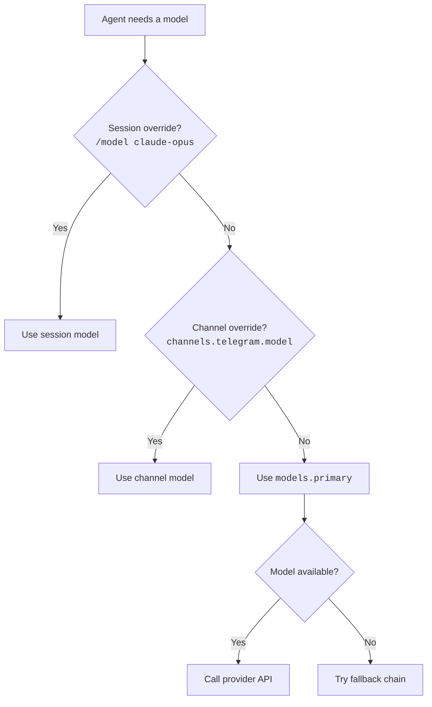
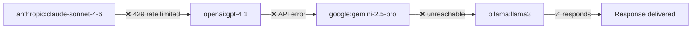

# Model Configuration

OpenClaw can talk to a dozen LLM providers simultaneously. In this lesson you'll learn how to configure providers, set up aliases, build failover chains, and route different channels to different models.

---

## How Model Selection Works

When the agent needs to call an LLM, it resolves the model through this chain:



| Priority | Source | Config key |
|----------|--------|-----------|
| 1 (highest) | Session override (`/model` command) | Runtime |
| 2 | Channel-specific model | `channels.<name>.model` |
| 3 | Primary model | `models.primary` |
| 4 (lowest) | Fallback chain | `models.fallbacks` |

---

## Configuring the Primary Model

```json5
{
  models: {
    primary: "anthropic:claude-sonnet-4-6"
  }
}
```

The model identifier format is `provider:model-id`. If no provider prefix is given, OpenClaw tries to resolve it from the known models registry.

### Common Model Identifiers

| Provider | Model ID | Identifier |
|----------|----------|-----------|
| Anthropic | Claude Sonnet 4.6 | `anthropic:claude-sonnet-4-6` |
| Anthropic | Claude Opus 4.6 | `anthropic:claude-opus-4-6` |
| Anthropic | Claude Haiku 4.5 | `anthropic:claude-haiku-4-5` |
| OpenAI | GPT-4.1 | `openai:gpt-4.1` |
| OpenAI | GPT-5 | `openai:gpt-5` |
| Google | Gemini 2.5 Pro | `google:gemini-2.5-pro` |
| Ollama | Llama 3 | `ollama:llama3` |
| OpenRouter | Any model | `openrouter:anthropic/claude-sonnet-4.6` |

---

## Provider Authentication

Each provider needs credentials. There are three ways to supply them:

### 1. API Key in Config

```json5
{
  models: {
    providers: {
      anthropic: {
        apiKey: "${ANTHROPIC_API_KEY}"    // From env var
      },
      openai: {
        apiKey: "sk-..."                  // Inline (not recommended)
      }
    }
  }
}
```

### 2. OAuth (Anthropic)

Anthropic supports an OAuth flow via setup tokens:

```bash
openclaw models auth anthropic
# Opens browser → approve → tokens saved to auth-profiles.json
```

### 3. Environment Variables (Auto-Detected)

Many providers are auto-detected from standard env vars:

| Provider | Expected env var |
|----------|-----------------|
| Anthropic | `ANTHROPIC_API_KEY` |
| OpenAI | `OPENAI_API_KEY` |
| Google | `GOOGLE_AI_API_KEY` or `GOOGLE_APPLICATION_CREDENTIALS` |
| OpenRouter | `OPENROUTER_API_KEY` |
| Mistral | `MISTRAL_API_KEY` |
| Groq | `GROQ_API_KEY` |

If the env var is set, OpenClaw picks it up automatically — no explicit provider config needed.

---

## Custom Providers

For providers not built into OpenClaw, use the `providers` config:

```json5
{
  models: {
    providers: {
      // Local vLLM server
      "my-local": {
        type: "openai-compatible",
        baseUrl: "http://localhost:8000/v1",
        apiKey: "not-needed",
        models: ["my-finetuned-model"]
      },
      // Corporate LiteLLM proxy
      "corp-proxy": {
        type: "openai-compatible",
        baseUrl: "https://llm-proxy.company.com/v1",
        apiKey: "${CORP_LLM_KEY}",
        models: ["gpt-4.1", "claude-sonnet-4-6"]
      }
    }
  }
}
```

Then reference them as `my-local:my-finetuned-model` or `corp-proxy:gpt-4.1`.

### Provider Types

| Type | Used for |
|------|----------|
| `"anthropic"` | Anthropic API (native) |
| `"openai"` | OpenAI API (native) |
| `"openai-compatible"` | Any OpenAI-compatible endpoint (vLLM, LiteLLM, Ollama, etc.) |
| `"google"` | Google AI / Vertex |
| `"bedrock"` | AWS Bedrock |

---

## Model Aliases

Aliases let you create short names for models you use frequently:

```json5
{
  models: {
    aliases: {
      fast: "anthropic:claude-haiku-4-5",
      smart: "anthropic:claude-opus-4-6",
      default: "anthropic:claude-sonnet-4-6",
      local: "ollama:llama3",
      cheap: "openrouter:meta-llama/llama-3-70b"
    }
  }
}
```

Now you can use aliases everywhere — in config, in the `/model` chat command, or in cron jobs:

```
/model fast       ← switches session to Haiku
/model smart      ← switches session to Opus
/model local      ← switches session to local Llama
```

---

## Failover Chains

What happens when your primary provider is down? Failover chains provide automatic fallback:

```json5
{
  models: {
    primary: "anthropic:claude-sonnet-4-6",
    fallbacks: [
      "openai:gpt-4.1",
      "google:gemini-2.5-pro",
      "ollama:llama3"           // Last resort: local model
    ]
  }
}
```



Failover triggers on:
- HTTP 429 (rate limited)
- HTTP 5xx (server error)
- Network timeout
- Connection refused

Failover does **not** trigger on:
- HTTP 400 (bad request — indicates a config problem)
- HTTP 401/403 (auth problem — won't be fixed by switching provider)
- Content filter errors (provider-specific content policy)

---

## Model-by-Channel

Different channels can use different models. Useful when you want a fast model for quick chats and a powerful one for complex work:

```json5
{
  models: {
    primary: "anthropic:claude-sonnet-4-6",  // Default
  },
  channels: {
    telegram: {
      model: "anthropic:claude-sonnet-4-6"   // Standard for Telegram
    },
    whatsapp: {
      model: "anthropic:claude-haiku-4-5"    // Faster for WhatsApp
    },
    discord: {
      model: "anthropic:claude-opus-4-6"     // Full power for Discord
    },
    webchat: {
      model: "ollama:llama3"                 // Local model for web UI
    }
  }
}
```

### Per-Channel Model Rationale

| Channel | Recommended model | Why |
|---------|------------------|-----|
| Main DM (Telegram/WhatsApp) | Sonnet or Opus | Your primary interaction surface |
| Group chats | Haiku | Lower cost for frequent messages |
| WebChat (dev) | Local (Ollama) | Free, fast, private |
| Discord (coding) | Opus | Complex tasks need the best model |
| Heartbeat/cron | Haiku | Background tasks don't need top-tier |

---

## Image Models

Some tasks need vision (image analysis). Configure the image model separately:

```json5
{
  models: {
    primary: "anthropic:claude-sonnet-4-6",
    image: "anthropic:claude-sonnet-4-6"     // Must support vision
  }
}
```

If `image` is not set, the primary model is used (assuming it supports vision).

---

## Model Allowlists

Restrict which models the agent (or users via `/model`) can select:

```json5
{
  agents: {
    defaults: {
      models: [
        "anthropic:claude-sonnet-4-6",
        "anthropic:claude-haiku-4-5",
        "anthropic:claude-opus-4-6"
      ]
    }
  }
}
```

If this list is set, only these models can be used. The `/model` command in chat will only show allowed models.

---

## CLI: Model Management

```bash
# List available models
openclaw models list

# Check model status (reachability + auth)
openclaw models status
openclaw models status --probe    # Actually call the API to verify

# Set primary model
openclaw models set primary anthropic:claude-sonnet-4-6

# Set fallbacks
openclaw models set fallbacks '["openai:gpt-4.1", "ollama:llama3"]'

# Manage aliases
openclaw models aliases set fast anthropic:claude-haiku-4-5
openclaw models aliases list

# Scan for available models (queries all configured providers)
openclaw models scan
```

---

## Checking Provider Status

```bash
$ openclaw models status --probe

  Provider        Model                      Status    Latency
  ─────────────   ──────────────────────     ──────    ───────
  anthropic       claude-sonnet-4-6          ✅ OK     230ms
  anthropic       claude-opus-4-6            ✅ OK     310ms
  anthropic       claude-haiku-4-5           ✅ OK     150ms
  openai          gpt-4.1                    ✅ OK     280ms
  ollama          llama3                     ❌ Error  Connection refused
  openrouter      meta-llama/llama-3-70b     ✅ OK     420ms
```

---

## Summary

| Concept | Config key | Example |
|---------|-----------|---------|
| **Primary model** | `models.primary` | `"anthropic:claude-sonnet-4-6"` |
| **Fallbacks** | `models.fallbacks` | `["openai:gpt-4.1", "ollama:llama3"]` |
| **Provider auth** | `models.providers.<name>.apiKey` | `"${ANTHROPIC_API_KEY}"` |
| **Custom provider** | `models.providers.<name>` | `{ type: "openai-compatible", baseUrl: "..." }` |
| **Aliases** | `models.aliases` | `{ fast: "anthropic:claude-haiku-4-5" }` |
| **Channel model** | `channels.<name>.model` | `"anthropic:claude-haiku-4-5"` |
| **Image model** | `models.image` | `"anthropic:claude-sonnet-4-6"` |
| **Allowlist** | `agents.defaults.models` | `["anthropic:claude-sonnet-4-6", ...]` |

---

> **Exercise:**
> 1. Run `openclaw models status --probe` and check which providers are reachable.
> 2. Set up at least one failover model. Test it by temporarily breaking your primary model's API key and sending a message.
> 3. Create three aliases (`fast`, `smart`, `local`) and test switching between them with `/model fast` in chat.
> 4. Configure a different model for one channel and verify it's used by checking the session transcript.

---

In the next lesson, we'll configure the **agent** — workspace settings, bootstrap, tools, and compaction.
