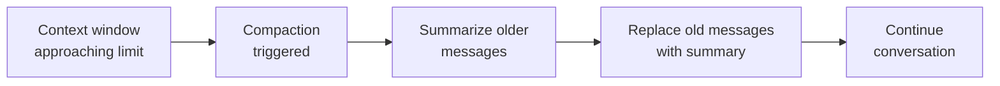

# Agent Configuration

The agent is the brain of your Gateway — the LLM-powered runtime that processes messages, calls tools, and maintains conversation context. In this lesson we'll configure the agent's workspace, bootstrap behavior, available tools, and context window management.

---

## Agent Basics

OpenClaw supports multiple agents, but most setups use just one: `main`.

```json5
{
  agents: {
    defaults: {
      workspace: "~/.openclaw/workspace",
      // ... all agent settings
    },
    // Optional: named agents with overrides
    entries: {
      main: {},          // Uses all defaults
      coding: {
        workspace: "~/code-workspace",
        models: ["anthropic:claude-opus-4-6"]
      }
    }
  }
}
```

### Multi-Agent Routing

If you configure multiple agents, the Gateway routes messages based on channel, group, or explicit selection:

```json5
{
  agents: {
    entries: {
      main: {},
      coding: {},
      support: {}
    },
    routing: {
      "telegram:dm:*": "main",           // Telegram DMs → main agent
      "discord:channel:coding": "coding", // Discord #coding → coding agent
      "webhook:support": "support"        // Support webhooks → support agent
    }
  }
}
```

For most users, a single `main` agent is sufficient. Everything in `agents.defaults` applies to all agents unless overridden.

---

## Workspace Configuration

The workspace is the agent's "home directory" — where its identity files, memory, and skills live.

```json5
{
  agents: {
    defaults: {
      workspace: "~/.openclaw/workspace"   // Default
    }
  }
}
```

### Workspace File Map

```
~/.openclaw/workspace/
├── AGENTS.md       ← Core operating instructions
├── SOUL.md         ← Persona and tone
├── USER.md         ← User context (timezone, preferences)
├── IDENTITY.md     ← Agent name, emoji, avatar path
├── TOOLS.md        ← Tool-specific notes
├── HEARTBEAT.md    ← Periodic check instructions
├── BOOTSTRAP.md    ← First-run onboarding flow
├── BOOT.md         ← One-time gateway startup tasks
├── memory/
│   ├── MEMORY.md   ← Long-term curated memory
│   └── *.md        ← Daily session logs
├── skills/         ← Workspace skills
└── hooks/          ← Workspace hooks
```

> **Key Takeaway:** These files are **injected into the system prompt** at session start. Editing them changes the agent's behavior immediately (on next session reset). No restart needed.

### Changing the Workspace Path

If you want your workspace in a git repo or a synced folder:

```json5
{
  agents: {
    defaults: {
      workspace: "~/Dropbox/openclaw-workspace"
    }
  }
}
```

Just make sure the directory is writable — the agent needs to update memory files.

---

## Bootstrap: First-Run Setup

When the agent starts its very first session (or when the workspace is empty), it enters **bootstrap mode** — an interactive onboarding flow.

### What Bootstrap Does

1. Reads `BOOTSTRAP.md` (if it exists) for custom onboarding instructions
2. Collects user preferences (name, timezone, communication style)
3. Generates initial workspace files (AGENTS.md, SOUL.md, USER.md, IDENTITY.md)
4. Sets up the memory directory

### Customizing Bootstrap

Create `~/.openclaw/workspace/BOOTSTRAP.md`:

```markdown
# Bootstrap Instructions

When setting up for the first time:

1. Ask the user for their name, timezone, and preferred language
2. Ask about their primary use case (personal assistant, coding, research)
3. Ask about their preferred communication style (casual, professional, terse)
4. Generate the workspace files based on their answers
5. Set up daily heartbeat checks for email and calendar
```

### BOOT.md: Gateway Startup Tasks

`BOOT.md` runs once when the Gateway process starts (not per session). Use it for:

```markdown
# Boot Tasks

On Gateway startup:
- Check for pending calendar events in the next hour
- Review any unread messages that arrived while offline
- Send a brief "I'm back online" status to the main channel
```

---

## Tool Configuration

We covered tool policy in the security module. Here's the full config reference:

```json5
{
  tools: {
    // Preset profile
    profile: "full",    // "full", "coding", "messaging", "minimal"

    // Fine-grained control
    deny: [
      "browser",         // Specific tools
      "group:automation" // Tool groups
    ],
    allow: [
      "web_search"       // Override denials
    ],

    // Elevated exec (sandbox escape hatch)
    elevated: {
      enabled: true,
      patterns: ["brew *", "git push *"],
      requireApproval: true
    }
  }
}
```

### Tool Configuration Hierarchy

```
Profile → defines base tool set
  ↓
Deny   → removes tools from the set
  ↓
Allow  → adds tools back (override deny)
  ↓
Final effective tool set
```

Example: `profile: "coding"` includes exec, read, write, edit, browser. If you `deny: ["browser"]`, browser is removed. If you then `allow: ["browser"]`, it's added back.

---

## Compaction: Managing Context Window

LLM context windows are finite. A long conversation will eventually exceed the limit. OpenClaw handles this with **compaction** — intelligently summarizing older history to free up space.

### How Compaction Works



### Compaction Settings

```json5
{
  agents: {
    defaults: {
      compaction: {
        enabled: true,
        // Trigger compaction when context reaches this % of max
        threshold: 0.85,    // 85% of context window
        // How many recent messages to preserve (not summarized)
        preserveRecent: 10,
        // Model to use for summarization (can be a cheaper one)
        model: "anthropic:claude-haiku-4-5"
      }
    }
  }
}
```

| Setting | Default | Description |
|---------|---------|-------------|
| `enabled` | `true` | Enable auto-compaction |
| `threshold` | `0.85` | Trigger at 85% of context window capacity |
| `preserveRecent` | `10` | Keep last N messages intact |
| `model` | Primary model | Model for generating summaries (use a fast/cheap one) |

### Memory Flush Before Compaction

Before compaction runs, the `session-memory` hook can save important context to memory files. This ensures nothing critical is lost when older messages are summarized:

```
Session context approaching limit
  → Memory flush: save key facts to memory/YYYY-MM-DD.md
  → Compaction: summarize old messages
  → Continue with more room
```

> **Key Takeaway:** Compaction is automatic and transparent. The user won't notice it happening — the conversation just keeps going. But important details from early in the conversation may be lost to summarization, which is why the memory system exists.

---

## Session Configuration

```json5
{
  session: {
    // DM session scope (covered in security module)
    dmScope: "per-channel-peer",

    // Queue mode: what happens when messages arrive during a turn
    queueMode: "steer",

    // Auto-reset session after inactivity
    inactivityTimeout: "4h",

    // Maximum session transcript size before forcing compaction
    maxTranscriptTokens: 200000
  }
}
```

### Queue Modes

When the agent is processing a turn and a new message arrives:

| Mode | Behavior |
|------|----------|
| `"steer"` | Inject the new message as a "steering" signal — the agent sees it mid-turn |
| `"followup"` | Queue the message and process it as a new turn after current one completes |
| `"collect"` | Collect all messages until the current turn ends, then batch-process |

`"steer"` is the most natural — if you send a correction ("actually, I meant Paris not London"), the agent can adjust mid-response.

---

## Agent Identity

The agent's display identity is configured via `IDENTITY.md` in the workspace or through config:

```json5
{
  agents: {
    entries: {
      main: {
        identity: {
          name: "Archie",
          emoji: "🦞",
          avatar: "~/.openclaw/avatar.png"
        }
      }
    }
  }
}
```

Or create `~/.openclaw/workspace/IDENTITY.md`:

```markdown
---
name: Archie
emoji: 🦞
---
```

The identity affects:
- Bot display name on channels that support it
- Canvas UI header
- macOS menu bar app label

---

## Heartbeat Configuration

The heartbeat schedule for periodic agent checks:

```json5
{
  agents: {
    defaults: {
      heartbeat: {
        enabled: true,
        intervalMinutes: 15,
        quietHours: {
          start: "23:00",
          end: "07:00"
        }
      }
    }
  }
}
```

The agent reads `HEARTBEAT.md` from the workspace on each heartbeat trigger. If the agent has nothing to report, it returns `HEARTBEAT_OK` and stays silent.

---

## Logging & Debugging

```json5
{
  logging: {
    level: "info",              // "debug", "info", "warn", "error"
    redactSensitive: "tools",   // "off", "tools", "all"
    transcriptDir: "~/.openclaw/agents/main/sessions/"
  }
}
```

| Setting | What it does |
|---------|-------------|
| `level: "debug"` | Verbose logging — useful for troubleshooting |
| `redactSensitive: "tools"` | Redact sensitive data in tool call logs |
| `redactSensitive: "all"` | Redact in all logs |
| `transcriptDir` | Where session JSONL files are stored |

To watch agent activity in real-time:

```bash
# Stream Gateway logs
openclaw logs --follow

# View a specific session's transcript
openclaw sessions show <session-id>
```

---

## Full Agent Config Example

```json5
{
  agents: {
    defaults: {
      workspace: "~/.openclaw/workspace",
      heartbeat: {
        enabled: true,
        intervalMinutes: 15,
        quietHours: { start: "23:00", end: "07:00" }
      },
      compaction: {
        enabled: true,
        threshold: 0.85,
        preserveRecent: 10,
        model: "anthropic:claude-haiku-4-5"
      },
      sandbox: {
        mode: "non-main",
        scope: "session",
        workspace: "none"
      }
    }
  },
  session: {
    dmScope: "per-channel-peer",
    queueMode: "steer",
    inactivityTimeout: "4h"
  },
  tools: {
    profile: "coding",
    deny: ["group:automation"],
    elevated: {
      enabled: true,
      patterns: ["brew *", "git push *"],
      requireApproval: true
    }
  },
  logging: {
    level: "info",
    redactSensitive: "tools"
  }
}
```

---

## Summary

| Config area | Key settings | Config path |
|-------------|-------------|-------------|
| **Workspace** | Path to workspace files | `agents.defaults.workspace` |
| **Bootstrap** | First-run behavior | `BOOTSTRAP.md` in workspace |
| **Tools** | Profile, deny, allow, elevated | `tools.*` |
| **Compaction** | Threshold, preserve count, model | `agents.defaults.compaction.*` |
| **Session** | DM scope, queue mode, timeout | `session.*` |
| **Heartbeat** | Interval, quiet hours | `agents.defaults.heartbeat.*` |
| **Identity** | Name, emoji, avatar | `IDENTITY.md` or `agents.entries.<id>.identity` |
| **Logging** | Level, redaction | `logging.*` |

---

> **Exercise:**
> 1. Check your compaction settings: `openclaw config get agents.defaults.compaction`. Are they set, or using defaults?
> 2. Set `queueMode` to `"steer"` and test sending a correction mid-turn.
> 3. Review your workspace files (`ls ~/.openclaw/workspace/`). Which files exist? Which are missing? Create any that are absent.
> 4. If you use multiple channels, consider setting up a second agent for a specific channel (e.g., a `coding` agent for Discord).

---

In the next lesson, we'll cover **authentication profiles** — OAuth flows, API key rotation, and fallback authentication strategies.
