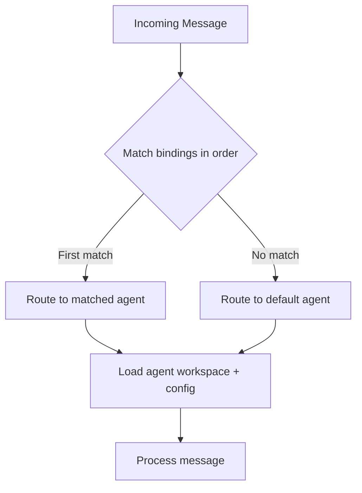

# Custom Routing

A single OpenClaw Gateway can serve multiple agents — each with its own persona, model, tools, and security profile. Routing rules determine which agent handles which messages, based on the channel, sender, group, or any combination.

In this lesson, you'll learn how to set up multi-agent configurations, write routing bindings, and configure per-agent workspaces, tools, and sandboxing.

---

## Why Multiple Agents?

A single agent that does everything is fine for personal use. But what happens when:

- Your **family group chat** should get a friendly, restricted bot — not one that can run shell commands
- Your **work Slack** needs a coding assistant with access to repos
- Your **public Discord** needs a sandboxed agent that can't access your files
- You want a **background analyst** that processes data on a cheaper model

Each of these is a different agent with different permissions, connected to different channels.

> **Key Takeaway:** Multi-agent isn't about running multiple AI models. It's about giving different contexts different access levels and personas.

---

## The agents Configuration

Agents are defined in `~/.openclaw/openclaw.json` under `agents.list`:

```json5
{
  agents: {
    list: [
      {
        id: "main",
        default: true,
        name: "Personal Assistant",
        workspace: "~/.openclaw/workspace",
        sandbox: { mode: "off" },
      },
      {
        id: "family",
        name: "Family Bot",
        workspace: "~/.openclaw/workspace-family",
        sandbox: { mode: "all", scope: "agent" },
        tools: {
          allow: ["read"],
          deny: ["exec", "write", "edit", "apply_patch", "process", "browser"],
        },
      },
      {
        id: "work",
        name: "Work Assistant",
        workspace: "~/.openclaw/workspace-work",
        tools: { profile: "coding" },
      },
    ],
  },
}
```

Each agent gets:
- A unique `id` (used in bindings and session keys)
- Its own `workspace` directory (with its own AGENTS.md, SOUL.md, skills, etc.)
- Optional sandbox and tool restrictions
- Optional model overrides

---

## Routing with Bindings

Bindings map incoming messages to agents. Without bindings, everything goes to the `default: true` agent.

```json5
{
  bindings: [
    {
      agentId: "family",
      match: {
        provider: "whatsapp",
        accountId: "*",
        peer: {
          kind: "group",
          id: "120363424282127706@g.us",
        },
      },
    },
    {
      agentId: "work",
      match: {
        provider: "slack",
        accountId: "*",
      },
    },
  ],
}
```

### Match Fields

| Field | Description | Example |
|-------|-------------|---------|
| `provider` | Channel type | `"whatsapp"`, `"telegram"`, `"discord"`, `"slack"` |
| `accountId` | Specific account (or `"*"` for any) | `"default"`, `"*"` |
| `peer.kind` | Conversation type | `"dm"`, `"group"` |
| `peer.id` | Specific chat/group/channel ID | WhatsApp group JID, Telegram chat ID |
| `senderId` | Specific sender (by phone/ID) | `"+61400000000"` |

### Routing Logic



Bindings are evaluated **in order** — first match wins. Put specific rules before general ones.

---

## Per-Agent Workspaces

Each agent needs its own workspace. This is where the agent's personality, instructions, and skills live:

```
~/.openclaw/workspace/           ← main agent
~/.openclaw/workspace-family/    ← family agent
~/.openclaw/workspace-work/      ← work agent
```

Each workspace has the standard layout:

```
workspace-family/
├── AGENTS.md     ← Behavior rules for this agent
├── SOUL.md       ← Persona (friendly, family-appropriate)
├── TOOLS.md      ← Tool notes
├── USER.md       ← Notes about users
└── skills/       ← Skills specific to this agent
```

### Sharing Content Across Agents

If you want agents to share memory, skills, or projects, use **symlinks**:

```bash
# Share memory across all agents
ln -s ../workspace/MEMORY.md workspace-family/MEMORY.md

# Share a skills directory
ln -s ../workspace/skills/shared-skill workspace-family/skills/shared-skill
```

Alternatively, use `skills.load.extraDirs` in config for shared skill directories:

```json5
{
  skills: {
    load: {
      extraDirs: ["~/.openclaw/shared-skills"],
    },
  },
}
```

---

## Tool Restrictions

The tool policy system is layered. Each level can restrict further, but never grant back denied tools:

```
1. Tool profile (global or per-agent)
2. Provider tool profile
3. Global allow/deny
4. Provider allow/deny
5. Agent-specific allow/deny
6. Agent provider policy
7. Sandbox tool policy
8. Subagent tool policy
```

### Common Profiles

| Profile | What it allows |
|---------|---------------|
| `coding` | Full filesystem + exec access |
| `messaging` | Message tools only, no filesystem |

### Tool Groups

Instead of listing individual tools, use group shorthands:

| Group | Expands to |
|-------|------------|
| `group:runtime` | `exec`, `bash`, `process` |
| `group:fs` | `read`, `write`, `edit`, `apply_patch` |
| `group:sessions` | `sessions_list`, `sessions_history`, `sessions_send`, `sessions_spawn`, `session_status` |
| `group:memory` | `memory_search`, `memory_get` |
| `group:ui` | `browser`, `canvas` |
| `group:automation` | `cron`, `gateway` |
| `group:messaging` | `message` |

### Example: Read-Only Agent

```json5
{
  id: "readonly",
  name: "Reader",
  tools: {
    allow: ["read"],
    deny: ["exec", "write", "edit", "apply_patch", "process"],
  },
}
```

### Example: Communication-Only Agent

```json5
{
  id: "comms",
  name: "Comms Bot",
  tools: {
    allow: ["group:sessions", "group:messaging"],
    deny: ["group:runtime", "group:fs", "browser"],
  },
}
```

---

## Sandbox Modes

Sandboxing runs agent tools inside Docker containers for isolation:

| Mode | Behavior |
|------|----------|
| `off` | No sandboxing (full host access) |
| `non-main` | Sandbox everything except the main session |
| `all` | Sandbox all sessions |

| Scope | Container lifecycle |
|-------|-------------------|
| `session` | One container per session (maximum isolation) |
| `agent` | One container per agent (default, persistent) |
| `shared` | One container for all (least isolation) |

```json5
{
  id: "public",
  sandbox: {
    mode: "all",
    scope: "agent",
    docker: {
      image: "openclaw-sandbox:bookworm-slim",
      network: "none",
      memory: "1g",
      pidsLimit: 256,
    },
  },
}
```

> **Key Takeaway:** `sandbox.mode: "non-main"` is based on the session key, not the agent ID. Group and channel sessions are always "non-main." If you want an agent to never sandbox, set `mode: "off"` explicitly.

---

## Sub-Agents: Background Workers

Sub-agents are background runs spawned from an existing session. They're perfect for parallel work:

```
/subagents spawn helper "analyze the last 100 git commits and summarize trends"
```

### Key Sub-Agent Commands

| Command | Purpose |
|---------|---------|
| `/subagents list` | See active sub-agent runs |
| `/subagents spawn <agentId> <task>` | Start a background task |
| `/subagents kill <id\|all>` | Stop a sub-agent |
| `/subagents log <id>` | View sub-agent output |
| `/subagents info <id>` | Run metadata and status |

### Orchestrator Pattern

Enable nesting for orchestrator workflows (main → orchestrator → workers):

```json5
{
  agents: {
    defaults: {
      subagents: {
        maxSpawnDepth: 2,        // Allow sub-sub-agents
        maxChildrenPerAgent: 5,   // Max active children per session
        maxConcurrent: 8,         // Global concurrency cap
        runTimeoutSeconds: 900,   // 15-minute timeout
      },
    },
  },
}
```

| Depth | Role | Can spawn? |
|-------|------|-----------|
| 0 | Main agent | Always |
| 1 | Orchestrator | Only if `maxSpawnDepth >= 2` |
| 2 | Leaf worker | Never |

Results flow back up the chain: depth-2 announces to depth-1, depth-1 announces to main, main delivers to the user.

### Cross-Agent Spawning

By default, an agent can only spawn sub-agents under its own ID. To allow cross-agent spawning:

```json5
{
  agents: {
    list: [
      {
        id: "main",
        subagents: {
          allowAgents: ["analyst", "coder"],  // Can spawn these
        },
      },
      {
        id: "analyst",
        subagents: {
          allowAgents: ["main"],  // Can spawn back to main
        },
      },
    ],
  },
}
```

Use `["*"]` to allow spawning any agent (use with caution).

---

## Thread-Bound Sessions (Discord)

On Discord, sub-agents can bind to threads for persistent conversations:

```
/subagents spawn analyst "monitor this channel" --thread
```

The sub-agent gets its own Discord thread. Follow-up messages in that thread route to the same sub-agent session. Use `/focus` and `/unfocus` to manage thread bindings.

---

## Auth Isolation

Each agent has its own auth store:

```
~/.openclaw/agents/<agentId>/agent/auth-profiles.json
```

Credentials are **not** shared between agents. The main agent's profiles are merged as a fallback, but agent-specific profiles override on conflicts.

---

## Verifying Your Setup

After configuring multi-agent routing:

```bash
# Check agent resolution and bindings
openclaw agents list --bindings

# Verify sandbox containers
docker ps --filter "name=openclaw-sbx-"

# Monitor routing in logs
tail -f ~/.openclaw/logs/gateway.log | grep -E "routing|sandbox|tools"
```

---

## Complete Example: Three-Agent Setup

```json5
{
  agents: {
    defaults: {
      sandbox: { mode: "non-main" },
    },
    list: [
      {
        id: "main",
        default: true,
        name: "Loki",
        workspace: "~/.openclaw/workspace",
        sandbox: { mode: "off" },
      },
      {
        id: "family",
        name: "Family Bot",
        workspace: "~/.openclaw/workspace-family",
        sandbox: { mode: "all", scope: "agent" },
        tools: {
          allow: ["read"],
          deny: ["exec", "write", "edit", "apply_patch", "process", "browser"],
        },
      },
      {
        id: "public",
        name: "Public Bot",
        workspace: "~/.openclaw/workspace-public",
        sandbox: { mode: "all", scope: "session" },
        tools: {
          allow: ["read"],
          deny: ["exec", "write", "edit", "apply_patch", "process", "browser",
                 "gateway", "cron"],
        },
      },
    ],
  },
  bindings: [
    {
      agentId: "family",
      match: { provider: "whatsapp", peer: { kind: "group", id: "FAMILY_GROUP_JID" } },
    },
    {
      agentId: "public",
      match: { provider: "discord", accountId: "*" },
    },
    // Everything else → main (default)
  ],
}
```

---

## Summary

| Concept | Config location |
|---------|----------------|
| Define agents | `agents.list[]` |
| Set default agent | `agents.list[].default: true` |
| Route messages | `bindings[]` with match rules |
| Restrict tools | `agents.list[].tools.allow/deny` |
| Enable sandbox | `agents.list[].sandbox.mode` |
| Share skills | `skills.load.extraDirs` or symlinks |
| Spawn sub-agents | `/subagents spawn <agentId> <task>` |
| Verify routing | `openclaw agents list --bindings` |

---

## Exercise

1. Design a two-agent setup: a **personal** agent with full access and a **guest** agent with read-only tools, sandboxed, routed from a specific Telegram group
2. Write the `openclaw.json` configuration (don't forget the binding)
3. Create a minimal workspace for the guest agent (just `AGENTS.md` + `SOUL.md`)
4. **Bonus:** Add a sub-agent configuration that lets the personal agent spawn tasks on the guest agent's model

---

In the next lesson, we'll cover **MCP integration** — wiring external tool servers into OpenClaw via the Model Context Protocol.
