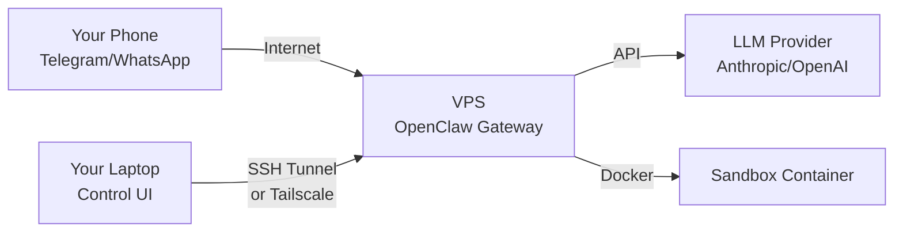

# Linux & VPS Deployment

Running OpenClaw on a Linux VPS gives you a 24/7 always-on gateway for about $5/month. No sleep issues, no TCC permissions, no macOS quirks — just a clean systemd service that starts on boot and runs forever.

In this lesson, you'll set up OpenClaw on a Hetzner (or any Linux) VPS using Docker, configure secure remote access with Tailscale or SSH tunnels, and optionally add an nginx reverse proxy.

---

## What You'll Build



The VPS runs the Gateway. Your phone talks to it through messaging channels. Your laptop accesses the Control UI through a secure tunnel.

---

## Choosing a VPS

Any Linux VPS works. Popular options for OpenClaw:

| Provider | Minimum spec | Approx. cost |
|----------|-------------|--------------|
| Hetzner | CX22 (2 vCPU, 4GB) | ~$5/mo |
| DigitalOcean | Basic Droplet (2GB) | ~$6/mo |
| Oracle Cloud | ARM A1 Flex (4 vCPU, 24GB) | Free tier |
| Raspberry Pi | Pi 4/5 (4GB+) | One-time ~$60 |

Requirements:
- Ubuntu 22.04+ or Debian 12+
- Docker + Docker Compose v2
- SSH access
- 2GB+ RAM (4GB recommended)

---

## Step 1: Provision and Prepare

```bash
ssh root@YOUR_VPS_IP

# Update system
apt-get update && apt-get upgrade -y

# Install Docker
apt-get install -y git curl ca-certificates
curl -fsSL https://get.docker.com | sh

# Verify
docker --version
docker compose version
```

---

## Step 2: Clone and Configure

```bash
git clone https://github.com/openclaw/openclaw.git
cd openclaw

# Create persistent directories
mkdir -p /root/.openclaw/workspace
chown -R 1000:1000 /root/.openclaw
```

Create `.env`:

```bash
cat > .env << 'EOF'
OPENCLAW_IMAGE=openclaw:latest
OPENCLAW_GATEWAY_TOKEN=$(openssl rand -hex 32)
OPENCLAW_GATEWAY_BIND=lan
OPENCLAW_GATEWAY_PORT=18789

OPENCLAW_CONFIG_DIR=/root/.openclaw
OPENCLAW_WORKSPACE_DIR=/root/.openclaw/workspace

NODE_ENV=production
EOF
```

> **Key Takeaway:** Generate a strong gateway token. This is the only thing protecting your Control UI from unauthorized access.

---

## Step 3: Build and Launch

```bash
docker compose build
docker compose run --rm openclaw-cli onboard
docker compose up -d openclaw-gateway
```

Verify:

```bash
docker compose logs -f openclaw-gateway
```

You should see:

```
[gateway] listening on ws://0.0.0.0:18789
```

---

## Step 4: Secure Remote Access

The Gateway should not be exposed to the public internet without protection. You have three options:

### Option A: SSH Tunnel (Simplest)

Keep the port bound to localhost in your compose file:

```yaml
ports:
  - "127.0.0.1:18789:18789"
```

From your laptop:

```bash
ssh -N -L 18789:127.0.0.1:18789 root@YOUR_VPS_IP
```

Open `http://127.0.0.1:18789/` locally. The tunnel encrypts everything.

### Option B: Tailscale (Recommended for Multi-Device)

Tailscale creates a private mesh network between your devices. No ports exposed, no firewall rules to manage.

On the VPS:

```bash
curl -fsSL https://tailscale.com/install.sh | sh
tailscale up
```

On your laptop/phone: install Tailscale and join the same tailnet.

Access the Gateway via Tailscale IP:

```
http://100.x.y.z:18789/
```

Tailscale advantages:
- Works from phone and laptop
- No port forwarding needed
- MagicDNS: `http://your-vps.tailc12345.ts.net:18789/`
- ACLs for fine-grained access control

### Option C: nginx Reverse Proxy (Public Access)

If you need the Control UI accessible from any browser without tunnels:

```nginx
# /etc/nginx/sites-available/openclaw
server {
    listen 443 ssl;
    server_name openclaw.yourdomain.com;

    ssl_certificate     /etc/letsencrypt/live/openclaw.yourdomain.com/fullchain.pem;
    ssl_certificate_key /etc/letsencrypt/live/openclaw.yourdomain.com/privkey.pem;

    location / {
        proxy_pass http://127.0.0.1:18789;
        proxy_http_version 1.1;
        proxy_set_header Upgrade $http_upgrade;
        proxy_set_header Connection "upgrade";
        proxy_set_header Host $host;
        proxy_set_header X-Real-IP $remote_addr;
        proxy_set_header X-Forwarded-For $proxy_add_x_forwarded_for;
        proxy_set_header X-Forwarded-Proto $scheme;
        proxy_read_timeout 86400s;
        proxy_send_timeout 86400s;
    }
}
```

Key lines:
- `proxy_http_version 1.1` + `Upgrade` headers: required for WebSocket
- `proxy_read_timeout 86400s`: keep connections alive for 24 hours

Enable and get a certificate:

```bash
ln -s /etc/nginx/sites-available/openclaw /etc/nginx/sites-enabled/
apt-get install -y certbot python3-certbot-nginx
certbot --nginx -d openclaw.yourdomain.com
nginx -t && systemctl reload nginx
```

---

## systemd Service (Native, Non-Docker)

If you prefer to run OpenClaw natively without Docker:

```ini
# /etc/systemd/system/openclaw-gateway.service
[Unit]
Description=OpenClaw Gateway
After=network-online.target
Wants=network-online.target

[Service]
Type=simple
User=openclaw
Group=openclaw
WorkingDirectory=/home/openclaw
ExecStart=/usr/bin/node /home/openclaw/.npm-global/lib/node_modules/openclaw/dist/index.js gateway
Restart=always
RestartSec=5

Environment=HOME=/home/openclaw
Environment=NODE_ENV=production
Environment=PATH=/home/openclaw/.npm-global/bin:/usr/local/bin:/usr/bin:/bin
Environment=OPENCLAW_GATEWAY_BIND=lan
Environment=OPENCLAW_GATEWAY_PORT=18789

# Security hardening
NoNewPrivileges=true
ProtectSystem=strict
ProtectHome=read-only
ReadWritePaths=/home/openclaw/.openclaw
PrivateTmp=true

[Install]
WantedBy=multi-user.target
```

### Create a Dedicated User

```bash
useradd -m -s /bin/bash openclaw
su - openclaw
npm install -g openclaw@latest
openclaw onboard
exit
```

### Enable and Start

```bash
systemctl daemon-reload
systemctl enable openclaw-gateway
systemctl start openclaw-gateway
systemctl status openclaw-gateway
```

### Manage the Service

```bash
# View logs
journalctl -u openclaw-gateway -f

# Restart
systemctl restart openclaw-gateway

# Stop
systemctl stop openclaw-gateway
```

---

## Firewall Configuration

### UFW (Simple)

```bash
ufw default deny incoming
ufw default allow outgoing
ufw allow ssh
# Only allow Gateway from Tailscale subnet:
ufw allow from 100.64.0.0/10 to any port 18789
ufw enable
```

### pf Rules (for Specific Services)

If you run additional services (like a control plane API), lock them to Tailscale:

```bash
# /etc/pf.conf addition
pass in on utun3 proto tcp from 100.64.0.0/10 to any port 8765
block in on ! utun3 proto tcp to any port 8765
```

---

## What Persists Where (Docker)

| Component | Location | Persistence | Notes |
|-----------|----------|-------------|-------|
| Gateway config | `/home/node/.openclaw/` | Host volume | openclaw.json, tokens |
| Model auth | `/home/node/.openclaw/` | Host volume | OAuth tokens, API keys |
| Workspace | `/home/node/.openclaw/workspace/` | Host volume | Agent files |
| WhatsApp session | `/home/node/.openclaw/` | Host volume | Preserves QR login |
| External binaries | `/usr/local/bin/` | Docker image | Bake at build time |
| Container filesystem | Ephemeral | Restartable | Safe to destroy |

---

## Backup Strategy

The minimum backup set:

```bash
#!/bin/bash
# backup-openclaw.sh
BACKUP_DIR="/root/backups/openclaw"
DATE=$(date +%Y%m%d)

mkdir -p "$BACKUP_DIR"
tar czf "$BACKUP_DIR/openclaw-$DATE.tar.gz" \
  /root/.openclaw/openclaw.json \
  /root/.openclaw/workspace/ \
  /root/.openclaw/agents/ \
  /root/.openclaw/skills/

# Keep last 7 days
find "$BACKUP_DIR" -name "openclaw-*.tar.gz" -mtime +7 -delete
```

Add to cron:

```bash
0 2 * * * /root/scripts/backup-openclaw.sh
```

---

## Security Hardening Checklist

```
[ ] Strong OPENCLAW_GATEWAY_TOKEN (32+ hex chars)
[ ] Gateway bound to 127.0.0.1 or Tailscale only
[ ] SSH key-only auth (disable password login)
[ ] UFW or iptables configured
[ ] Automatic security updates (unattended-upgrades)
[ ] Dedicated non-root user for OpenClaw
[ ] TLS via Let's Encrypt if using nginx
[ ] Regular backups of ~/.openclaw/
[ ] Docker images rebuilt periodically for security patches
```

---

## Infrastructure as Code (Terraform)

For reproducible deployments, community-maintained Terraform modules exist:

- **Infrastructure:** [openclaw-terraform-hetzner](https://github.com/andreesg/openclaw-terraform-hetzner)
- **Docker config:** [openclaw-docker-config](https://github.com/andreesg/openclaw-docker-config)

These provide automated provisioning, cloud-init scripts, backup/restore, and security hardening out of the box.

---

## Summary

| Topic | Key point |
|-------|-----------|
| **VPS choice** | Hetzner CX22 (~$5/mo), DigitalOcean, Oracle Free |
| **Docker** | `docker compose up -d` with host volume mounts |
| **systemd** | Native alternative with security hardening |
| **Remote access** | SSH tunnel (simple) or Tailscale (multi-device) |
| **nginx** | WebSocket proxy with `Upgrade` headers |
| **Security** | Loopback bind + strong token + firewall |
| **Backup** | Cron tar of `~/.openclaw/` config and workspace |

---

## Exercise

1. Write a systemd unit file for OpenClaw from scratch with security hardening (`NoNewPrivileges`, `ProtectSystem`, etc.)
2. Set up Tailscale on two machines and verify you can reach the Gateway from both
3. Write an nginx config that proxies WebSocket connections and test with the Control UI
4. **Bonus:** Create a backup script that tars the critical OpenClaw files and keeps 7 days of history

---

This wraps up Module 9. You now know how to deploy OpenClaw on macOS, Docker, and Linux VPS. In **Module 10**, we'll walk through a real-world case study — our actual production setup.
