# Linux VPS deployment

A VPS is how you run OpenClaw when you need it always on, not just when your laptop lid is open. For $5-6/month you get a machine that's up 24/7, doesn't sleep, and has a stable IP address that Telegram webhooks and WhatsApp sessions won't lose.

This lesson covers DigitalOcean (the most beginner-friendly VPS provider), systemd for keeping the Gateway alive, a reverse proxy for HTTPS, and Tailscale for remote management without punching holes in your firewall.

---

## Choosing a provider

| Provider | Plan | Price | Specs | Notes |
|----------|------|-------|-------|-------|
| DigitalOcean | Basic | $6/mo | 1 vCPU, 1GB RAM, 25GB SSD | Easiest UX, great docs |
| Hetzner | CX22 | €3.79/mo | 2 vCPU, 4GB RAM | Best price/performance in Europe |
| Linode/Akamai | Nanode | $5/mo | 1 vCPU, 1GB RAM | Long track record |
| Oracle Cloud | Always Free | $0/mo | 4 OCPU, 24GB RAM | ARM, finicky signup, incredible value if you get through it |
| Raspberry Pi | One-time ~$55 | $0/mo | ARM, yours at home | No monthly fees; needs stable internet |

This lesson uses Ubuntu 24.04 LTS, the recommended image for all these providers.

> 1GB RAM note: the $6 droplet is fine for the Gateway plus a few channels. Add 2GB swap to prevent OOM crashes. If you add Langfuse, Postgres, and Redis to the same machine, upgrade to 2GB RAM.

---

## Step 1: Create and connect to the VPS

```bash
# Create a DigitalOcean Droplet:
# Region: closest to you
# Image: Ubuntu 24.04 LTS
# Size: $6/mo basic
# Auth: SSH key (recommended)

# Then connect
ssh root@YOUR_DROPLET_IP
```

---

## Step 2: Initial setup

```bash
# Update the system
apt update && apt upgrade -y

# Install essentials
apt install -y git curl build-essential

# Set timezone
timedatectl set-timezone Australia/Sydney   # Change to yours

# Add 2GB swap (critical for 1GB RAM servers)
fallocate -l 2G /swapfile
chmod 600 /swapfile
mkswap /swapfile
swapon /swapfile
echo '/swapfile none swap sw 0 0' >> /etc/fstab
echo 'vm.swappiness=10' >> /etc/sysctl.conf
sysctl -p
```

---

## Step 3: Install Node.js 22+

```bash
curl -fsSL https://deb.nodesource.com/setup_22.x | bash -
apt install -y nodejs

# Verify
node --version   # Should show v22.x.x or higher
npm --version
```

---

## Step 4: Install OpenClaw

```bash
npm install -g openclaw@latest

# Run onboarding
openclaw onboard --install-daemon
```

The `--install-daemon` flag installs the systemd service automatically. The wizard asks for model provider API keys, channel configuration, and a gateway token.

---

## Step 5: The systemd service

OpenClaw installs a user-level systemd service by default. This runs as your user, not as root:

```
~/.config/systemd/user/openclaw-gateway.service
```

Basic commands:

```bash
# Check status
systemctl --user status openclaw-gateway.service

# View logs (live)
journalctl --user -u openclaw-gateway.service -f

# Start / stop / restart
systemctl --user start openclaw-gateway.service
systemctl --user stop openclaw-gateway.service
systemctl --user restart openclaw-gateway.service

# Enable on login
systemctl --user enable openclaw-gateway.service

# Run at boot (even without login) — important for VPS
loginctl enable-linger $USER
```

> Run `loginctl enable-linger $USER` on a VPS. Without it, your user's systemd services don't start until you SSH in. With it, they start at boot even without a logged-in session.

### System-level service (alternative)

For shared servers or always-on production use, a system service runs as root (or a dedicated user) and starts at boot without `linger`:

Create `/etc/systemd/system/openclaw-gateway.service`:

```ini
[Unit]
Description=OpenClaw Gateway
After=network-online.target
Wants=network-online.target

[Service]
Type=simple
User=openclaw
WorkingDirectory=/home/openclaw
ExecStart=/usr/local/bin/openclaw gateway --port 18789
Restart=always
RestartSec=5
Environment=NODE_ENV=production

[Install]
WantedBy=multi-user.target
```

```bash
# Create the user
useradd -m -s /bin/bash openclaw

# Enable and start
systemctl daemon-reload
systemctl enable --now openclaw-gateway.service

# View logs
journalctl -u openclaw-gateway.service -f
```

---

## Step 6: Reverse proxy with Caddy

The Gateway binds to loopback by default (`127.0.0.1:18789`). A reverse proxy handles HTTPS/TLS (required for Telegram webhooks), an optional authentication layer, and routing if you have multiple services on the same server.

### Why Caddy?

Caddy handles TLS certificates automatically via Let's Encrypt with zero config. You give it a domain name and it handles the rest.

```bash
apt install -y debian-keyring debian-archive-keyring apt-transport-https
curl -1sLf 'https://dl.cloudsmith.io/public/caddy/stable/gpg.key' | \
  gpg --dearmor -o /usr/share/keyrings/caddy-stable-archive-keyring.gpg
curl -1sLf 'https://dl.cloudsmith.io/public/caddy/stable/debian.deb.txt' | \
  tee /etc/apt/sources.list.d/caddy-stable.list
apt update && apt install -y caddy
```

Edit `/etc/caddy/Caddyfile`:

```caddyfile
openclaw.yourdomain.com {
    reverse_proxy localhost:18789
}
```

```bash
systemctl enable --now caddy
```

Done. Caddy automatically obtains a TLS certificate for `openclaw.yourdomain.com`. Your Gateway is now reachable at `https://openclaw.yourdomain.com`.

### Nginx alternative

If you prefer nginx:

```nginx
server {
    listen 443 ssl;
    server_name openclaw.yourdomain.com;

    ssl_certificate     /etc/letsencrypt/live/openclaw.yourdomain.com/fullchain.pem;
    ssl_certificate_key /etc/letsencrypt/live/openclaw.yourdomain.com/privkey.pem;

    location / {
        proxy_pass         http://127.0.0.1:18789;
        proxy_http_version 1.1;
        proxy_set_header   Upgrade $http_upgrade;
        proxy_set_header   Connection "upgrade";  # required for WebSocket
        proxy_set_header   Host $host;
        proxy_set_header   X-Real-IP $remote_addr;
    }
}
```

Get the cert with Certbot:

```bash
apt install -y certbot python3-certbot-nginx
certbot --nginx -d openclaw.yourdomain.com
```

> The `Upgrade: websocket` and `Connection: upgrade` headers are required for the Control UI's WebSocket connection. Without them, the UI will connect then disconnect immediately.

---

## Step 7: SSL/TLS considerations

### Telegram webhooks

Telegram requires HTTPS with a valid certificate (no self-signed). Once you have Caddy or nginx + Certbot running:

```json5
{
  channels: {
    telegram: {
      webhookUrl: "https://openclaw.yourdomain.com/telegram-webhook",
      webhookSecret: "a-random-secret"
    }
  }
}
```

### Certificate renewal

Caddy renews automatically. With Certbot/nginx, add a cron job or rely on the systemd timer Certbot installs:

```bash
systemctl status certbot.timer
```

---

## Step 8: Remote management via Tailscale

Tailscale gives you secure access to your VPS from anywhere, without exposing ports to the public internet.

```bash
# On the VPS
curl -fsSL https://tailscale.com/install.sh | sh
tailscale up

# Your VPS gets a Tailscale IP (e.g., 100.x.x.x)
tailscale ip -4
```

### Why Tailscale for OpenClaw?

Three reasons it's worth it:

1. SSH without port 22 exposed, connect to your VPS from anywhere via `ssh user@100.x.x.x`
2. Gateway access without a public URL, point your Control UI at `http://100.x.x.x:18789` from any Tailscale device
3. Bind the Gateway to Tailscale only so it's only reachable from your Tailscale network:

```bash
openclaw config set gateway.bind tailnet
openclaw gateway restart
```

Now `http://<tailscale-ip>:18789` works from any of your devices, but it's invisible to the public internet.

### Tailscale Serve (HTTPS via MagicDNS)

For an even cleaner setup, Tailscale Serve exposes the Gateway over HTTPS on your Tailscale domain:

```bash
openclaw config set gateway.tailscale.mode serve
openclaw gateway restart

# Access at: https://<magicdns-hostname>/
```

---

## Full architecture diagram

```mermaid
graph TB
    INTERNET["🌐 Internet"] -->|HTTPS| CADDY["Caddy / nginx\n(TLS termination)"]
    CADDY -->|HTTP proxy| GW["OpenClaw Gateway\nlocalhost:18789"]

    TAILSCALE["🔒 Tailscale network"] -->|WireGuard| VPS["VPS\n(your machine)"]
    VPS --> GW

    GW -->|long poll / webhook| TG["Telegram API"]
    GW -->|WebSocket| WA["WhatsApp (Baileys)"]
    GW -->|API calls| LLM["LLM Provider\n(Anthropic, OpenAI, etc.)"]

    SYSTEMD["systemd\nopenclaw-gateway.service"] -->|supervises| GW
```



---

## Raspberry Pi: the budget alternative

A Pi 4 (4GB, ~$55 one-time) breaks even against a $6/mo VPS in about 9 months. Setup is identical to the Linux VPS path, with a few ARM-specific notes:

```bash
# Pi OS Lite (64-bit) — headless, no desktop
# Always use 64-bit OS (uname -m should show aarch64, not armv7l)
# Add 2GB swap — same as the VPS
# Install Node via NodeSource — same command

# Disable GPU memory (headless server)
echo 'gpu_mem=16' | sudo tee -a /boot/config.txt
```


The Pi is good for home automation, a device that physically lives somewhere and monitors things, or when you'd rather make a one-time hardware purchase than pay a monthly bill.

---

## Exercises

1. If you have a VPS or spare Linux machine, run through steps 1-5 and confirm `openclaw gateway status` shows the service running.
2. Run `loginctl enable-linger $USER` and reboot. Confirm the Gateway starts without you logging in.
3. Challenge: install Caddy on your VPS, point a domain at it, and confirm you can reach the Control UI at `https://yourdomain.com`.
4. Challenge: install Tailscale on both your VPS and your laptop. Confirm you can SSH to the VPS using its Tailscale IP.

---

## Module 9 summary

You now know how to deploy OpenClaw in three configurations:

| Setup | Best for | Auto-start | Cost |
|-------|---------|-----------|------|
| macOS + LaunchAgent | Daily driver, full Apple ecosystem | On login | Your existing machine |
| Docker + Compose | Reproducibility, multi-service setups | Compose restart policy | Wherever Docker runs |
| Linux VPS + systemd | Always-on, 24/7, reliable | On boot (with linger) | $5-6/month |

The deployment doesn't change what the Gateway does. It changes how reliably it stays running and how you access it. Pick the one that matches your reliability requirements.
