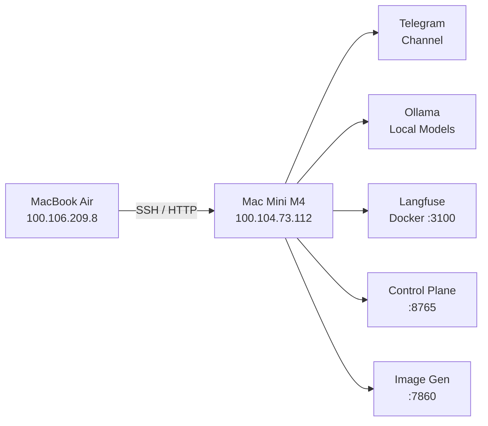
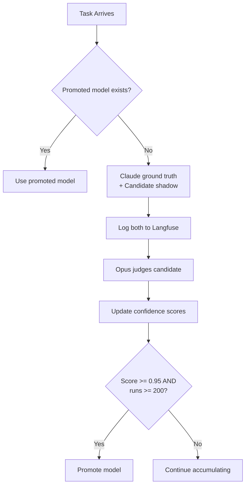

# A Real-World Architecture

Everything in this course so far has been theory and documentation. This module is different — it's our actual production setup. A Mac Mini M4 running 5 agents, connected via Tailscale, processing real tasks 24/7.

This isn't a demo. These are the real config files, the real gotchas, and the real decisions we made (and the ones we'd make differently).

---

## The Hardware

| Component | Spec |
|-----------|------|
| Machine | Mac Mini M4, 24GB unified RAM, 512GB SSD |
| User account | `loki` (standard, non-admin — intentional hardening) |
| Admin account | Nissan (used only for `brew install` and system-level changes) |
| Location | Home office, Sydney, Australia |
| Power | AC, always-on via `caffeinate -s -i` LaunchAgent |

Why a Mac Mini and not a VPS? Two reasons:
1. Local Ollama models (10 models, 44GB total) need the unified memory
2. Physical access for TCC permissions and debugging

The hardware isn't the hard part. A $5 Hetzner VPS could run the Gateway just fine. The Mac Mini is specifically for the Ollama workload — shadow-testing local models against Claude for cost reduction.

---

## The Agent Team

We run 5 agents on a single Gateway, each with a distinct role:

| Agent | Model | Role | Emoji |
|-------|-------|------|-------|
| **Loki** (main) | Opus 4.6 | Orchestration, complex reasoning, memory management | 🐱 |
| **Archie** | Sonnet 4.6 | Data analysis, statistics, evaluation | 📊 |
| **Sara** | Sonnet 4.6 | Content writing, blog posts, course material | ✍️ |
| **Kit** | Sonnet 4.6 | Engineering tasks, code, infrastructure | 🔧 |
| **Liv** | Sonnet 4.6 | Research, inbox triage, information gathering | 🔍 |

Loki uses Opus because orchestration and judgment need the highest-quality model. Everyone else runs Sonnet — it's cheaper and fast enough for specialized tasks.

### The Workspace Symlink Trick

Each agent needs its own workspace (OpenClaw requirement). But we want shared memory, projects, and content. The solution: **symlinks**.

```
~/.openclaw/workspace/          ← Loki (main)
~/.openclaw/workspace-archie/   ← Archie
~/.openclaw/workspace-sara/     ← Sara
~/.openclaw/workspace-kit/      ← Kit
~/.openclaw/workspace-liv/      ← Liv
```

What's unique per agent:
- `SOUL.md` — personality and tone
- `AGENTS.md` — behavior rules

What's shared via symlinks:
- `MEMORY.md` — shared long-term memory
- `projects/` — all project directories
- `content/` — blog drafts, course material
- `skills/` — shared skill library
- `scripts/` — automation scripts

```bash
# Example: setting up Archie's workspace
mkdir -p ~/.openclaw/workspace-archie
# Unique files
cp templates/SOUL-archie.md ~/.openclaw/workspace-archie/SOUL.md
cp templates/AGENTS-archie.md ~/.openclaw/workspace-archie/AGENTS.md
# Shared via symlinks
ln -s ../workspace/MEMORY.md ~/.openclaw/workspace-archie/MEMORY.md
ln -s ../workspace/projects ~/.openclaw/workspace-archie/projects
ln -s ../workspace/content ~/.openclaw/workspace-archie/content
ln -s ../workspace/skills ~/.openclaw/workspace-archie/skills
```

This means when Loki updates MEMORY.md, all agents see the change immediately.

---

## The Network: Tailscale Mesh



Tailscale creates a private network between the Mac Mini and MacBook Air:

| Device | Tailscale IP | MagicDNS |
|--------|-------------|----------|
| Mac Mini | `100.104.73.112` | `nissans-mac-mini.tailc49510.ts.net` |
| MacBook Air | `100.106.209.8` | — |

SSH from the Air: `ssh loki@100.104.73.112`

Control Plane API from anywhere on the tailnet: `http://100.104.73.112:8765`

### Why Tailscale?

- No port forwarding, no dynamic DNS, no VPN server to maintain
- Works through NAT, firewalls, and mobile networks
- MagicDNS means human-readable hostnames
- ACLs for fine-grained access control
- Free for personal use (up to 100 devices)

---

## Firewall: pf Rules

The Hybrid Control Plane API runs on port 8765. We lock it to the Tailscale subnet only:

```bash
# /etc/pf.conf addition (managed by scripts/setup_pf_cp.sh)
pass in on utun3 proto tcp from 100.64.0.0/10 to any port 8765
block in on ! utun3 proto tcp to any port 8765
```

This means:
- Port 8765 is accessible from the Tailscale network
- Port 8765 is blocked from the local network and internet
- The gateway port (18789) has its own auth via `OPENCLAW_GATEWAY_TOKEN`

---

## Always-On Services

Six services run as LaunchAgents (user-level daemons):

| Service | Port | LaunchAgent label | Purpose |
|---------|------|-------------------|---------|
| OpenClaw Gateway | 18789 | `ai.openclaw.gateway` | Agent runtime + channels |
| Hybrid Control Plane | 8765 | `com.openclaw.control-plane` | Task routing + evaluation |
| Image Gen Studio | 7860 | `com.openclaw.image-gen-studio` | FLUX + SDXL image generation |
| Langfuse | 3100 | Docker Compose | Observability + traces |
| Grafana (LGTM) | 3000 | Docker Compose | Dashboards + monitoring |
| QMD Memory | — | `com.openclaw.qmd-embed` (nightly) | Semantic search over notes |

### The Hybrid Control Plane

This is our most ambitious project — an evaluation system that routes tasks to local Ollama models, judges their output against Claude, and tracks confidence scores to eventually promote models that match Claude's quality.



Current stats (as of this writing):
- **909 total scored runs** across 38 model/task pairs
- **0 promotions** (gate is strict: 200 runs + mean >= 0.95)
- **Top performers:** phi4/classify at 1.000, qwen2.5/classify at 0.989
- **Task types:** analyze, classify, extract, format, summarize, rag_synthesis, code_transform

The goal: reduce daily API costs by routing commodity tasks to free local models while maintaining Claude-level quality.

### QMD: Semantic Memory

QMD indexes the Proton Drive vault — daily notes, project decisions, people notes, patterns. It runs a nightly embedding job and exposes semantic search to all agents.

```
~/Library/CloudStorage/ProtonDrive-monkfenix@proton.me-folder/
└── Vault/
    ├── daily/          ← Daily logs
    ├── projects/       ← Project-specific notes
    ├── decisions/      ← Architecture decisions
    ├── people/         ← Contact notes
    └── patterns/       ← Recurring patterns
```

Any agent can search this with natural language and get contextually relevant notes from the vault.

---

## Secrets Management: 1Password

No plaintext secrets on disk. Everything goes through 1Password:

```bash
# .zshrc auto-loads all API keys
export OP_SERVICE_ACCOUNT_TOKEN=$(cat ~/.config/openclaw/.op-service-token)

# Read any secret
op read "op://OpenClaw/Anthropic API Key/notesPlain"
op read "op://OpenClaw/GitHub PAT - reddinft/credential"
```

The gateway plist has API keys baked into its `EnvironmentVariables` block (because `launchctl setenv` doesn't work — see Module 9, Lesson 1):

- `OPENAI_API_KEY`
- `MISTRAL_API_KEY`
- `VOYAGE_API_KEY`
- `GEMINI_API_KEY`
- `HF_TOKEN`
- `OP_SERVICE_ACCOUNT_TOKEN`

---

## Fallback Model Chain

Every agent has the same fallback chain:

```
Opus 4.6 → Sonnet 4.6 → GPT-4.1 → Ollama qwen2.5:latest
```

If Anthropic is down, the agent falls back to OpenAI. If that's down too, it falls back to a local Ollama model. The agent keeps working no matter what.

---

## Channels

| Channel | Status | Notes |
|---------|--------|-------|
| Telegram | Active | Personal (821071206) + Desktop (1620268058), both approved |
| WhatsApp | Planned | Not connected yet (needs QR scan) |
| Proton Mail | Active | monkfenix@proton.me via Bridge IMAP/SMTP |
| Control UI | Active | `http://127.0.0.1:18789/` or Tailscale |

Telegram receives all messages by default. Loki (main agent) handles them and can dispatch to other agents via sub-agent spawning.

---

## What This Actually Costs

| Component | Monthly cost |
|-----------|-------------|
| Mac Mini M4 (electricity) | ~$10 |
| Anthropic API (Opus + Sonnet) | ~$50-100 (varies with usage) |
| OpenAI API (fallback) | ~$5 |
| Tailscale | Free (personal plan) |
| 1Password | $3 (personal plan) |
| Proton Drive | Included in Proton subscription |
| Ollama models | Free (local) |
| **Total** | **~$70-120/month** |

The Hybrid Control Plane's whole purpose is to push that Anthropic bill down by proving local models can handle commodity tasks.

---

## Summary

| Component | Our choice | Why |
|-----------|-----------|-----|
| Hardware | Mac Mini M4, 24GB | Local Ollama models need unified memory |
| Agents | 5 (Loki, Archie, Sara, Kit, Liv) | Specialized roles, different models |
| Sharing | Symlinked workspaces | Shared memory, unique personas |
| Network | Tailscale mesh | Zero-config, secure, multi-device |
| Firewall | pf rules | Lock API ports to Tailscale subnet |
| Secrets | 1Password service account | No plaintext on disk |
| Fallback | Opus → Sonnet → GPT-4.1 → Ollama | Always-on, provider-independent |
| Channels | Telegram primary | Simple, reliable, works everywhere |

---

## Exercise

1. Sketch out your own agent team. What roles would you create? What model would each use? What tools would each have access to?
2. Design the symlink structure for sharing memory across 3 agents
3. Calculate your estimated monthly cost based on your expected usage
4. **Bonus:** Set up Tailscale between two of your devices and verify SSH access

---

In the next lesson, we'll look at the **skills and workflows** we've built on top of this architecture.
