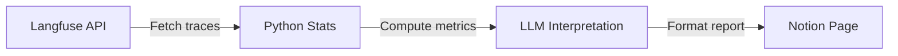

# Skills & Workflows in Practice

Architecture is just plumbing. What makes an OpenClaw setup useful is the skills and workflows you build on top of it. In this lesson, we'll walk through the actual skills running in our production environment — what they do, how they're structured, and what we learned building them.

---

## The Skill Portfolio

We currently have 8 skills published to ClawHub, plus several workspace-only skills. Here's the full picture:

| Skill | Type | Purpose | Published? |
|-------|------|---------|-----------|
| **insight-engine** | Cron + MCP | Langfuse stats → Notion reports | No (workspace) |
| **image-gen-studio** | Skill + API | FLUX/SDXL image generation | No (workspace) |
| **tweet pipeline** | Skill + OAuth | Draft, review, post to X/Twitter | No (workspace) |
| **backup automation** | Cron script | Proton Drive daily backup | No (workspace) |
| **observability-lgtm** | ClawHub | Grafana + Loki + Tempo + Mimir | Yes |
| **llm-eval-router** | ClawHub | Evaluation + model routing patterns | Yes |
| **llm-judge-ensemble** | ClawHub | Multi-judge ensemble scoring | Yes |
| **fastapi-studio-template** | ClawHub | FastAPI + HTMX dark UI template | Yes |
| **openai-image-gen** | Bundled | DALL-E image generation | Bundled |
| **openai-whisper-api** | Bundled | Speech-to-text transcription | Bundled |
| **sherpa-onnx-tts** | Bundled | Local text-to-speech | Bundled |
| **blogwatcher** | Go binary | RSS/blog monitoring | Managed |

Let's walk through the most interesting ones.

---

## Insight Engine: Data-Driven Reports

The Insight Engine is our crown jewel workflow. It connects Langfuse observability data to statistical analysis to Notion reports — with the LLM handling interpretation, never aggregation.

### The Pipeline



### How It Works

1. **Data collection**: Python fetches traces from the Langfuse API (self-hosted, port 3100)
2. **Statistical analysis**: Pandas/NumPy compute aggregations — the LLM never touches raw numbers
3. **Interpretation**: The LLM reads the computed statistics and writes human-readable insights
4. **Delivery**: Formatted report is pushed to a Notion database

### The Rule

> **Never let the LLM aggregate numbers.** LLMs hallucinate statistics. Always compute in Python first, then hand the computed results to the LLM for interpretation.

### Cron Schedule

| Frequency | Model | Time |
|-----------|-------|------|
| Daily | Sonnet 4.6 | 11pm AEST |
| Weekly | Sonnet 4.6 | Sunday 11pm |
| Monthly | Opus 4.6 | 1st of month 11pm |

Monthly reports use Opus because they need deeper analysis of trends and anomalies.

### What We Learned

- **Citation enforcement**: The skill instructions require the LLM to cite specific trace IDs. This prevents hallucinated insights.
- **Langfuse SDK version matters**: Use `start_generation()` not `trace()` — the API changed. Traces live in ClickHouse, not Postgres (which explains why pg_dump showed "0 scores").

---

## Image Gen Studio: Local Image Generation

A FastAPI + HTMX application that generates images locally on the Mac Mini's Apple Silicon GPU.

### Available Generators

| Generator | Model | Time per image | Notes |
|-----------|-------|---------------|-------|
| `flux-schnell` | mflux 8-bit quantized | ~105 seconds | Primary generator, cached ~9GB |
| `sdxl-turbo` | diffusers AutoPipeline | ~15 seconds | 512x512, 4 steps, float32 MPS |
| `sdxl-base` | diffusers 30-step | ~25 minutes | High quality but slow |

### Key Technical Decisions

- **mflux for FLUX**: 105 seconds vs ~90 minutes with raw PyTorch MPS. Always prefer mflux for FLUX models on Apple Silicon.
- **float32 required on MPS**: PyTorch float16 silently produces NaN outputs on Apple Silicon. We lost hours to this before discovering the fix.
- **Provenance sidecars**: Every generated image gets a `.provenance.json` file next to it — model, seed, prompt, timestamp, generation time. This matters for reproducibility.

### Output Structure

```
~/Library/CloudStorage/ProtonDrive/Artifacts/images/
└── 2026/
    └── 02/
        └── 27/
            ├── cyberpunk-alley-777.png
            └── cyberpunk-alley-777.provenance.json
```

The provenance file:

```json
{
  "model": "flux-schnell",
  "seed": 777,
  "prompt": "cyberpunk alley with neon signs, rain, moody lighting",
  "steps": 4,
  "width": 1024,
  "height": 1024,
  "generation_time_seconds": 105.2,
  "timestamp": "2026-02-27T14:30:00+11:00"
}
```

---

## Tweet Pipeline: Social Media Automation

The tweet pipeline is a skill that drafts, reviews, and posts content to X/Twitter.

### Workflow

1. Loki or Sara drafts content based on recent work, insights, or blog posts
2. The draft goes to a review step (human-in-the-loop — Nissan approves via Telegram)
3. On approval, the skill posts via the X OAuth2 API

### OAuth Setup

X OAuth2 was set up via a manual PKCE flow (the SDK was unreliable):
- Token stored at `~/.xurl`
- Free tier: 1,500 tweets/month
- Account: `@monkfenix`

### What We Learned

- **Human-in-the-loop is essential for social media.** The LLM can draft, but a human must approve every public post. We built this as a hard requirement, not an option.
- **Rate limits matter.** The free tier is generous enough for a personal account, but you need to track usage.

---

## Backup Automation: Proton Drive

A shell script runs daily at 2am via LaunchAgent, syncing critical files to Proton Drive:

### What Gets Backed Up

```
Vault/config/launchagents/   ← All LaunchAgent plists
Vault/daily/                 ← Daily snapshots
Vault/content-drafts/        ← Blog and course content
Vault/agents/                ← Agent configs and souls
Artifacts/avatars/           ← Agent avatars
Artifacts/docker-backups/    ← Langfuse volume dumps
```

### Retention Policy

| Content | Retention |
|---------|-----------|
| Images | 90 days |
| Audio | 30 days |
| Video | 60 days |
| Memory snapshots | 60 days |
| Docker backups | Keep last 3 |

### The Skill

The backup isn't a "skill" in the SKILL.md sense — it's a pure shell script managed by a LaunchAgent. Not everything needs to go through the LLM. If a task is deterministic and repeatable, a cron job is better than a skill.

---

## Dashboard: Observability Stack

The observability stack (LGTM — Loki, Grafana, Tempo, Mimir) runs via Docker Compose and feeds dashboards showing:

- Gateway request latency
- Agent token usage over time
- Model routing decisions
- Error rates by channel
- Cost tracking per model

The `observability-lgtm` ClawHub skill provides the setup instructions and configuration for this stack.

---

## What Got Published to ClawHub

We followed a strict pre-publish audit process (via `scripts/clawhub_audit.py`):

1. **Metadata declarations must match actual code behavior** — if the skill declares `requires.env: ["MY_KEY"]`, the code must actually use `MY_KEY`
2. **Network declarations** — `network.outbound` must list all external endpoints with reasons
3. **Binary declarations** — `requires.bins` must match actual binary usage

### Published Skills

| Skill | Version | Description |
|-------|---------|-------------|
| `observability-lgtm` | 1.0.2 | Set up Grafana + Loki + Tempo + Mimir for OpenClaw |
| `llm-eval-router` | 1.2.1 | Patterns for evaluating and routing LLM tasks |
| `llm-judge-ensemble` | 1.0.0 | Multi-judge scoring ensemble (Sonnet + GPT-4o-mini) |
| `fastapi-studio-template` | 1.0.0 | FastAPI + HTMX dark UI scaffold |

### Publishing Workflow

```bash
# Audit first
python3 scripts/clawhub_audit.py

# Dry run
clawhub sync --all --dry-run

# Publish
clawhub sync --all
```

---

## Patterns That Emerged

After building a dozen skills, some patterns became clear:

### 1. Skills Are Workflows, Not Tools

The best skills don't just call a tool — they describe a multi-step workflow with decision points. "Use curl to fetch weather" is a bad skill. "Analyze overnight system health by querying Langfuse traces, computing error rates in Python, and formatting as a morning briefing" is a good skill.

### 2. Separate Compute from Interpretation

Never let the LLM do math. Compute in Python/shell, then hand the results to the LLM. This applies to:
- Statistical analysis (Insight Engine)
- Cost calculations (budget tracking)
- Evaluation scoring (Hybrid Control Plane)

### 3. Deterministic Tasks Don't Need Skills

If the task is the same every time (backup, rotation, cleanup), use a cron job or LaunchAgent. Skills are for tasks that need judgment and adaptation.

### 4. Gate Everything

Every skill should declare its requirements. If the skill needs `jq`, declare `requires.bins: ["jq"]`. If it needs an API key, declare `requires.env: ["MY_KEY"]`. Ungated skills load for everyone — including agents that can't use them.

---

## Summary

| Skill | Key pattern |
|-------|------------|
| Insight Engine | LLM interprets, never aggregates; citation enforcement |
| Image Gen | Provenance sidecars; float32 on MPS; mflux over PyTorch |
| Tweet Pipeline | Human-in-the-loop for all public posts |
| Backup | Cron job, not a skill — deterministic tasks don't need LLMs |
| Dashboard | LGTM stack for full observability |
| ClawHub publishing | Audit before publish; metadata must match behavior |

---

## Exercise

1. Design a skill workflow (not just a tool wrapper) for a problem you face regularly. Write the SKILL.md frontmatter and instructions.
2. Identify which parts of your workflow need LLM judgment vs. which are deterministic (and should be scripts)
3. Write a provenance sidecar spec for content your agent generates — what metadata would you track?
4. **Bonus:** Publish a skill to ClawHub with proper metadata declarations

---

In the next lesson, we'll share the **lessons learned** — the infrastructure surprises, evaluation pitfalls, and budget management insights from running this setup in production.
